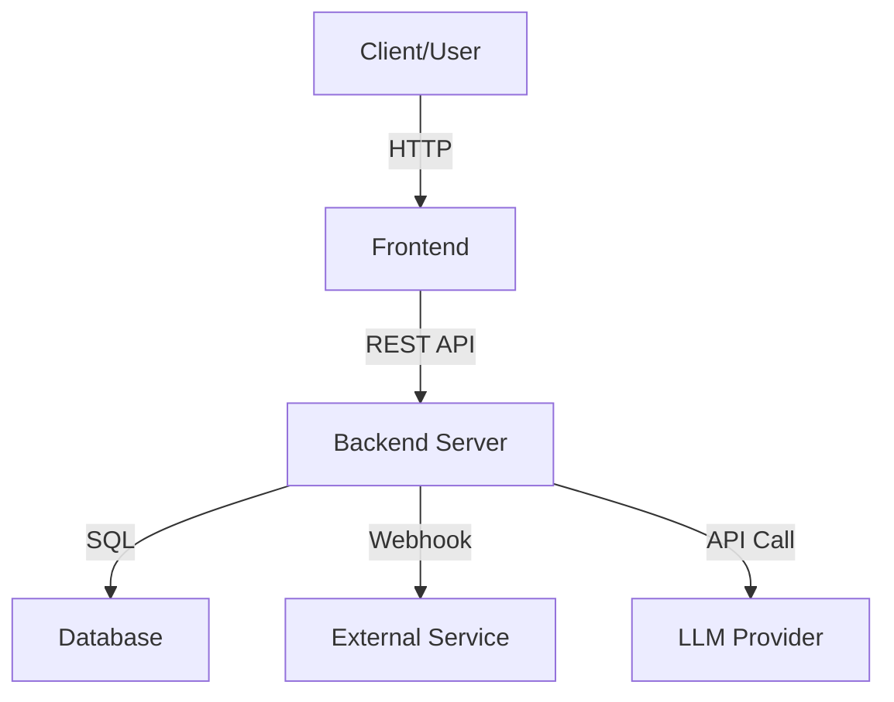
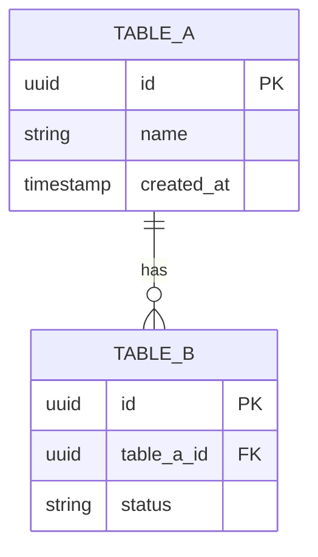

# Architecture: [Project/Epic Name]

> Use this template only when the story requires a deeper split technical artifact. In the lean preview-first process, the default technical handoff before BE is `T-Integration-Spec`.

**Status**: Draft / In Review / Approved / Blocked / Deprecated
**Owner**: [[A05_Tech_Lead_Agent|A05 Tech Lead Agent]]
**Last Updated By**: A05
**Last Reviewed By**: A01
**Approval Required**: PM
**Approved By**: -
**Last Status Change**: YYYY-MM-DD
**Source of Truth**: This document
**Blocking Reason**: -
**Created by**: [[A05_Tech_Lead_Agent|A05 Tech Lead Agent]]
**Date**: YYYY-MM-DD

---

## 1. High-Level Architecture

_Replace with actual architecture diagram._

### Component Descriptions
| Component | Technology | Purpose |
|-----------|-----------|---------|
| Frontend | | |
| Backend | | |
| Database | | |
| External | | |

---

## 2. Database Schema

_Replace with actual ER diagram._

### Table Details
| Table | Column | Type | Constraints | Description |
|-------|--------|------|-------------|-------------|
| | | | PK | |
| | | | FK → table.col | |

---

## 3. Tech Stack

| Layer | Technology | Reason |
|-------|-----------|--------|
| Frontend | | |
| Backend | | |
| Database | | |
| Hosting | | |
| AI/LLM | | |

---

## 4. Feature-to-Service Mapping

| Feature ID | Service / Component | API IDs | DB Tables | Event IDs |
|-----------|----------------------|---------|-----------|-----------|
| | | | | |

---

## 5. Non-Functional Requirements

| Requirement | Specification |
|-------------|--------------|
| **Logging** | |
| **Performance** | |
| **Security** | |
| **Data Retention** | |

---

## 6. Cross-Check

- [ ] Every UI field (from Design System) has a corresponding DB column
- [ ] Every API endpoint (from API Contract) has supporting DB tables
- [ ] Every in-scope Feature ID maps to service/component ownership
- [ ] Naming is consistent across Architecture, API Contract, and Design System
