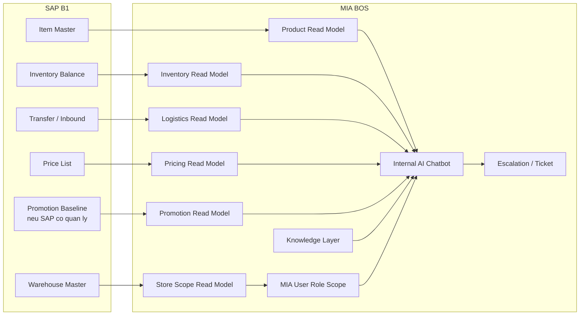

# Tich Hop SAP B1 cho AI Chatbot Noi Bo - Ban POC

**Status**: Draft
**Owner**: A03 BA Agent
**Last Updated By**: Codex CLI (GPT-5 Codex)
**Last Reviewed By**: A01 PM Agent
**Approval Required**: Business Owner
**Approved By**: -
**Last Status Change**: 2026-04-14
**Source of Truth**: This document
**Blocking Reason**: -

---

## 1. Muc Dich

Tai lieu nay la ban chuan hoa o cap `project` cho tinh nang `tich hop SAP B1 phuc vu AI Chatbot Noi Bo` trong workspace `MIABOS`.

Muc tieu cua tai lieu:

- dat dung tai lieu vao dung lop project thay vi de o lop raw intake
- chot mo hinh POC co the dem di trao doi voi khach hang ngay
- bo cac gia dinh khong phu hop thuc te van hanh
- xac dinh ro phong ban nao hoi gi, truy cap den nhom du lieu nao, va vi vay MIA can lay nhung thong tin nao
- xac dinh ranh gioi giu MIA gon, khong bien thanh ban sao cua SAP B1

Tai lieu nay uu tien tinh `thuc chien` va `POC-ready`, khong co gang bao phu tat ca truong hop ngay tu dau.

## 2. Tu Phan Bien Ban Cu

Ban truoc co nhieu diem dung, nhung chua thuc su tot neu dem di chot scope POC:

### 2.1 Dat sai lop tai lieu

Tai lieu dang nam o `04_Raw_Information`, phu hop cho intake/discovery tho, nhung khong phai noi ly tuong de doi trien khai su dung lam tai lieu feature.

### 2.2 Mo hinh phan quyen qua ly tuong

Ban truoc co xu huong nghi den viec lay them `User / Authorization Reference` tu SAP de dua vao MIA.

Dieu nay khong phu hop voi van hanh thuc te vi:

- moi he thong da co logic phan quyen rieng
- MIA khong nen co gang dong bo va tai hien toan bo quyen cua SAP
- MIA chi can quan ly `user`, `role`, `data scope`, va `feature scope` trong chinh he thong MIA

### 2.3 Chua du ro theo phong ban

Ban truoc moi dung o muc domain tong quan, chua tra loi ro:

- phong ban nao su dung
- ho se hoi nhung cau gi
- can xem nhung nhom du lieu nao
- can dong bo nhung field nao moi du cho POC

### 2.4 Chua du POC-ready

Ban truoc dung cho framing tot, nhung van con mo rong qua nhieu huong. POC can mot scope gon hon, uu tien cho nhom nguoi dung va cau hoi co tan suat cao.

## 3. Nguyen Tac Chot Lai Cho POC

### 3.1 SAP B1 la nguon dung cho du lieu nghiep vu cot loi

Trong scope hien tai, SAP B1 duoc xem la nguon dung cho:

- item / product master
- warehouse master
- inventory balance
- transfer / inbound logistics context
- base pricing va mot phan pricing control

### 3.2 MIA khong tich hop phan quyen tu SAP

Day la quyet dinh thiet ke quan trong:

- `Khong` lay role/quyen SAP ve de dung lam quyen chinh cho chatbot
- `Khong` co gang dong bo authorization matrix cua SAP sang MIA
- `Khong` coi SAP la nguon cap quyen cho MIA

MIA se tu thiet lap:

- user cua MIA
- role cua MIA
- phong ban cua MIA
- data scope cua MIA
- feature scope cua MIA

Neu can, MIA chi dung thong tin user hoac phong ban tu he thong khac lam `reference`, khong dung lam `nguon quyen`.

### 3.3 POC phai tra loi duoc cau hoi that

Khong lay du lieu vi `co the se dung sau nay`.

Chi lay du lieu neu phuc vu mot trong cac nhu cau sau:

- nguoi dung hoi nhieu trong van hanh hang ngay
- giam thoi gian hoi dap noi bo
- giam phu thuoc vao 1 vai nhan su kinh nghiem
- giup ra quyet dinh nhanh hon trong ban hang, kho, trade, pricing

### 3.4 MIA chi luu read model can thiet

MIA chi nen luu:

- read model de hoi dap nhanh
- metadata de truy vet
- knowledge / SOP phuc vu giai thich
- audit log va escalation context

MIA khong nen luu:

- full transaction history cua SAP
- full accounting data
- toan bo authorization data cua SAP
- moi field ky thuat trong SAP

## 4. Muc Tieu POC Nen Chot Voi Khach Hang

POC nen giai quyet 4 nhom bai toan chinh:

1. `Tra cuu san pham`
2. `Tra cuu ton kho`
3. `Tra cuu gia va CTKM dang hieu luc`
4. `Tra cuu logistics context co ban`

Dong thoi chatbot noi bo can:

- tra loi bang ngon ngu tu nhien
- chi hien thi dung pham vi du lieu ma user duoc phep xem trong MIA
- neu khong chac, cho phep tao escalation / ticket
- hien thi nguon va do moi du lieu o muc vua du

## 5. Phong Ban Nao Se Dung, Hoi Gi, Va Can Du Lieu Nao

### 5.1 Sales / Cua hang / ASM / RSM

**Cau hoi thuong gap**

- Ma hang nay la gi?
- Con hang khong?
- Con bao nhieu o cua hang / kho nao?
- San pham nay dang ap gia nao?
- San pham nay dang co CTKM gi?
- Neu cua hang toi het hang thi co kho nao con hang de de nghi dieu chuyen khong?

**Can truy cap den**

- thong tin san pham
- ton kho theo scope duoc cap
- kho / cua hang mapping
- gia dang hieu luc
- CTKM dang hieu luc
- thong tin hang dang chuyen / sap ve neu lien quan

**MIA can lay**

- item_code, item_name, barcode, category, color, size
- warehouse_code, store_code, store_name
- on_hand_qty, available_qty, in_transit_qty
- regular_price, effective_price
- promo_code, promo_name, start_at, end_at, scope
- transfer_status, expected_arrival_at

### 5.2 Logistics / Kho

**Cau hoi thuong gap**

- Ma hang nao dang thieu o khu vuc nao?
- Hang dang nam o kho nao?
- Co hang dang chuyen khong?
- Hang sap nhap ve khi nao?
- Dieu chuyen nao dang tre?

**Can truy cap den**

- ton kho theo kho
- transfer / inbound status
- warehouse master
- supplier / partner reference o muc can thiet

**MIA can lay**

- warehouse_code, warehouse_name
- item_code, item_name
- on_hand_qty, committed_qty, available_qty
- transfer_id, from_warehouse, to_warehouse, qty, status
- inbound_ref, expected_arrival_at

### 5.3 Marketing / Trade Marketing

**Cau hoi thuong gap**

- San pham nao dang nam trong CTKM nao?
- CTKM nao dang ap cho kenh nao?
- CTKM nao ap cho cua hang chinh hang, cua hang dai ly?
- Gia / CTKM hien tai cua ma hang nay la gi?
- Co ma hang nao dang khong co CTKM nhung can day sell-through khong?

**Can truy cap den**

- pricing baseline
- promotion data
- scope theo kenh
- scope theo loai cua hang
- category / product grouping

**MIA can lay**

- item_code, category, brand, collection
- regular_price
- promo_code, promo_name, discount_type, discount_value
- channel_scope, store_type_scope, item_scope, category_scope
- effective_from, effective_to
- approval_status neu co

### 5.4 Finance / Pricing Control

**Cau hoi thuong gap**

- Gia co so cua ma hang nay la bao nhieu?
- Gia dang ap dung cho kenh nay co dung khong?
- CTKM nay co hop le theo khung hien hanh khong?
- Ma hang nao dang co gia / CTKM bat thuong?

**Can truy cap den**

- base pricing
- effective pricing
- promotion status
- scope theo kenh / loai cua hang

**MIA can lay**

- item_code
- base_price
- effective_price
- channel
- store_type
- promo_code
- approval_status
- effective_from, effective_to

### 5.5 CSKH / Call center

**Ket luan cho POC**

`Chua nen dua vao scope POC dau tien` neu BQ chi can chatbot noi bo phuc vu van hanh ban hang.

Ly do:

- de phuc vu CSKH tot can them don hang, giao hang, doi tra, bao hanh
- nhom nay se can du lieu order / service context, khong chi la SAP inventory

Neu BQ muon dua CSKH vao POC, can bo sung them luong:

- order status
- exchange / return policy
- warranty policy
- customer-facing SOP

### 5.6 IT / ERP Key User

**Ket luan cho POC**

Khong can lay nhieu transaction data hon. Nhom nay chu yeu can:

- SOP
- huong dan su dung SAP
- source-of-truth rule
- glossary loi / nghiep vu

Vi vay, thay vi mo rong sync SAP, nen bo sung:

- knowledge document index
- SOP chunks
- error glossary

## 6. Chot Lai Scope POC Nen Lam Ngay

Sau khi tu phan bien, scope POC de xuat nen gom 4 nhom user:

1. `Sales / cua hang / ASM`
2. `Logistics / kho`
3. `Marketing / Trade`
4. `Finance / Pricing control`

Khong nen dua ngay vao POC dau:

- CSKH / call center
- HR
- accounting detail
- purchasing detail sau
- full management dashboard

## 7. Mo Hinh Tong Quan Module SAP B1 Tich Hop Voi MIA BOS

### 7.1 Cach doc mo hinh

- `SAP -> MIA` la chieu du lieu chinh.
- `MIA User Role Scope` la role / scope do MIA quan ly, khong phai role dong bo tu SAP.
- `Knowledge Layer` la lop bo sung de chatbot giai thich thay vi chi doc so lieu tho.
- `Escalation / Ticket` la luong hanh dong sau hoi dap.

## 8. Bang Module Tich Hop POC

| Module SAP B1 | Module MIA | Chieu ket noi | Tan suat | Nhom dung chinh | POC Priority |
|---------------|------------|---------------|----------|-----------------|-------------|
| Item Master | Product Read Model | `SAP -> MIA` | 15-30 phut | Sales, Marketing, Finance | Bat buoc |
| Warehouse Master | Store Scope Read Model | `SAP -> MIA` | 1 gio / on-change | Sales, Logistics | Bat buoc |
| Inventory Balance | Inventory Read Model | `SAP -> MIA` | 1-5 phut | Sales, Logistics | Bat buoc |
| Transfer / Inbound | Logistics Read Model | `SAP -> MIA` | 5-15 phut | Logistics, Sales | Nen co |
| Price List | Pricing Read Model | `SAP -> MIA` | 5-15 phut | Sales, Marketing, Finance | Bat buoc |
| Promotion Baseline | Promotion Read Model | `SAP -> MIA` | 5-15 phut | Sales, Marketing, Finance | Nen co |
| SOP / Policy docs | Knowledge Layer | `Document source -> MIA` | Curated publish | IT key user, Sales, Logistics | Bat buoc |
| Escalation action | Ticket / Workflow | `MIA -> Workflow` | Theo su kien | Tat ca nhom user | Nen co |

## 9. MIA Nen Lay Nhung Truong Thong Tin Nao

### 9.1 Product

- item_code
- item_name
- barcode
- category
- brand
- color
- size
- active_status

### 9.2 Inventory

- item_code
- warehouse_code
- warehouse_name
- store_code
- store_name
- on_hand_qty
- committed_qty
- available_qty
- in_transit_qty
- freshness_timestamp

### 9.3 Logistics

- transfer_id
- from_warehouse
- to_warehouse
- item_code
- qty
- status
- expected_arrival_at

### 9.4 Pricing

- item_code
- base_price
- effective_price
- channel
- store_type
- effective_from
- effective_to

### 9.5 Promotion

- promo_code
- promo_name
- discount_type
- discount_value
- channel_scope
- store_type_scope
- item_scope
- category_scope
- effective_from
- effective_to
- approval_status neu co

### 9.6 Knowledge / SOP

- document_id
- title
- domain
- owner
- approved_version
- effective_date
- chunk_reference

### 9.7 User scope trong MIA

- mia_user_id
- department
- role
- region_scope
- store_scope
- warehouse_scope
- feature_scope

## 10. MIA Khong Nen Lay Hoac Khong Nen Luu Day Du

De tranh bien MIA thanh ban sao cua SAP, POC khong nen lay / khong nen luu day du:

- toan bo transaction history
- toan bo accounting detail
- full A/R, A/P
- journal entries
- payment history
- full SAP authorization matrix
- moi field ky thuat trong item / inventory tables
- low-value system logs

## 11. Tan Suat Dong Bo POC

| Nhom du lieu | Tan suat de xuat | Ly do |
|--------------|------------------|-------|
| Product master | 15-30 phut | Bien dong khong qua cao |
| Warehouse master | 1 gio / on-change | Chu yeu dung cho mapping va scope |
| Inventory | 1-5 phut | Day la nhom du lieu nhay va co gia tri van hanh cao |
| Transfer / Inbound | 5-15 phut | Can cho logistics va sales support |
| Pricing | 5-15 phut | Can doi tuoi trong gio ban hang |
| Promotion | 5-15 phut | Can theo ngay hieu luc va pham vi ap dung |
| Knowledge docs | Curated publish | Quan tri bang approval workflow |
| MIA role / scope | On-change | MIA tu quan tri |

## 12. Cau Hoi Mau Chatbot Phai Tra Loi Duoc Trong POC

### 12.1 Sales

- Ma `X` la san pham gi?
- Ma `X` con bao nhieu o cua hang / kho trong pham vi toi duoc xem?
- Ma `X` dang ap gia nao?
- Ma `X` dang co CTKM nao?

### 12.2 Logistics

- Ma `X` hien con o kho nao?
- Ma `X` co hang dang chuyen khong?
- Chuyen kho nao dang tre?

### 12.3 Marketing / Trade

- CTKM `Y` dang ap dung cho kenh nao?
- Nhom san pham nao dang thuoc CTKM `Y`?
- Ma `X` dang thuoc CTKM nao?

### 12.4 Finance / Pricing

- Gia co so cua ma `X` la bao nhieu?
- Gia dang ap theo kenh `Y` co dung khong?
- CTKM nay con hieu luc khong?

## 13. Discovery Questions Can Chot Truoc Khi Build

- Gia va CTKM cuoi cung theo tung kenh dang do he thong nao so huu?
- Dinh nghia `available_qty` cua BQ la gi?
- Trade / Marketing co can xem ton kho chi tiet hay chi can nhin tong quan?
- Finance / Pricing co can xem gia nhay cam hay chi can gia da duoc cong bo noi bo?
- Escalation se day sang dau: `Lark`, `MIA task`, hay mot he thong khac?
- Nguon tai lieu SOP / policy nao la nguon da duyet cuoi cung?

## 14. Ket Luan POC

Ban POC hoan chinh nen duoc chot theo nguyen tac sau:

- bat dau bang `Sales + Logistics + Marketing/Trade + Finance/Pricing`
- lay du lieu nghiep vu chinh tu `SAP B1`
- khong tich hop phan quyen SAP vao MIA
- MIA tu quan ly user, role, va data scope cua MIA
- MIA chi luu read model va metadata can thiet
- chatbot phai tra loi duoc cac cau hoi van hanh that, khong chi la demo tong quan

Neu chot theo cach nay, day la mot scope co the POC duoc ngay voi khach hang ma van giu he thong gon, ro boundary, va co kha nang mo rong sau.
