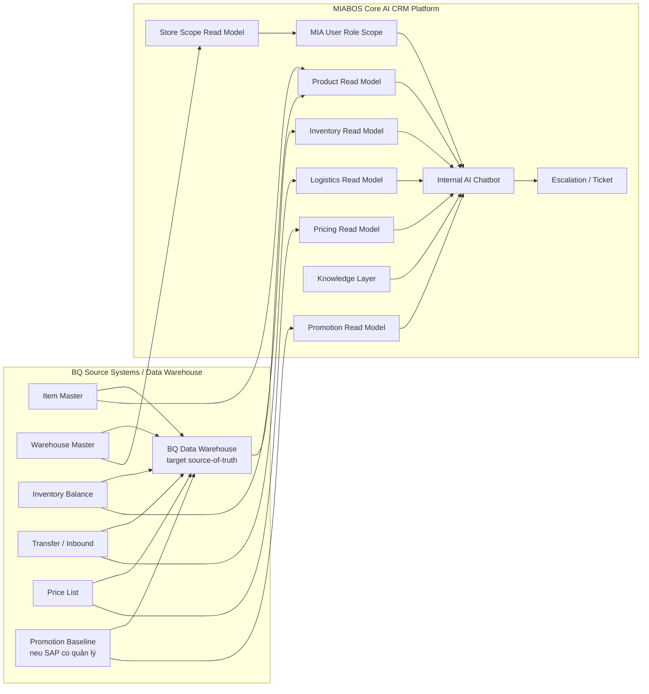

# Tích Hợp SAP B1 cho AI Chatbot Nội Bộ - Bản POC

**Status**: Draft
**Owner**: A03 BA Agent
**Last Updated By**: Codex CLI (GPT-5.4 Codex environment)
**Last Reviewed By**: A01 PM Agent
**Approval Required**: Business Owner
**Approved By**: -
**Last Status Change**: 2026-04-19
**Source of Truth**: This document
**Blocking Reason**: -

---

## 1. Mục Đích

Tài liệu này là bản chuẩn hóa ở cấp `project` cho tính năng `tích hợp SAP B1 phục vụ AI Chatbot Nội Bộ` trong workspace `MIABOS`.

Mục tiêu của tài liệu:

- đặt đúng tài liệu vào đúng lớp project thay vì để ở lớp raw intake
- chốt mô hình POC có thể đem đi trao đổi với khách hàng ngay
- bỏ các giả định không phù hợp thực tế vận hành
- xác định rõ phòng ban nào hỏi gì, truy cập đến nhóm dữ liệu nào, và vì vậy MIA cần lấy những thông tin nào
- xác định ranh giới giữ MIABOS đúng vai trò `Core AI CRM Platform`, không biến thành bản sao của SAP B1, KiotViet, Haravan, hay Data Warehouse của BQ

Tài liệu này ưu tiên tính `thực chiến` và `POC-ready`, không cố gắng bao phủ tất cả trường hợp ngay từ đầu.

## 2. Tự Phản Biện Bản Cũ

Bản trước có nhiều điểm đúng, nhưng chưa thực sự tốt nếu đem đi chốt scope POC:

### 2.1 Đặt sai lớp tài liệu

Tài liệu đang nằm ở `04_Raw_Information`, phù hợp cho intake/discovery thô, nhưng không phải nơi lý tưởng để đội triển khai sử dụng làm tài liệu feature.

### 2.2 Mô hình phân quyền quá lý tưởng

Bản trước có xu hướng nghĩ đến việc lấy thêm `User / Authorization Reference` từ SAP để đưa vào MIA.

Điều này không phù hợp với vận hành thực tế vì:

- mỗi hệ thống đã có logic phân quyền riêng
- MIA không nên cố gắng đồng bộ và tái hiện toàn bộ quyền của SAP
- MIA chỉ cần quản lý `user`, `role`, `data scope`, và `feature scope` trong chính hệ thống MIA

### 2.3 Chưa đủ rõ theo phòng ban

Bản trước mới dừng ở mức domain tổng quan, chưa trả lời rõ:

- phòng ban nào sử dụng
- họ sẽ hỏi những câu gì
- cần xem những nhóm dữ liệu nào
- cần đồng bộ những field nào mới đủ cho POC

### 2.4 Chưa đủ POC-ready

Bản trước đúng cho framing tốt, nhưng vẫn còn mở rộng quá nhiều hướng. POC cần một scope gọn hơn, ưu tiên cho nhóm người dùng và câu hỏi có tần suất cao.

## 3. Nguyên Tắc Chốt Lại Cho POC

### 3.1 SAP B1 là nguồn đúng cho dữ liệu nghiệp vụ cốt lõi

Trong scope hiện tại, SAP B1 được xem là nguồn đúng cho:

- item / product master
- warehouse master
- inventory balance
- transfer / inbound logistics context
- base pricing và một phần pricing control

### 3.2 MIA không tích hợp phân quyền từ SAP

Đây là quyết định thiết kế quan trọng:

- `Không` lấy role/quyền SAP về để dùng làm quyền chính cho chatbot
- `Không` cố gắng đồng bộ authorization matrix của SAP sang MIA
- `Không` coi SAP là nguồn cấp quyền cho MIA

MIA sẽ tự thiết lập:

- user của MIA
- role của MIA
- phòng ban của MIA
- data scope của MIA
- feature scope của MIA

Nếu cần, MIA chỉ dùng thông tin user hoặc phòng ban từ hệ thống khác làm `reference`, không dùng làm `nguồn quyền`.

### 3.3 POC phải trả lời được câu hỏi thật

Không lấy dữ liệu vì `có thể sẽ dùng sau này`.

Chỉ lấy dữ liệu nếu phục vụ một trong các nhu cầu sau:

- người dùng hỏi nhiều trong vận hành hằng ngày
- giảm thời gian hỏi đáp nội bộ
- giảm phụ thuộc vào một vài nhân sự kinh nghiệm
- giúp ra quyết định nhanh hơn trong bán hàng, kho, trade, pricing

### 3.4 MIA chỉ lưu read model cần thiết

Business Owner clarify ngày 2026-04-19: BQ đang dự định xây `Data Warehouse` riêng làm source-of-truth để hứng dữ liệu từ SAP B1, KiotViet, Haravan. MIABOS không sở hữu source data vận hành của BQ.

MIA chỉ nên lưu:

- read model để hỏi đáp nhanh
- metadata để truy vết
- knowledge / SOP phục vụ giải thích
- audit log và escalation context
- conversation data do MIABOS tạo ra
- knowledge data do MIABOS quản trị/publish

MIA không nên lưu:

- full transaction history của SAP
- full accounting data
- toàn bộ authorization data của SAP
- mọi field kỹ thuật trong SAP
- full Data Warehouse dataset của BQ
- dữ liệu vận hành gốc mà BQ đã chốt nằm ở SAP B1, KiotViet, Haravan, hoặc Data Warehouse

## 4. Mục Tiêu POC Nên Chốt Với Khách Hàng

POC nên giải quyết 4 nhóm câu hỏi vận hành chính, không định vị CTKM là pain point:

1. `Tra cứu sản phẩm`
2. `Tra cứu tồn kho`
3. `Tra cứu giá và CTKM đang hiệu lực theo context`
4. `Tra cứu logistics context cơ bản`

Đồng thời chatbot nội bộ cần:

- trả lời bằng ngôn ngữ tự nhiên
- chỉ hiển thị đúng phạm vi dữ liệu mà user được phép xem trong MIA
- nếu không chắc, cho phép tạo escalation / ticket
- hiển thị nguồn và độ mới dữ liệu ở mức vừa đủ
- tôn trọng boundary: source-of-truth là hệ thống BQ / Data Warehouse khi sẵn sàng; MIABOS là Core AI CRM Platform tạo Conversation + Knowledge

## 5. Phòng Ban Nào Sẽ Dùng, Hỏi Gì, Và Cần Dữ Liệu Nào

### 5.1 Sales / Cửa hàng / ASM / RSM

**Câu hỏi thường gặp**

- Mã hàng này là gì?
- Còn hàng không?
- Còn bao nhiêu ở cửa hàng / kho nào?
- Sản phẩm này đang áp giá nào?
- Sản phẩm này đang có CTKM gì?
- Nếu cửa hàng tôi hết hàng thì có kho nào còn hàng để đề nghị điều chuyển không?

**Cần truy cập đến**

- thông tin sản phẩm
- tồn kho theo scope được cấp
- kho / cửa hàng mapping
- giá đang hiệu lực
- CTKM đang hiệu lực
- thông tin hàng đang chuyển / sắp về nếu liên quan

**MIA cần lấy**

- item_code, item_name, barcode, category, color, size
- warehouse_code, store_code, store_name
- on_hand_qty, available_qty, in_transit_qty
- regular_price, effective_price
- promo_code, promo_name, start_at, end_at, scope
- transfer_status, expected_arrival_at

### 5.2 Logistics / Kho

**Câu hỏi thường gặp**

- Mã hàng nào đang thiếu ở khu vực nào?
- Hàng đang nằm ở kho nào?
- Có hàng đang chuyển không?
- Hàng sắp nhập về khi nào?
- Điều chuyển nào đang trễ?

**Cần truy cập đến**

- tồn kho theo kho
- transfer / inbound status
- warehouse master
- supplier / partner reference ở mức cần thiết

**MIA cần lấy**

- warehouse_code, warehouse_name
- item_code, item_name
- on_hand_qty, committed_qty, available_qty
- transfer_id, from_warehouse, to_warehouse, qty, status
- inbound_ref, expected_arrival_at

### 5.3 Marketing / Trade Marketing

**Câu hỏi thường gặp**

- Sản phẩm nào đang nằm trong CTKM nào?
- CTKM nào đang áp cho kênh nào?
- CTKM nào áp cho cửa hàng chính hãng, cửa hàng đại lý?
- Giá / CTKM hiện tại của mã hàng này là gì?
- Có mã hàng nào đang không có CTKM nhưng cần đẩy sell-through không?

**Cần truy cập đến**

- pricing baseline
- promotion data
- scope theo kênh
- scope theo loai cửa hàng
- category / product grouping

**MIA cần lấy**

- item_code, category, brand, collection
- regular_price
- promo_code, promo_name, discount_type, discount_value
- channel_scope, store_type_scope, item_scope, category_scope
- effective_from, effective_to
- approval_status neu co

### 5.4 Finance / Pricing Control

**Câu hỏi thường gặp**

- Giá cơ sở của mã hàng này là bao nhiêu?
- Giá đang áp dụng cho kênh này có đúng không?
- CTKM này có hợp lệ theo khung hiện hành không?
- Mã hàng nào đang có giá / CTKM bất thường?

**Cần truy cập đến**

- base pricing
- effective pricing
- promotion status
- scope theo kênh / loai cửa hàng

**MIA cần lấy**

- item_code
- base_price
- effective_price
- channel
- store_type
- promo_code
- approval_status
- effective_from, effective_to

### 5.5 CSKH / Call center

**Kết luận cho POC**

`Chưa nên đưa vào scope POC đầu tiên` nếu BQ chỉ cần chatbot nội bộ phục vụ vận hành bán hàng.

Lý do:

- để phục vụ CSKH tốt cần thêm đơn hàng, giao hàng, đổi trả, bảo hành
- nhóm này sẽ cần dữ liệu order / service context, không chỉ là SAP inventory

Nếu BQ muốn đưa CSKH vào POC, cần bổ sung thêm luồng:

- order status
- exchange / return policy
- warranty policy
- customer-facing SOP

### 5.6 IT / ERP Key User

**Kết luận cho POC**

Không cần lấy nhiều transaction data hơn. Nhóm này chủ yếu cần:

- SOP
- hướng dẫn sử dụng SAP
- source-of-truth rule
- glossary lỗi / nghiệp vụ

Vì vậy, thay vì mở rộng sync SAP, nên bổ sung:

- knowledge document index
- SOP chunks
- error glossary

## 6. Chốt Lại Scope POC Nên Làm Ngay

Sau feedback Business Owner 2026-04-19, scope POC nên rollout trước cho nhóm nội bộ/content của BQ để chuẩn hóa knowledge và hỏi đáp trước khi mở rộng. Về user domain, POC có thể demo 4 nhóm hỏi đáp:

1. `Nội bộ / content / knowledge owner`
2. `Sales / cửa hàng / ASM`
3. `Logistics / kho`
4. `Marketing / Trade` và `Finance / Pricing control` trong phạm vi tra cứu dữ liệu được cấp

Không nên đưa ngay vào POC đầu:

- HR
- accounting detail
- purchasing detail sau
- full management dashboard
- full automation cho Finance/Accounting/HR
- forecasting

## 7. Mô Hình Tổng Quan Module SAP B1 / BQ Data Warehouse Tích Hợp Với MIABOS

### 7.1 Cách đọc mô hình

- `SAP / KiotViet / Haravan -> BQ Data Warehouse -> MIABOS` là chiều target khi Data Warehouse sẵn sàng; trong POC có thể dùng connector/read model được BQ cho phép.
- `MIA User Role Scope` là role / scope do MIA quản lý, không phải role đồng bộ từ SAP.
- `Knowledge Layer` là lớp bổ sung để chatbot giải thích thay vì chỉ đọc số liệu thô.
- `Escalation / Ticket` là luồng hành động sau hỏi đáp.
- `Conversation` và `Knowledge` là hai nhóm data chính MIABOS tạo thêm; data vận hành gốc vẫn thuộc BQ.

## 8. Bảng Module Tích Hợp POC

| Module SAP B1 | Module MIA | Chiều kết nối | Tần suất | Nhóm dùng chính | POC Priority |
|---------------|------------|---------------|----------|-----------------|-------------|
| Item Master | Product Read Model | `SAP -> MIA` | 15-30 phút | Sales, Marketing, Finance | Bat buoc |
| Warehouse Master | Store Scope Read Model | `SAP -> MIA` | 1 giờ / on-change | Sales, Logistics | Bat buoc |
| Inventory Balance | Inventory Read Model | `SAP -> MIA` | 1-5 phút | Sales, Logistics | Bat buoc |
| Transfer / Inbound | Logistics Read Model | `SAP -> MIA` | 5-15 phút | Logistics, Sales | Nên có |
| Price List | Pricing Read Model | `SAP -> MIA` | 5-15 phút | Sales, Marketing, Finance | Bat buoc |
| Promotion Baseline | Promotion Read Model | `SAP -> MIA` | 5-15 phút | Sales, Marketing, Finance | Nên có |
| SOP / Policy docs | Knowledge Layer | `Document source -> MIA` | Curated publish | IT key user, Sales, Logistics | Bat buoc |
| Escalation action | MIABOS Internal Queue / Destination TBD | `MIA -> MIABOS queue` | Theo sự kiện | Tất cả nhóm user | Nên có |

## 9. MIA Nên Lấy Những Trường Thông Tin Nào

### 9.1 Product

- item_code
- item_name
- barcode
- category
- brand
- color
- size
- active_status

### 9.2 Inventory

- item_code
- warehouse_code
- warehouse_name
- store_code
- store_name
- on_hand_qty
- committed_qty
- available_qty
- in_transit_qty
- freshness_timestamp

### 9.3 Logistics

- transfer_id
- from_warehouse
- to_warehouse
- item_code
- qty
- status
- expected_arrival_at

### 9.4 Pricing

- item_code
- base_price
- effective_price
- channel
- store_type
- effective_from
- effective_to

### 9.5 Promotion

- promo_code
- promo_name
- discount_type
- discount_value
- channel_scope
- store_type_scope
- item_scope
- category_scope
- effective_from
- effective_to
- approval_status neu co

### 9.6 Knowledge / SOP

- document_id
- title
- domain
- owner
- approved_version
- effective_date
- chunk_reference

### 9.7 User scope trong MIA

- mia_user_id
- department
- role
- region_scope
- store_scope
- warehouse_scope
- feature_scope

## 10. MIA Không Nên Lấy Hoặc Không Nên Lưu Đầy Đủ

Để tránh biến MIA thành bản sao của SAP, POC không nên lấy / không nên lưu đầy đủ:

- toàn bộ transaction history
- toàn bộ accounting detail
- full A/R, A/P
- journal entries
- payment history
- full SAP authorization matrix
- mọi field kỹ thuật trong item / inventory tables
- low-value system logs

## 11. Tần Suất Đồng Bộ POC

| Nhóm dữ liệu | Tần suất đề xuất | Lý do |
|--------------|------------------|-------|
| Product master | 15-30 phút | Biến động không quá cao |
| Warehouse master | 1 giờ / on-change | Chủ yếu dùng cho mapping và scope |
| Inventory | 1-5 phút | Đây là nhóm dữ liệu nhạy và có giá trị vận hành cao |
| Transfer / Inbound | 5-15 phút | Cần cho logistics và sales support |
| Pricing | 5-15 phút | Cần độ tươi trong gio bán hàng |
| Promotion | 5-15 phút | Cần theo ngày hiệu lực và phạm vi áp dụng |
| Knowledge docs | Curated publish | Quản trị bằng approval workflow |
| MIA role / scope | On-change | MIA tự quản trị |

## 12. Câu Hỏi Mẫu Chatbot Phải Trả Lời Được Trong POC

### 12.1 Sales

- Mã `X` là sản phẩm gì?
- Mã `X` còn bao nhiêu ở cửa hàng / kho trong phạm vi tôi được xem?
- Mã `X` đang áp giá nào?
- Mã `X` đang có CTKM nào?

### 12.2 Logistics

- Mã `X` hiện còn ở kho nào?
- Mã `X` có hàng đang chuyển không?
- Chuyển kho nào đang trễ?

### 12.3 Marketing / Trade

- CTKM `Y` đang áp dụng cho kênh nào?
- Nhóm sản phẩm nào đang thuộc CTKM `Y`?
- Mã `X` đang thuộc CTKM nào?

### 12.4 Finance / Pricing

- Giá cơ sở của mã `X` là bao nhiêu?
- Giá đang áp theo kênh `Y` có đúng không?
- CTKM này còn hiệu lực không?

## 13. Discovery Questions Cần Chốt Trước Khi Build

- Giá và CTKM cuối cùng theo từng kênh đang do hệ thống nào sở hữu?
- Định nghĩa `available_qty` của BQ là gì?
- Trade / Marketing có cần xem tồn kho chi tiết hay chỉ cần nhìn tổng quan?
- Finance / Pricing có cần xem giá nhạy cảm hay chỉ cần giá đã được công bố nội bộ?
- Escalation sẽ giữ trong `MIABOS internal queue` hay đẩy sang hệ thống nào của BQ sau khi BQ xác nhận?
- Nguồn tài liệu SOP / policy nào là nguồn đã duyệt cuối cùng?

## 14. Kết Luận POC

Bản POC hoàn chỉnh nên được chốt theo nguyên tắc sau:

- bắt đầu bằng nhóm `nội bộ/content` của BQ, sau đó mở rộng sang `Sales + Logistics + Marketing/Trade + Finance/Pricing`
- lấy dữ liệu nghiệp vụ chính từ hệ thống BQ đang sở hữu hoac `BQ Data Warehouse` khi sẵn sàng
- không tích hợp phân quyền SAP vào MIA
- MIA tự quản lý user, role, và data scope của MIA
- MIA chỉ lưu read model, metadata cần thiết, Conversation, Knowledge, audit/escalation context
- chatbot phải trả lời được các câu hỏi vận hành thật, không chỉ là demo tổng quan

Nếu chốt theo cách này, đây là một scope có thể POC được ngay với khách hàng mà vẫn giữ hệ thống gọn, rõ boundary, và có khả năng mở rộng sau.
