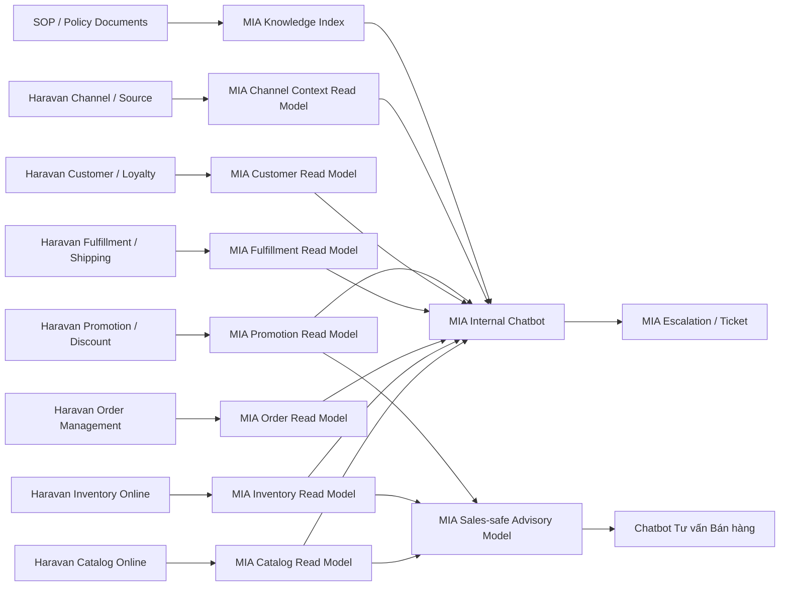

# Feature SRS: F-HAR-INT-001 Tích hợp Haravan cho Chatbot Nội bộ và Chatbot Tư vấn Bán hàng

**Status**: Draft  
**Owner**: A03 BA Agent  
**Last Updated By**: Codex CLI (GPT-5 Codex)  
**Last Reviewed By**: A01 PM Agent  
**Approval Required**: PM  
**Approved By**: -  
**Last Status Change**: 2026-04-14  
**Source of Truth**: This document  
**Blocking Reason**: Chưa chốt phạm vi dữ liệu nào từ Haravan được phép dùng cho chatbot tư vấn bán hàng ngoài trạng thái còn hàng, giá bán, và CTKM online  
**Module**: Integration / Source Spec  
**Phase**: PB-02 / PB-03  
**Priority**: High  
**Document Role**: Integration source specification theo hệ Haravan; dùng làm input cho Integration SRS và MIABOS module SRS

---

## 0. Metadata

- Feature ID: `F-HAR-INT-001`
- Related User Story: `US-HAR-INT-001`
- Related PRD: Chưa có PRD chính thức; tạm thời kế thừa từ brief POC nội bộ
- Related Screens:
  - Màn hình chatbot nội bộ
  - Màn hình kết quả tra cứu dữ liệu Haravan
  - Màn hình chi tiết nguồn dữ liệu và thời điểm cập nhật
  - Màn hình tạo escalation / ticket
  - Màn hình cấu hình sales-safe data scope cho chatbot tư vấn bán hàng
- Related APIs:
  - API đồng bộ Catalog Online từ Haravan
  - API đồng bộ Inventory Online từ Haravan
  - API đồng bộ Order Management từ Haravan
  - API đồng bộ Fulfillment / Shipping từ Haravan
  - API đồng bộ Customer / Loyalty từ Haravan
  - API đồng bộ Promotion / Discount từ Haravan
  - API đồng bộ Channel / Omnichannel Source từ Haravan
  - API hỏi đáp nội bộ của MIA
  - API tạo escalation / ticket của MIA
- Related Tables:
  - `har_catalog_read_model`
  - `har_inventory_read_model`
  - `har_order_read_model`
  - `har_fulfillment_read_model`
  - `har_customer_read_model`
  - `har_promotion_read_model`
  - `har_channel_context_read_model`
  - `knowledge_document_index`
  - `mia_user_scope_profile`
  - `chat_audit_log`
  - `escalation_ticket_ref`
- Related Events:
  - `haravan.catalog.synced`
  - `haravan.inventory.synced`
  - `haravan.order.synced`
  - `haravan.fulfillment.synced`
  - `haravan.customer.synced`
  - `haravan.promotion.synced`
  - `haravan.channel.synced`
  - `mia.chatbot.answer_generated`
  - `mia.chatbot.escalation_created`
- Related Error IDs:
  - `HAR-INT-001`
  - `HAR-INT-002`
  - `HAR-INT-003`
  - `MIA-CHAT-001`
  - `MIA-CHAT-002`

## 1. User Story

Là người dùng nội bộ của BQ thuộc các nhóm `Sales Online`, `CSKH`, `Operations`, `Marketing / Trade`, hoặc `Ecommerce`, tôi muốn hỏi đáp bằng ngôn ngữ tự nhiên với AI trên MIA để tra cứu nhanh thông tin online commerce từ Haravan như sản phẩm online, tồn khả dụng online, đơn hàng, giao vận, khách hàng, CTKM, mã giảm giá, và kênh phát sinh đơn, nhằm giảm thời gian tra cứu trên hệ thống quản trị và tăng tốc xử lý vận hành đa kênh.

Đối với chatbot tư vấn bán hàng, tôi muốn AI sử dụng tập dữ liệu Haravan đã được chuẩn hóa và giới hạn phạm vi để trả lời các câu hỏi về sản phẩm, giá bán, CTKM, và trạng thái `còn hàng / hết hàng` trên kênh online ở mức an toàn, không làm lộ dữ liệu nội bộ nhạy cảm như tồn chi tiết theo location, trạng thái thanh toán nội bộ, COD đối soát, hay dữ liệu khách hàng riêng tư.

## 1A. User Task Flow

| Step | User Role | Action | Task Type | Notes |
|------|-----------|--------|-----------|-------|
| 1 | Sales Online / CSKH | Mở chatbot nội bộ và nhập câu hỏi về sản phẩm online, tồn, đơn hàng, khách hàng, CTKM | Quick Action | Điểm vào chính |
| 2 | Ecommerce / Operations | Xem câu trả lời kèm nguồn dữ liệu Haravan, kênh áp dụng, và thời điểm cập nhật | Quick Action | Bắt buộc có trace |
| 3 | Operations | Hỏi về trạng thái xử lý đơn, giao hàng, COD, hoặc lỗi fulfillment | Quick Action | Luồng vận hành online |
| 4 | Marketing / Trade | Hỏi CTKM, discount code, phạm vi áp dụng, hiệu lực theo kênh | Quick Action | Luồng kiểm tra promo |
| 5 | CSKH | Hỏi lịch sử mua hàng hoặc trạng thái đơn của khách ở mức được cấp quyền | Reporting | Luồng hỗ trợ khách hàng |
| 6 | User nội bộ | Tạo escalation / ticket nếu dữ liệu chưa rõ hoặc cần xác minh tiếp | Exception Handling | Luồng follow-up |
| 7 | Chatbot tư vấn bán hàng | Trả lời sản phẩm phù hợp, giá bán, CTKM, và `còn hàng / hết hàng` | Quick Action | Không lộ dữ liệu nội bộ |
| 8 | User nội bộ | Xem cảnh báo khi dữ liệu Haravan chưa đồng bộ, thiếu mapping, hoặc vượt scope | Exception Handling | Bắt buộc cho trust |

## 2. Business Context

BQ đang vận hành mô hình retail đa kênh, trong đó online commerce đóng vai trò quan trọng trong bán hàng, CSKH, và điều phối đơn hàng. Trong phạm vi tài liệu này:

- `Haravan` được xem là hệ thống nguồn cho các nghiệp vụ ecommerce / omnichannel / online order trong scope tích hợp.
- Haravan nhiều khả năng đang giữ vai trò:
  - quản lý sản phẩm online và variant
  - đồng bộ tồn khả dụng cho online
  - quản lý đơn hàng online và nguồn phát sinh đơn
  - theo dõi giao vận / fulfillment
  - quản lý khách hàng online, loyalty, và CTKM / discount code
- Các phòng ban thường lặp lại nhiều câu hỏi giống nhau về đơn online, giao hàng, khách hàng, mã giảm giá, sản phẩm trên website, và trạng thái kênh bán.
- Nếu không có một lớp hợp nhất nghĩa nghiệp vụ, chatbot dễ trả lời rời rạc theo từng API hoặc từng module Haravan.

Mục tiêu của tính năng là xây dựng một lớp `AI access layer` nằm trên Haravan để:

- Giảm thời gian tra cứu dữ liệu online commerce.
- Tăng tốc độ phản hồi cho đội ecommerce, CSKH, và vận hành online.
- Giảm phụ thuộc vào key user Haravan.
- Tạo nền cho chatbot tư vấn bán hàng dùng dữ liệu online an toàn.

## 3. Preconditions

- Haravan có API hoặc cơ chế kết nối đủ để expose dữ liệu cần thiết cho MIA.
- BQ đồng ý phạm vi POC ưu tiên cho `Sales Online`, `CSKH`, `Operations`, `Marketing / Trade`, `Ecommerce`.
- MIA có cơ chế quản lý user, role, feature-scope, và data-scope riêng.
- Có danh sách rõ dữ liệu nào từ Haravan được dùng cho chatbot nội bộ và dữ liệu nào được phép dùng cho chatbot tư vấn bán hàng.
- Có workflow hoặc nơi tiếp nhận escalation / ticket sau chatbot.
- Có quy tắc xác định quyền xem dữ liệu theo kênh, vai trò, hoặc nhóm vận hành.

## 4. Postconditions

- Người dùng nội bộ có thể hỏi đáp bằng ngôn ngữ tự nhiên trên các domain online commerce đã chốt.
- Câu trả lời hiển thị được nội dung chính, nguồn dữ liệu Haravan, kênh áp dụng, và độ mới dữ liệu.
- Nếu dữ liệu chưa chắc chắn hoặc cần xử lý tiếp, người dùng có thể tạo escalation.
- Chatbot tư vấn bán hàng chỉ dùng tập dữ liệu sales-safe để trả lời ở mức `còn hàng / hết hàng`, thông tin sản phẩm, giá bán, và CTKM phù hợp để tư vấn.

## 5. Main Flow

### 5.1 Luồng hỏi đáp nội bộ

1. Người dùng đăng nhập vào MIA.
2. MIA xác định `user`, `role`, `department`, `channel scope`, `data scope`.
3. Người dùng nhập câu hỏi tự nhiên.
4. MIA phân loại câu hỏi theo domain: `catalog online`, `inventory online`, `order management`, `fulfillment / shipping`, `customer / loyalty`, `promotion / discount`, `channel / source`, `SOP / policy`.
5. MIA truy vấn read model tương ứng; chỉ gọi live source nếu câu hỏi cần dữ liệu gần thời gian thực.
6. MIA áp dụng business rule, data scope của user, và sensitivity rule.
7. MIA trả lời kèm `nguồn`, `kênh / phạm vi áp dụng`, `thời điểm cập nhật`, và `cảnh báo` nếu có.
8. Nếu user yêu cầu hoặc hệ thống phát hiện rủi ro, MIA cho phép tạo escalation / ticket.

### 5.2 Luồng chatbot tư vấn bán hàng

1. Người dùng hoặc nhân viên bán hàng hỏi về sản phẩm.
2. MIA phân loại là câu hỏi thuộc `sales-safe advisory mode`.
3. MIA chỉ truy cập sales-safe model, không dùng trực tiếp raw online commerce data nội bộ để trả lời.
4. Nếu hỏi về tồn, hệ thống chỉ trả lời `còn hàng` hoặc `hết hàng`.
5. Nếu hỏi về sản phẩm, giá bán, hoặc CTKM, hệ thống chỉ trả lời thông tin đã whitelist cho tư vấn bán hàng.
6. Nếu không chắc chắn dữ liệu, hệ thống ưu tiên trả lời thận trọng và hướng người dùng sang kênh xác nhận tiếp theo.

## 6. Alternate Flows

### 6.1 Dữ liệu tồn online đã đồng bộ nhưng chưa tới ngưỡng hết hạn
- MIA trả lời từ `har_inventory_read_model`.
- Không gọi live Haravan.
- Hiển thị `last_synced_at`.

### 6.2 Câu hỏi cần SOP hoặc policy đi kèm dữ liệu online
- MIA kết hợp read model với `knowledge_document_index`.
- Câu trả lời gồm dữ liệu nghiệp vụ và hướng dẫn xử lý.

### 6.3 User hỏi vượt ngoài data scope
- MIA không trả dữ liệu chi tiết.
- MIA thông báo người dùng không có phạm vi truy cập phù hợp.

### 6.4 Dữ liệu khách hàng hoặc thanh toán thuộc nhóm nhạy cảm
- MIA chỉ trả lời mức đã được cấp quyền.
- Nếu vượt quyền, hệ thống yêu cầu user dùng kênh phù hợp hoặc tạo escalation.

## 7. Error Flows

### 7.1 Haravan không phản hồi hoặc timeout
- MIA dùng read model gần nhất nếu còn trong ngưỡng cho phép.
- Nếu vượt ngưỡng, trả lời có cảnh báo dữ liệu có thể không còn mới.

### 7.2 Không map được mã hàng, order, khách hàng, hoặc kênh
- MIA gợi ý danh sách gần đúng theo mã hoặc tên.
- Nếu vẫn không xác định được, trả lỗi có hướng dẫn nhập lại.

### 7.3 Dữ liệu giữa các module online xung đột
- MIA không tự suy diễn kết luận cuối cùng nếu xung đột chưa được rule hóa.
- Hệ thống trả cảnh báo và đề nghị tạo escalation.

## 8. State Machine

### 8.1 Trạng thái dữ liệu tích hợp
`Pending Sync` -> `Synced` -> `Stale` -> `Needs Review`

### 8.2 Trạng thái escalation / ticket
`Draft` -> `Submitted` -> `Assigned` -> `Resolved` -> `Closed`

## 9. UX / Screen Behavior

- Câu trả lời phải hiển thị rõ `kết luận chính` trước, `chi tiết hỗ trợ` sau.
- Luôn hiển thị `nguồn dữ liệu`, `kênh / phạm vi áp dụng`, và `thời điểm cập nhật`.
- Nếu dữ liệu có xung đột hoặc chưa chắc chắn, phải có badge cảnh báo rõ ràng.
- Luồng tạo escalation phải lấy được ngay ngữ cảnh gồm `câu hỏi`, `câu trả lời`, `nguồn`, `user`, `kênh`, `thời điểm`.
- Chatbot tư vấn bán hàng không được hiển thị tồn chi tiết theo location, trạng thái thanh toán nội bộ, COD đối soát, hoặc dữ liệu khách hàng nhạy cảm.

## 10. Role / Permission Rules

- Không phụ thuộc hoàn toàn vào phân quyền gốc của Haravan như điều kiện bắt buộc cho chatbot.
- MIA tự quản lý `user`, `role`, `feature permission`, và `data scope`.
- Haravan đóng vai trò là nguồn dữ liệu nghiệp vụ online commerce; không đóng vai trò là nguồn phân quyền cuối cùng cho chatbot.
- Cần cấu hình trên MIA tối thiểu các lớp sau:
  - `Phòng ban / role`
  - `Phạm vi kênh / loại kênh`
  - `Mức độ nhạy cảm dữ liệu`
  - `Quyền xem dữ liệu khách hàng`
  - `Quyền xem trạng thái thanh toán / fulfillment`
  - `Quyền tạo escalation`

## 11. Business Rules

1. Haravan là nguồn dữ liệu online commerce trong phạm vi tài liệu này.
2. MIA không được thiết kế như bản sao đầy đủ của Haravan.
3. MIA chỉ lưu các read model tối thiểu cần cho AI hỏi đáp, audit, và workflow follow-up.
4. Với chatbot tư vấn bán hàng, dữ liệu tồn chỉ được biểu diễn ở mức `còn hàng / hết hàng`.
5. Nếu dữ liệu vượt quá ngưỡng freshness cho phép, chatbot phải nói rõ dữ liệu có thể đã cũ.
6. Nếu người dùng hỏi vượt ngoài scope, hệ thống không được trả về dữ liệu chi tiết.
7. Dữ liệu khách hàng, payment status chi tiết, COD, và địa chỉ giao hàng là dữ liệu nhạy cảm và phải có sensitivity rule.
8. Câu trả lời nội bộ nên ưu tiên dạng `kết luận + bằng chứng + hành động tiếp theo`.

## 12. API Contract Excerpt + Canonical Links

### 12.1 Nguyên tắc ownership API
- `Haravan / BQ` sở hữu nguồn dữ liệu online commerce.
- `MIA BOS` sở hữu connector, scheduler, read model, AI query API, và escalation API.
- Không cho LLM gọi trực tiếp API Haravan.

### 12.2 Nhóm API tích hợp tối thiểu
- `GET /haravan/catalog`
- `GET /haravan/inventory`
- `GET /haravan/orders`
- `GET /haravan/fulfillment`
- `GET /haravan/customers`
- `GET /haravan/promotions`
- `GET /haravan/channels`
- `POST /mia/chat/query`
- `POST /mia/escalations`

## 13. Event / Webhook Contract Excerpt + Canonical Links

- `haravan.catalog.synced`: Phát sau khi đồng bộ xong catalog online.
- `haravan.inventory.synced`: Phát sau khi đồng bộ tồn khả dụng online.
- `haravan.order.synced`: Phát sau khi đồng bộ đơn hàng.
- `haravan.fulfillment.synced`: Phát sau khi đồng bộ trạng thái giao vận.
- `haravan.customer.synced`: Phát sau khi đồng bộ khách hàng.
- `haravan.promotion.synced`: Phát sau khi đồng bộ CTKM / discount.
- `haravan.channel.synced`: Phát sau khi đồng bộ metadata về kênh phát sinh đơn.
- `mia.chatbot.answer_generated`: Lưu audit cho truy vết.
- `mia.chatbot.escalation_created`: Ghi nhận phát sinh xử lý tiếp theo.

## 14. Data / DB Impact Excerpt + Canonical Links

### 14.1 Mô hình tích hợp tổng quan giữa Haravan và MIA BOS

### 14.2 Bảng giải thích chi tiết thông tin tích hợp

| Hạng mục tích hợp | Module nguồn | Module đích trên MIA | Chiều tích hợp | Tần suất | MIA có lưu dữ liệu không | Mục đích | Ghi chú logic |
|-------------------|--------------|----------------------|----------------|----------|--------------------------|----------|---------------|
| Catalog Online | Haravan Product / Variant / Collection | `har_catalog_read_model` | Haravan -> MIA | 15-30 phút hoặc on-change | Có | Tra cứu sản phẩm online, variant, collection | Không cần sao chép mọi field kỹ thuật |
| Inventory Online | Haravan Inventory / Location | `har_inventory_read_model` | Haravan -> MIA | 1-5 phút | Có | Hỏi đáp tồn khả dụng online | Rất quan trọng cho ecommerce ops |
| Order Management | Haravan Orders | `har_order_read_model` | Haravan -> MIA | 1-5 phút | Có, rút gọn | Trả lời câu hỏi về đơn online | Không cần mirror full payload |
| Fulfillment / Shipping | Haravan Fulfillment / Shipping | `har_fulfillment_read_model` | Haravan -> MIA | 1-5 phút | Có | Theo dõi giao hàng, vận đơn, COD context cơ bản | Hữu ích cho Operations và CSKH |
| Customer / Loyalty | Haravan Customer / Segment / Loyalty | `har_customer_read_model` | Haravan -> MIA | 5-15 phút | Có, có kiểm soát | Hỗ trợ sales online, CSKH, loyalty | Phải qua sensitivity rule |
| Promotion / Discount | Haravan Promotion / Discount Code | `har_promotion_read_model` | Haravan -> MIA | 5-15 phút | Có | Hỏi đáp CTKM, code giảm giá, phạm vi áp dụng | Chỉ whitelist phần an toàn |
| Channel / Source | Haravan Source / Channel Metadata | `har_channel_context_read_model` | Haravan -> MIA | 5-15 phút | Có | Biết đơn đến từ kênh nào | Quan trọng cho omnichannel |
| SOP / policy | Tài liệu được duyệt | `knowledge_document_index` | Tài liệu -> MIA | Manual publish | Có | Giải thích nghiệp vụ và hướng dẫn xử lý | Chỉ index tài liệu đã duyệt |
| User / role / scope | Cấu hình trên MIA | `mia_user_scope_profile` | MIA nội bộ | On-change | Có | Kiểm soát phạm vi chatbot | Không phụ thuộc hoàn toàn vào Haravan |
| Audit câu trả lời | MIA Chat Layer | `chat_audit_log` | MIA nội bộ | Realtime | Có | Truy vết, kiểm tra chất lượng trả lời | Cần lưu tối thiểu câu hỏi, nguồn, kết luận |
| Escalation / ticket | MIA Workflow hoặc hệ thống nhận việc | `escalation_ticket_ref` | MIA -> Workflow | Realtime | Có, mức tham chiếu | Theo dõi xử lý sau chatbot | Không cần sao chép toàn bộ ticket payload |

### 14.3 MIA nên lưu gì và không nên lưu gì

#### MIA nên lưu
- Read model rút gọn cho các domain online commerce cần hỏi đáp.
- Metadata về `source system`, `channel scope`, `last_synced_at`, `freshness status`.
- User scope của MIA.
- Audit câu hỏi, câu trả lời, nguồn đã dùng.
- Tham chiếu escalation / ticket.
- Chỉ mục tài liệu nghiệp vụ đã duyệt.

#### MIA không nên lưu
- Toàn bộ lịch sử transaction chi tiết của Haravan nếu chưa phục vụ trực tiếp cho chatbot.
- Toàn bộ object gốc của Haravan theo kiểu mirror 1:1.
- Toàn bộ log kỹ thuật hoặc trường hệ thống không phục vụ AI.
- Dữ liệu nhạy cảm không phục vụ hỏi đáp, ví dụ thanh toán chi tiết, COD đối soát chi tiết, dữ liệu khách hàng riêng tư, trừ khi có phase riêng được phê duyệt.

### 14.4 Thông tin chi tiết các trường tích hợp

#### a. Catalog online
| Trường | Bắt buộc | Mục đích |
|--------|----------|----------|
| `product_id` | Có | Định danh sản phẩm |
| `variant_id` | Nên có | Biến thể |
| `item_code` | Có | Khóa tra cứu |
| `sku` | Có | Hỏi đáp theo SKU |
| `barcode` | Nên có | Hỗ trợ tra cứu |
| `item_name` | Có | Hiển thị tên sản phẩm |
| `collection` | Nên có | Nhóm online |
| `brand` | Nên có | Tư vấn bán hàng |
| `color` | Nên có | Tư vấn sản phẩm |
| `size` | Nên có | Tư vấn sản phẩm |
| `status` | Có | Trạng thái publish / active |
| `image_url` | Nên có | Hỗ trợ tư vấn bán hàng |

#### b. Inventory online
| Trường | Bắt buộc | Mục đích |
|--------|----------|----------|
| `item_code` | Có | Liên kết sản phẩm |
| `variant_id` | Nên có | Biến thể |
| `location_id` | Có | Xác định location |
| `location_name` | Nên có | Dễ đọc cho người dùng |
| `available_qty` | Có | Tồn khả dụng nội bộ |
| `status_summary` | Có | Tóm tắt trạng thái bán được |
| `last_updated_at` | Có | Độ mới dữ liệu |

#### c. Order management
| Trường | Bắt buộc | Mục đích |
|--------|----------|----------|
| `order_id` | Có | Định danh đơn |
| `order_name` | Nên có | Mã hiển thị |
| `channel_source` | Có | Kênh phát sinh |
| `customer_id` | Nên có | Liên kết khách hàng |
| `financial_status` | Có | Trạng thái thanh toán |
| `fulfillment_status` | Có | Trạng thái giao hàng |
| `order_total` | Có | Giá trị đơn |
| `discount_total` | Nên có | Tổng giảm giá |
| `created_at` | Có | Thời điểm tạo |
| `last_updated_at` | Có | Thời điểm cập nhật |

#### d. Fulfillment / shipping
| Trường | Bắt buộc | Mục đích |
|--------|----------|----------|
| `fulfillment_id` | Có | Định danh fulfillment |
| `order_id` | Có | Liên kết đơn |
| `carrier_name` | Nên có | Nhà vận chuyển |
| `tracking_code` | Nên có | Mã vận đơn |
| `shipping_status` | Có | Trạng thái giao hàng |
| `cod_amount` | Không bắt buộc | Ngữ cảnh COD nội bộ |
| `created_at` | Có | Thời điểm tạo |
| `last_updated_at` | Có | Thời điểm cập nhật |

#### e. Customer / loyalty
| Trường | Bắt buộc | Mục đích |
|--------|----------|----------|
| `customer_id` | Có | Định danh khách hàng |
| `customer_name` | Có | Hiển thị |
| `phone` | Nên có | Tra cứu |
| `email` | Không bắt buộc | Tra cứu |
| `customer_tags` | Nên có | Phân nhóm |
| `loyalty_tier` | Không bắt buộc | Hỗ trợ loyalty |
| `total_spent` | Không bắt buộc | Chỉ cho quyền phù hợp |
| `last_order_at` | Nên có | Hỗ trợ CSKH |
| `accepts_marketing` | Không bắt buộc | Hỗ trợ CRM |

#### f. Promotion / discount
| Trường | Bắt buộc | Mục đích |
|--------|----------|----------|
| `promotion_id` | Có | Định danh CTKM |
| `promotion_name` | Có | Hiển thị CTKM |
| `discount_code` | Nên có | Mã giảm giá |
| `discount_type` | Có | Phần trăm / số tiền / freeship |
| `discount_value` | Có | Giá trị giảm |
| `apply_scope` | Có | Phạm vi áp dụng |
| `channel_scope` | Có | Kênh áp dụng |
| `item_scope` | Nên có | Mặt hàng áp dụng |
| `start_at` | Có | Ngày bắt đầu |
| `end_at` | Có | Ngày kết thúc |
| `status` | Có | Trạng thái |
| `source_system` | Có | Truy nguồn |

#### g. Channel / source
| Trường | Bắt buộc | Mục đích |
|--------|----------|----------|
| `channel_source` | Có | Kênh phát sinh |
| `channel_type` | Có | Web / social / marketplace / khác |
| `channel_name` | Nên có | Hiển thị rõ |
| `status` | Nên có | Trạng thái hoạt động |
| `last_updated_at` | Có | Độ mới dữ liệu |

### 14.5 Nghiệp vụ hỏi đáp của các phòng ban

| Đối tượng sử dụng | Module hỏi đáp chính | Những câu hỏi thường gặp | Dữ liệu cần lấy |
|------------------|----------------------|---------------------------|-----------------|
| Sales Online | Catalog, Inventory, Promotion | `Mẫu này còn hàng trên web không?`, `Đang có CTKM gì?` | Catalog, Inventory, Promotion |
| CSKH | Order, Fulfillment, Customer | `Đơn này đang ở bước nào?`, `Khách này vừa mua gì?` | Order, Fulfillment, Customer |
| Operations | Inventory, Fulfillment, Channel | `Đơn nào đang chậm giao?`, `Kênh nào phát sinh lỗi nhiều?` | Inventory, Fulfillment, Channel |
| Marketing / Trade | Promotion, Customer, Channel | `Code nào đang chạy?`, `Áp cho nhóm khách nào?`, `Kênh nào đang dùng promo này?` | Promotion, Customer, Channel |
| Ecommerce | Tổng hợp nhiều module | `Đơn từ kênh nào?`, `Variant nào đang thiếu hàng online?` | Catalog, Inventory, Order, Channel |
| Chatbot tư vấn bán hàng | Sales-safe Catalog, Availability, Promotion | `Sản phẩm này còn hàng không?`, `Giá bán là bao nhiêu?`, `Có khuyến mãi gì không?` | Catalog rút gọn, Availability rút gọn, Promotion đã whitelist |

## 15. Validation Rules

1. Mã hàng hoặc SKU phải map được về `item_code` hợp lệ trước khi truy vấn dữ liệu nghiệp vụ.
2. Nếu dữ liệu tồn quá ngưỡng freshness, phải gắn cảnh báo trước khi trả lời.
3. Chatbot tư vấn bán hàng không được hiển thị số lượng tồn kho chi tiết.
4. Nếu không map được order, sản phẩm, hoặc khách hàng, bắt buộc gợi ý lại hoặc yêu cầu người dùng nhập rõ hơn.
5. Nếu user không có scope phù hợp, hệ thống chỉ trả về thông báo giới hạn truy cập.
6. Dữ liệu khách hàng, loyalty, và payment status chỉ được hiển thị theo sensitivity level phù hợp.

## 16. Error Codes

| Error ID | Mô tả | Hành vi mong muốn |
|----------|------|-------------------|
| `HAR-INT-001` | Không đọc được dữ liệu từ Haravan | Fallback read model hoặc cảnh báo lỗi nguồn |
| `HAR-INT-002` | Dữ liệu Haravan trả về thiếu trường bắt buộc | Bỏ qua bản ghi lỗi, log cảnh báo |
| `HAR-INT-003` | Không map được kênh / order / mã hàng | Gợi ý gần đúng hoặc yêu cầu nhập lại |
| `MIA-CHAT-001` | Không xác định được intent hoặc domain câu hỏi | Yêu cầu người dùng nhập lại rõ hơn |
| `MIA-CHAT-002` | User vượt ngoài data scope | Không trả dữ liệu chi tiết |

## 17. Non-Functional Requirements

- Truy vấn chatbot nội bộ nên có thời gian phản hồi mục tiêu dưới `5 giây` với câu hỏi tra cứu read model.
- Dữ liệu trả lời phải kèm trace tối thiểu gồm `source`, `last_synced_at`, `channel / scope áp dụng`.
- Tất cả câu hỏi và câu trả lời tích hợp phải có audit log.
- Kiến trúc phải cho phép mở rộng thêm domain online commerce mà không phải mirror lại toàn bộ Haravan.
- Cần có cơ chế retry và dead-letter cho job đồng bộ thất bại.

## 18. Acceptance Criteria

1. Sales Online có thể hỏi về sản phẩm online, tồn online, và CTKM trong phạm vi được cấp.
2. CSKH có thể hỏi về đơn hàng, giao vận, và lịch sử khách hàng trong phạm vi được cấp.
3. Operations có thể hỏi về tồn online, fulfillment, và trạng thái vận hành đơn.
4. Marketing / Trade có thể hỏi CTKM, mã giảm giá, và phạm vi áp dụng theo kênh.
5. Ecommerce có thể hỏi đơn phát sinh từ kênh nào và các trạng thái online liên quan.
6. Mỗi câu trả lời nội bộ đều hiển thị nguồn dữ liệu và thời điểm cập nhật.
7. Người dùng có thể tạo escalation / ticket trực tiếp từ một câu trả lời.
8. Chatbot tư vấn bán hàng chỉ trả lời ở mức an toàn cho bán hàng và không lộ dữ liệu nội bộ nhạy cảm.
9. MIA không lưu mirror 1:1 toàn bộ object của Haravan.

## 19. Test Scenarios

- Sales Online hỏi `Mã BQ123 còn hàng trên website không?`
- Sales Online hỏi `Mã BQ123 đang áp dụng CTKM online gì?`
- CSKH hỏi `Đơn HAR123 đang ở trạng thái nào và đã giao chưa?`
- Operations hỏi `Đơn nào đang chậm fulfillment?`
- Marketing hỏi `Mã giảm giá ABC còn hiệu lực không và áp cho kênh nào?`
- User không có quyền hỏi dữ liệu khách hàng ngoài phạm vi được cấp.
- Chatbot tư vấn bán hàng hỏi `Sản phẩm này còn hàng không?` và chỉ nhận về `còn hàng / hết hàng`.

## 20. Observability

- Theo dõi số lượng job sync thành công / thất bại theo từng domain.
- Theo dõi độ trễ đồng bộ theo từng nguồn Haravan.
- Theo dõi tỷ lệ câu hỏi có thể trả lời ngay so với tỷ lệ phải escalation.
- Theo dõi top câu hỏi theo phòng ban.
- Theo dõi số lượng câu trả lời có cảnh báo dữ liệu stale hoặc vượt scope.
- Theo dõi các domain online bị hỏi nhiều nhưng chưa đủ dữ liệu.

## 21. Rollout / Feature Flag

- Giai đoạn 1: Bật cho nhóm nội bộ pilot gồm Sales Online, CSKH, Operations, Marketing / Trade, Ecommerce.
- Giai đoạn 2: Mở rộng chatbot tư vấn bán hàng với sales-safe data model.
- Giai đoạn 3: Bổ sung thêm domain hoặc quyền sâu hơn sau khi ổn định sensitivity rule và escalation routing.

## 22. Open Questions

### 22.1 Bộ câu hỏi cần trao đổi với khách hàng

1. Những kênh nào hiện đang đổ đơn về Haravan: website, social, marketplace, hay kết hợp?
2. Dữ liệu nào từ Haravan được phép dùng cho chatbot tư vấn bán hàng ngoài `còn hàng / hết hàng`?
3. Có cho phép chatbot tư vấn bán hàng trả `giá bán` và `CTKM` online hay chỉ nội bộ mới được xem?
4. Có cần mở dữ liệu khách hàng cho CSKH và Ecommerce hay giới hạn theo vai trò hẹp hơn?
5. Escalation sau chatbot sẽ giữ trong MIABOS internal queue hay đẩy sang ticket/workflow system nào khác do BQ xác nhận sau?
6. Dữ liệu nào được xem là nhạy cảm trong Haravan: địa chỉ, payment status, COD, loyalty, lịch sử mua hàng, hay tất cả?
7. Có cần hỗ trợ channel/source ở mức chi tiết theo từng sàn ngay trong phase 1 hay để phase sau?
8. Có danh mục tài liệu SOP / policy nào đã duyệt để import vào knowledge layer chưa?
9. Ai là owner nghiệp vụ xác nhận khi chatbot trả lời sai hoặc dữ liệu online xung đột?
10. Có cần mở rộng sang refund / return context online trong POC hay để phase sau?

### 22.2 Open Questions kỹ thuật

- Haravan sẽ được kết nối qua public API, private app, hay middleware trung gian?
- Có giới hạn rate limit, pagination, hoặc quota nào ảnh hưởng đến near-real-time sync không?
- Có webhook / event từ Haravan hay chỉ poll theo lịch?
- Mức độ sạch dữ liệu SKU, variant, channel source hiện nay ra sao?
- Có cần lưu snapshot ngày cho order, fulfillment, và promotion để phục vụ audit hay chỉ cần last-state read model?

## 23. Definition of Done

- Có SRS được PM review.
- Có danh sách domain tích hợp tối thiểu và trường dữ liệu tối thiểu.
- Có quyết định rõ về những gì MIA lưu và không lưu.
- Có bộ câu hỏi discovery để chốt phần còn mở với khách hàng.
- Có thể dùng tài liệu này để mở downstream UXUI và technical design.

## 24. Ready-for-UXUI Checklist

- [x] `User Story` có problem, trigger, happy path, dependencies, và AC context
- [x] User Task Flow đủ rõ cho screen/state design
- [x] Business rules và permission rules có thể test được
- [x] Main, alternate, và error flows đã được mô tả
- [x] State machine đã nêu rõ hoặc giản lược phù hợp
- [x] Data và event dependencies đã được linked ở mức SRS
- [x] Open questions ảnh hưởng đến UXUI đã được liệt kê rõ

## 25. Ready-for-FE-Preview Checklist

- [ ] User Story được approve và linked trong Sprint Backlog
- [ ] UXUI spec tồn tại và trích dẫn SRS này
- [ ] Không còn mâu thuẫn giữa SRS và UXUI
- [ ] Mock / stub data assumptions cho FE Preview được chốt
- [ ] PM mở rõ trạng thái `FE Preview`

## 26. Ready-for-BE / Integration Promotion Checklist

- [ ] FE Preview đã được review
- [ ] Feedback thay đổi hành vi đã được cập nhật ngược về SRS / UXUI
- [ ] Integration Spec hoặc technical pack đã align với SRS này
- [ ] UXUI spec tồn tại và trích dẫn SRS này
- [ ] Không còn mâu thuẫn giữa SRS, UXUI, và technical handoff
- [ ] PM xác nhận trạng thái `Build Ready`
