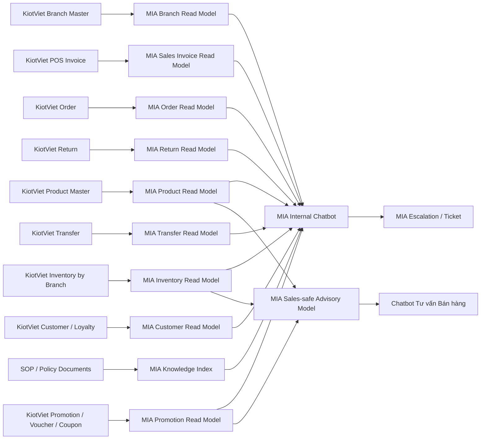

# Feature SRS: F-KV-INT-001 Tích hợp KiotViet cho Chatbot Nội bộ và Chatbot Tư vấn Bán hàng

**Status**: Draft  
**Owner**: A03 BA Agent  
**Last Updated By**: Codex CLI (GPT-5 Codex)  
**Last Reviewed By**: A01 PM Agent  
**Approval Required**: PM  
**Approved By**: -  
**Last Status Change**: 2026-04-14  
**Source of Truth**: This document  
**Blocking Reason**: Chưa chốt phạm vi chính xác giữa dữ liệu dùng cho chatbot nội bộ và dữ liệu được phép lộ cho chatbot tư vấn bán hàng  
**Module**: Integration / Source Spec  
**Phase**: PB-02 / PB-03  
**Priority**: High  
**Document Role**: Integration source specification theo hệ KiotViet; dùng làm input cho Integration SRS và MIABOS module SRS

---

## 0. Metadata

- Feature ID: `F-KV-INT-001`
- Related User Story: `US-KV-INT-001`
- Related PRD: Chưa có PRD chính thức; tạm thời kế thừa từ brief POC nội bộ
- Related Screens:
  - Màn hình chatbot nội bộ
  - Màn hình kết quả tra cứu dữ liệu từ KiotViet
  - Màn hình chi tiết nguồn dữ liệu và thời điểm cập nhật
  - Màn hình tạo escalation / ticket
  - Màn hình cấu hình sales-safe data scope cho chatbot tư vấn bán hàng
- Related APIs:
  - API đồng bộ Chi nhánh / Cửa hàng từ KiotViet
  - API đồng bộ Hàng hóa / SKU / Barcode từ KiotViet
  - API đồng bộ Tồn kho theo chi nhánh từ KiotViet
  - API đồng bộ Hóa đơn POS từ KiotViet
  - API đồng bộ Đặt hàng từ KiotViet
  - API đồng bộ Trả hàng từ KiotViet
  - API đồng bộ Chuyển hàng từ KiotViet
  - API đồng bộ Khách hàng / Loyalty / Voucher / Coupon / CTKM từ KiotViet
  - API hỏi đáp nội bộ của MIA
  - API tạo escalation / ticket của MIA
- Related Tables:
  - `kv_branch_read_model`
  - `kv_product_read_model`
  - `kv_inventory_read_model`
  - `kv_sales_invoice_read_model`
  - `kv_order_read_model`
  - `kv_return_read_model`
  - `kv_transfer_read_model`
  - `kv_customer_read_model`
  - `kv_promotion_read_model`
  - `knowledge_document_index`
  - `mia_user_scope_profile`
  - `chat_audit_log`
  - `escalation_ticket_ref`
- Related Events:
  - `kiotviet.branch.synced`
  - `kiotviet.product.synced`
  - `kiotviet.inventory.synced`
  - `kiotviet.sales.synced`
  - `kiotviet.order.synced`
  - `kiotviet.return.synced`
  - `kiotviet.transfer.synced`
  - `kiotviet.promotion.synced`
  - `mia.chatbot.answer_generated`
  - `mia.chatbot.escalation_created`
- Related Error IDs:
  - `KV-INT-001`
  - `KV-INT-002`
  - `KV-INT-003`
  - `MIA-CHAT-001`
  - `MIA-CHAT-002`

## 1. User Story

Là người dùng nội bộ của BQ thuộc các nhóm `Sales`, `Store Manager`, `Operations`, `Marketing / Trade`, hoặc `CSKH`, tôi muốn hỏi đáp bằng ngôn ngữ tự nhiên với AI trên MIA để tra cứu nhanh thông tin vận hành cửa hàng từ KiotViet như sản phẩm, tồn chi nhánh, hóa đơn POS, đơn hàng, trả hàng, chuyển hàng, khách hàng, và CTKM, nhằm giảm thời gian tra cứu trên hệ thống quản lý và hỗ trợ ra quyết định tại điểm bán nhanh hơn.

Đối với chatbot tư vấn bán hàng, tôi muốn AI sử dụng tập dữ liệu KiotViet đã được chuẩn hóa và giới hạn phạm vi để trả lời các câu hỏi về sản phẩm, trạng thái `còn hàng / hết hàng`, thông tin giá bán, CTKM, và gợi ý bán hàng ở mức an toàn, không làm lộ dữ liệu nội bộ nhạy cảm như số lượng tồn chi tiết, doanh thu chi nhánh, công nợ, hay dữ liệu khách hàng riêng tư.

## 1A. User Task Flow

| Step | User Role | Action | Task Type | Notes |
|------|-----------|--------|-----------|-------|
| 1 | Sales / Store Staff | Mở chatbot nội bộ và nhập câu hỏi về sản phẩm, tồn, hóa đơn, đơn hàng, khách hàng, CTKM | Quick Action | Điểm vào chính |
| 2 | Store Manager | Xem câu trả lời kèm nguồn dữ liệu KiotViet, chi nhánh áp dụng, và thời điểm cập nhật | Quick Action | Bắt buộc có trace |
| 3 | Operations | Hỏi về hàng chuyển, đơn pending, trả hàng, hoặc tình trạng bất thường tại chi nhánh | Quick Action | Luồng vận hành |
| 4 | Marketing / Trade | Hỏi CTKM, voucher, coupon, loyalty theo chi nhánh, nhóm hàng, thời gian hiệu lực | Quick Action | Luồng kiểm tra CTKM |
| 5 | CSKH | Hỏi lịch sử mua hàng gần đây hoặc trạng thái xử lý đơn ở mức được cấp quyền | Reporting | Luồng hỗ trợ khách hàng |
| 6 | User nội bộ | Tạo escalation / ticket nếu dữ liệu chưa rõ hoặc cần xác minh tiếp | Exception Handling | Luồng follow-up |
| 7 | Chatbot tư vấn bán hàng | Trả lời sản phẩm phù hợp, giá bán, CTKM, và `còn hàng / hết hàng` | Quick Action | Không lộ dữ liệu nội bộ |
| 8 | User nội bộ | Xem cảnh báo khi dữ liệu KiotViet chưa đồng bộ, thiếu mapping, hoặc vượt scope | Exception Handling | Bắt buộc cho trust |

## 2. Business Context

BQ đang vận hành retail đa chi nhánh và cần một lớp AI giúp nhân sự cửa hàng và quản lý vận hành hỏi đáp nhanh trên dữ liệu retail. Trong phạm vi tài liệu này:

- `KiotViet` được xem là hệ thống nguồn cho các nghiệp vụ retail / POS / cửa hàng trong scope tích hợp.
- KiotViet đang có hai lớp sử dụng chính:
  - `Hệ cho người bán`: thiên về POS, hóa đơn, bán hàng, thanh toán, trả hàng tại quầy
  - `Hệ cho người quản lý`: thiên về hàng hóa, chi nhánh, tồn kho, đơn hàng, khách hàng, CTKM, người dùng, báo cáo
- Các phòng ban thường lặp lại nhiều câu hỏi giống nhau về tồn cửa hàng, mã hàng, lịch sử bán, đơn hàng, trả hàng, khách hàng, voucher, loyalty, và CTKM.
- Nếu không có một lớp hợp nhất nghĩa nghiệp vụ, chatbot dễ trả lời rời rạc theo từng API hoặc từng màn hình KiotViet.

Mục tiêu của tính năng là xây dựng một lớp `AI access layer` nằm trên KiotViet để:

- Giảm thời gian tra cứu dữ liệu retail.
- Tăng tốc độ phản hồi tại cửa hàng và cấp quản lý.
- Giảm phụ thuộc vào key user KiotViet.
- Tạo nền cho chatbot tư vấn bán hàng dùng dữ liệu retail an toàn.

## 3. Preconditions

- KiotViet có API hoặc cơ chế kết nối đủ để expose dữ liệu cần thiết cho MIA.
- BQ đồng ý phạm vi POC ưu tiên cho `Sales`, `Store Manager`, `Operations`, `Marketing / Trade`, `CSKH`.
- MIA có cơ chế quản lý user, role, feature-scope, và data-scope riêng.
- Có danh sách rõ dữ liệu nào được dùng cho chatbot nội bộ và dữ liệu nào được phép dùng cho chatbot tư vấn bán hàng.
- Có workflow hoặc nơi tiếp nhận escalation / ticket sau chatbot.
- Có quy tắc xác định quyền xem dữ liệu theo chi nhánh, vùng, hoặc nhóm vai trò.

## 4. Postconditions

- Người dùng nội bộ có thể hỏi đáp bằng ngôn ngữ tự nhiên trên các domain retail được chốt.
- Câu trả lời hiển thị được nội dung chính, nguồn dữ liệu KiotViet, chi nhánh áp dụng, và độ mới dữ liệu.
- Nếu dữ liệu chưa chắc chắn hoặc cần xử lý tiếp, người dùng có thể tạo escalation.
- Chatbot tư vấn bán hàng chỉ dùng tập dữ liệu sales-safe để trả lời ở mức `còn hàng / hết hàng`, thông tin sản phẩm, giá bán, và CTKM phù hợp để tư vấn.

## 5. Main Flow

### 5.1 Luồng hỏi đáp nội bộ

1. Người dùng đăng nhập vào MIA.
2. MIA xác định `user`, `role`, `department`, `branch scope`, `data scope`.
3. Người dùng nhập câu hỏi tự nhiên.
4. MIA phân loại câu hỏi theo domain: `sản phẩm`, `tồn kho`, `hóa đơn POS`, `đặt hàng`, `trả hàng`, `chuyển hàng`, `khách hàng`, `CTKM`, `loyalty`, `SOP / policy`.
5. MIA truy vấn read model tương ứng; chỉ gọi live source nếu câu hỏi cần dữ liệu gần thời gian thực.
6. MIA áp dụng business rule, data scope của user, và sensitivity rule.
7. MIA trả lời kèm `nguồn`, `chi nhánh / phạm vi áp dụng`, `thời điểm cập nhật`, và `cảnh báo` nếu có.
8. Nếu user yêu cầu hoặc hệ thống phát hiện rủi ro, MIA cho phép tạo escalation / ticket.

### 5.2 Luồng chatbot tư vấn bán hàng

1. Người dùng hoặc nhân viên bán hàng hỏi về sản phẩm.
2. MIA phân loại là câu hỏi thuộc `sales-safe advisory mode`.
3. MIA chỉ truy cập sales-safe model, không dùng trực tiếp raw retail data nội bộ để trả lời.
4. Nếu hỏi về tồn, hệ thống chỉ trả lời `còn hàng` hoặc `hết hàng`.
5. Nếu hỏi về sản phẩm, giá bán, hoặc CTKM, hệ thống chỉ trả lời thông tin đã whitelist cho tư vấn bán hàng.
6. Nếu không chắc chắn dữ liệu, hệ thống ưu tiên trả lời thận trọng và hướng người dùng sang kênh xác nhận tiếp theo.

## 6. Alternate Flows

### 6.1 Dữ liệu tồn cửa hàng đã đồng bộ nhưng chưa tới ngưỡng hết hạn
- MIA trả lời từ `kv_inventory_read_model`.
- Không gọi live KiotViet.
- Hiển thị `last_synced_at`.

### 6.2 Câu hỏi cần SOP hoặc policy đi kèm dữ liệu retail
- MIA kết hợp read model với `knowledge_document_index`.
- Câu trả lời gồm dữ liệu nghiệp vụ và hướng dẫn xử lý.

### 6.3 User hỏi vượt ngoài data scope chi nhánh
- MIA không trả dữ liệu chi tiết.
- MIA thông báo người dùng không có phạm vi truy cập phù hợp.

### 6.4 Dữ liệu khách hàng hoặc CTKM thuộc nhóm nhạy cảm
- MIA chỉ trả lời mức đã được cấp quyền.
- Nếu vượt quyền, hệ thống yêu cầu user dùng kênh phù hợp hoặc tạo escalation.

## 7. Error Flows

### 7.1 KiotViet không phản hồi hoặc timeout
- MIA dùng read model gần nhất nếu còn trong ngưỡng cho phép.
- Nếu vượt ngưỡng, trả lời có cảnh báo dữ liệu có thể không còn mới.

### 7.2 Không map được mã hàng, barcode, khách hàng, hoặc chi nhánh
- MIA gợi ý danh sách gần đúng theo mã hoặc tên.
- Nếu vẫn không xác định được, trả lỗi có hướng dẫn nhập lại.

### 7.3 Dữ liệu giữa các module retail xung đột
- MIA không tự suy diễn kết luận cuối cùng nếu xung đột chưa được rule hóa.
- Hệ thống trả cảnh báo và đề nghị tạo escalation.

## 8. State Machine

### 8.1 Trạng thái dữ liệu tích hợp
`Pending Sync` -> `Synced` -> `Stale` -> `Needs Review`

### 8.2 Trạng thái escalation / ticket
`Draft` -> `Submitted` -> `Assigned` -> `Resolved` -> `Closed`

## 9. UX / Screen Behavior

- Câu trả lời phải hiển thị rõ `kết luận chính` trước, `chi tiết hỗ trợ` sau.
- Luôn hiển thị `nguồn dữ liệu`, `chi nhánh / phạm vi áp dụng`, và `thời điểm cập nhật`.
- Nếu dữ liệu có xung đột hoặc chưa chắc chắn, phải có badge cảnh báo rõ ràng.
- Luồng tạo escalation phải lấy được ngay ngữ cảnh gồm `câu hỏi`, `câu trả lời`, `nguồn`, `user`, `chi nhánh`, `thời điểm`.
- Chatbot tư vấn bán hàng không được hiển thị số lượng tồn chi tiết, doanh thu chi nhánh, công nợ, hoặc dữ liệu khách hàng nhạy cảm.

## 10. Role / Permission Rules

- Không phụ thuộc hoàn toàn vào phân quyền gốc của KiotViet như điều kiện bắt buộc cho chatbot.
- MIA tự quản lý `user`, `role`, `feature permission`, và `data scope`.
- KiotViet đóng vai trò là nguồn dữ liệu nghiệp vụ retail; không đóng vai trò là nguồn phân quyền cuối cùng cho chatbot.
- Cần cấu hình trên MIA tối thiểu các lớp sau:
  - `Phòng ban / role`
  - `Phạm vi chi nhánh / cửa hàng / vùng`
  - `Mức độ nhạy cảm dữ liệu`
  - `Quyền xem dữ liệu khách hàng`
  - `Quyền tạo escalation`

## 11. Business Rules

1. KiotViet là nguồn dữ liệu retail trong phạm vi tài liệu này.
2. MIA không được thiết kế như bản sao đầy đủ của KiotViet.
3. MIA chỉ lưu các read model tối thiểu cần cho AI hỏi đáp, audit, và workflow follow-up.
4. Với chatbot tư vấn bán hàng, dữ liệu tồn chỉ được biểu diễn ở mức `còn hàng / hết hàng`.
5. Nếu dữ liệu vượt quá ngưỡng freshness cho phép, chatbot phải nói rõ dữ liệu có thể đã cũ.
6. Nếu người dùng hỏi vượt ngoài scope, hệ thống không được trả về dữ liệu chi tiết.
7. Dữ liệu khách hàng, loyalty, công nợ, doanh thu chi nhánh là dữ liệu nhạy cảm và phải có sensitivity rule.
8. Câu trả lời nội bộ nên ưu tiên dạng `kết luận + bằng chứng + hành động tiếp theo`.

## 12. API Contract Excerpt + Canonical Links

### 12.1 Nguyên tắc ownership API
- `KiotViet / BQ` sở hữu nguồn dữ liệu retail.
- `MIA BOS` sở hữu connector, scheduler, read model, AI query API, và escalation API.
- Không cho LLM gọi trực tiếp API KiotViet.

### 12.2 Nhóm API tích hợp tối thiểu
- `GET /kiotviet/branches`
- `GET /kiotviet/products`
- `GET /kiotviet/inventory`
- `GET /kiotviet/invoices`
- `GET /kiotviet/orders`
- `GET /kiotviet/returns`
- `GET /kiotviet/transfers`
- `GET /kiotviet/customers`
- `GET /kiotviet/promotions`
- `POST /mia/chat/query`
- `POST /mia/escalations`

## 13. Event / Webhook Contract Excerpt + Canonical Links

- `kiotviet.branch.synced`: Phát sau khi đồng bộ xong danh sách chi nhánh.
- `kiotviet.product.synced`: Phát sau khi đồng bộ hàng hóa.
- `kiotviet.inventory.synced`: Phát sau khi đồng bộ tồn kho.
- `kiotviet.sales.synced`: Phát sau khi đồng bộ hóa đơn POS.
- `kiotviet.order.synced`: Phát sau khi đồng bộ đơn hàng.
- `kiotviet.return.synced`: Phát sau khi đồng bộ trả hàng.
- `kiotviet.transfer.synced`: Phát sau khi đồng bộ chuyển hàng.
- `kiotviet.promotion.synced`: Phát sau khi đồng bộ CTKM / voucher / loyalty.
- `mia.chatbot.answer_generated`: Lưu audit cho truy vết.
- `mia.chatbot.escalation_created`: Ghi nhận phát sinh xử lý tiếp theo.

## 14. Data / DB Impact Excerpt + Canonical Links

### 14.1 Mô hình tích hợp tổng quan giữa KiotViet và MIA BOS

### 14.2 Bảng giải thích chi tiết thông tin tích hợp

| Hạng mục tích hợp | Module nguồn | Module đích trên MIA | Chiều tích hợp | Tần suất | MIA có lưu dữ liệu không | Mục đích | Ghi chú logic |
|-------------------|--------------|----------------------|----------------|----------|--------------------------|----------|---------------|
| Chi nhánh / cửa hàng | KiotViet Branch | `kv_branch_read_model` | KiotViet -> MIA | 15-60 phút hoặc on-change | Có | Scope, mapping chi nhánh, giải thích câu trả lời | Dùng cho phân quyền và audit |
| Danh mục sản phẩm | KiotViet Product | `kv_product_read_model` | KiotViet -> MIA | 15-30 phút hoặc on-change | Có | Tra cứu sản phẩm, SKU, barcode, thuộc tính | Không cần sao chép mọi field kỹ thuật |
| Tồn kho theo chi nhánh | KiotViet Inventory | `kv_inventory_read_model` | KiotViet -> MIA | 1-5 phút | Có | Hỏi đáp tồn cửa hàng nội bộ | Rất quan trọng cho retail ops |
| Hóa đơn POS | KiotViet Invoice | `kv_sales_invoice_read_model` | KiotViet -> MIA | 1-5 phút | Có, rút gọn | Trả lời câu hỏi bán hàng, giao dịch gần đây | Không cần mirror full payload |
| Đặt hàng | KiotViet Order | `kv_order_read_model` | KiotViet -> MIA | 1-5 phút | Có | Theo dõi đơn pending, giữ hàng, xử lý bán | Dùng cho sales và store manager |
| Trả hàng | KiotViet Return | `kv_return_read_model` | KiotViet -> MIA | 1-5 phút | Có | Giải thích đổi trả, ngoại lệ, tác động vận hành | Hữu ích cho CSKH và quản lý |
| Chuyển hàng | KiotViet Transfer | `kv_transfer_read_model` | KiotViet -> MIA | 5-15 phút | Có | Theo dõi điều chuyển giữa chi nhánh | Quan trọng cho operations |
| Khách hàng / loyalty | KiotViet Customer | `kv_customer_read_model` | KiotViet -> MIA | 5-15 phút | Có, có kiểm soát | Hỗ trợ sales nội bộ và CSKH | Phải qua sensitivity rule |
| CTKM / voucher / coupon | KiotViet Promotion | `kv_promotion_read_model` | KiotViet -> MIA | 5-15 phút | Có | Hỏi đáp CTKM và tư vấn bán hàng | Chỉ whitelist phần an toàn |
| SOP / policy | Tài liệu được duyệt | `knowledge_document_index` | Tài liệu -> MIA | Manual publish | Có | Giải thích nghiệp vụ và hướng dẫn xử lý | Chỉ index tài liệu đã duyệt |
| User / role / scope | Cấu hình trên MIA | `mia_user_scope_profile` | MIA nội bộ | On-change | Có | Kiểm soát phạm vi chatbot | Không phụ thuộc hoàn toàn vào KiotViet |
| Audit câu trả lời | MIA Chat Layer | `chat_audit_log` | MIA nội bộ | Realtime | Có | Truy vết, kiểm tra chất lượng trả lời | Cần lưu tối thiểu câu hỏi, nguồn, kết luận |
| Escalation / ticket | MIA Workflow hoặc hệ thống nhận việc | `escalation_ticket_ref` | MIA -> Workflow | Realtime | Có, mức tham chiếu | Theo dõi xử lý sau chatbot | Không cần sao chép toàn bộ ticket payload |

### 14.3 MIA nên lưu gì và không nên lưu gì

#### MIA nên lưu
- Read model rút gọn cho các domain retail cần hỏi đáp.
- Metadata về `source system`, `branch scope`, `last_synced_at`, `freshness status`.
- User scope của MIA.
- Audit câu hỏi, câu trả lời, nguồn đã dùng.
- Tham chiếu escalation / ticket.
- Chỉ mục tài liệu nghiệp vụ đã duyệt.

#### MIA không nên lưu
- Toàn bộ lịch sử transaction chi tiết của KiotViet nếu chưa phục vụ trực tiếp cho chatbot.
- Toàn bộ object gốc của KiotViet theo kiểu mirror 1:1.
- Toàn bộ log kỹ thuật hoặc trường hệ thống không phục vụ AI.
- Dữ liệu nhạy cảm không phục vụ hỏi đáp, ví dụ doanh thu chi nhánh chi tiết, công nợ chi tiết, dữ liệu khách hàng riêng tư, trừ khi có phase riêng được phê duyệt.

### 14.4 Thông tin chi tiết các trường tích hợp

#### a. Branch / store
| Trường | Bắt buộc | Mục đích |
|--------|----------|----------|
| `branch_id` | Có | Khóa định danh chi nhánh |
| `branch_code` | Có | Mã chi nhánh |
| `branch_name` | Có | Hiển thị dễ hiểu |
| `status` | Có | Biết chi nhánh còn hoạt động hay không |
| `region` | Nên có | Phân nhóm quản trị |
| `address` | Không bắt buộc | Hiển thị ngữ cảnh |
| `last_updated_at` | Có | Độ mới dữ liệu |

#### b. Product master
| Trường | Bắt buộc | Mục đích |
|--------|----------|----------|
| `product_id` | Có | Định danh nguồn |
| `item_code` | Có | Khóa tra cứu |
| `sku` | Có | Hỏi đáp theo SKU |
| `barcode` | Nên có | Tra cứu nhanh tại cửa hàng |
| `item_name` | Có | Hiển thị tên sản phẩm |
| `category` | Có | Phân nhóm câu hỏi |
| `brand` | Nên có | Tư vấn bán hàng |
| `color` | Nên có | Tư vấn sản phẩm |
| `size` | Nên có | Tư vấn sản phẩm |
| `status` | Có | Biết còn kinh doanh hay không |
| `image_url` | Nên có | Hỗ trợ tư vấn bán hàng |

#### c. Inventory
| Trường | Bắt buộc | Mục đích |
|--------|----------|----------|
| `item_code` | Có | Liên kết sản phẩm |
| `branch_id` | Có | Xác định chi nhánh |
| `branch_name` | Nên có | Dễ đọc cho người dùng |
| `on_hand_qty` | Có | Tồn hiện có |
| `reserved_qty` | Nên có | Tồn đã giữ |
| `available_qty` | Có | Tồn khả dụng nội bộ |
| `last_updated_at` | Có | Độ mới dữ liệu |

#### d. Sales invoice
| Trường | Bắt buộc | Mục đích |
|--------|----------|----------|
| `invoice_id` | Có | Mã hóa đơn |
| `branch_id` | Có | Chi nhánh phát sinh |
| `sold_by` | Nên có | Nhân viên bán |
| `customer_id` | Nên có | Liên kết khách hàng |
| `invoice_total` | Có | Giá trị hóa đơn |
| `status` | Có | Trạng thái hóa đơn |
| `created_at` | Có | Thời điểm tạo |
| `last_updated_at` | Có | Thời điểm cập nhật |

#### e. Order
| Trường | Bắt buộc | Mục đích |
|--------|----------|----------|
| `order_id` | Có | Định danh đơn |
| `branch_id` | Có | Chi nhánh xử lý |
| `customer_id` | Nên có | Liên kết khách hàng |
| `status` | Có | Trạng thái đơn |
| `order_total` | Có | Giá trị đơn |
| `created_at` | Có | Thời điểm tạo |
| `last_updated_at` | Có | Thời điểm cập nhật |

#### f. Return
| Trường | Bắt buộc | Mục đích |
|--------|----------|----------|
| `return_id` | Có | Mã trả hàng |
| `invoice_id` | Nên có | Liên kết hóa đơn gốc |
| `branch_id` | Có | Chi nhánh phát sinh |
| `customer_id` | Nên có | Liên kết khách hàng |
| `return_total` | Có | Giá trị trả hàng |
| `status` | Có | Trạng thái xử lý |
| `created_at` | Có | Thời điểm tạo |

#### g. Transfer
| Trường | Bắt buộc | Mục đích |
|--------|----------|----------|
| `transfer_id` | Có | Mã chuyển hàng |
| `from_branch_id` | Có | Chi nhánh đi |
| `to_branch_id` | Có | Chi nhánh đến |
| `item_code` | Có | Hàng hóa |
| `qty` | Có | Số lượng |
| `status` | Có | Trạng thái |
| `created_at` | Có | Thời điểm tạo |

#### h. Customer / loyalty
| Trường | Bắt buộc | Mục đích |
|--------|----------|----------|
| `customer_id` | Có | Định danh khách hàng |
| `customer_code` | Nên có | Mã khách hàng |
| `customer_name` | Có | Hiển thị |
| `phone` | Nên có | Tra cứu |
| `customer_group` | Nên có | Phân nhóm |
| `loyalty_points` | Không bắt buộc | Hỗ trợ loyalty |
| `total_spent` | Không bắt buộc | Chỉ cho quyền phù hợp |
| `last_purchase_at` | Nên có | Hỗ trợ CSKH |

#### i. Promotion
| Trường | Bắt buộc | Mục đích |
|--------|----------|----------|
| `promo_id` | Có | Định danh CTKM |
| `promo_name` | Có | Hiển thị CTKM |
| `promo_type` | Có | Loại CTKM |
| `discount_type` | Có | Phần trăm / số tiền / quà tặng |
| `discount_value` | Có | Giá trị khuyến mãi |
| `apply_scope` | Có | Phạm vi áp dụng |
| `branch_scope` | Nên có | Chi nhánh áp dụng |
| `item_scope` | Nên có | Mặt hàng áp dụng |
| `start_at` | Có | Ngày bắt đầu |
| `end_at` | Có | Ngày kết thúc |
| `status` | Có | Trạng thái |
| `source_system` | Có | Truy nguồn |

### 14.5 Nghiệp vụ hỏi đáp của các phòng ban

| Đối tượng sử dụng | Module hỏi đáp chính | Những câu hỏi thường gặp | Dữ liệu cần lấy |
|------------------|----------------------|---------------------------|-----------------|
| Sales cửa hàng | Product, Inventory, Invoice, Order, Promotion | `Mẫu này còn hàng không?`, `Đơn này đang ở trạng thái nào?`, `Có CTKM nào không?` | Product, Inventory, Order, Promotion |
| Store Manager | Inventory, Invoice, Return, Transfer | `Chi nhánh hôm nay bán thế nào?`, `Mã này trả hàng nhiều không?`, `Hàng đang chuyển đến đâu?` | Inventory, Invoice, Return, Transfer |
| Operations | Inventory, Transfer, Order | `Chi nhánh nào đang thiếu hàng?`, `Phiếu chuyển này đã nhận chưa?` | Inventory, Transfer, Order |
| Marketing / Trade | Promotion, Product, Customer Group | `CTKM nào đang chạy theo chi nhánh?`, `Nhóm khách nào được áp voucher?` | Promotion, Product, Customer |
| CSKH | Customer, Invoice, Order, Return | `Khách này vừa mua gì?`, `Đơn xử lý đến đâu rồi?`, `Có phát sinh đổi trả không?` | Customer, Invoice, Order, Return |
| Quản lý vận hành | Tổng hợp nhiều module | `Chi nhánh nào có nhiều trả hàng?`, `Câu hỏi nào đang phải escalation nhiều?` | Audit, Invoice, Return, Escalation |
| Chatbot tư vấn bán hàng | Sales-safe Product, Availability, Promotion | `Sản phẩm này còn hàng không?`, `Giá bán là bao nhiêu?`, `Có khuyến mãi gì không?` | Product rút gọn, Availability rút gọn, Promotion đã whitelist |

## 15. Validation Rules

1. Mã hàng hoặc barcode phải map được về `item_code` hợp lệ trước khi truy vấn dữ liệu nghiệp vụ.
2. Nếu dữ liệu tồn quá ngưỡng freshness, phải gắn cảnh báo trước khi trả lời.
3. Chatbot tư vấn bán hàng không được hiển thị số lượng tồn kho chi tiết.
4. Nếu không map được mã hàng hoặc khách hàng, bắt buộc gợi ý lại hoặc yêu cầu người dùng nhập rõ hơn.
5. Nếu user không có scope phù hợp, hệ thống chỉ trả về thông báo giới hạn truy cập.
6. Dữ liệu khách hàng và loyalty chỉ được hiển thị theo sensitivity level phù hợp.

## 16. Error Codes

| Error ID | Mô tả | Hành vi mong muốn |
|----------|------|-------------------|
| `KV-INT-001` | Không đọc được dữ liệu từ KiotViet | Fallback read model hoặc cảnh báo lỗi nguồn |
| `KV-INT-002` | Dữ liệu KiotViet trả về thiếu trường bắt buộc | Bỏ qua bản ghi lỗi, log cảnh báo |
| `KV-INT-003` | Không map được chi nhánh / mã hàng / barcode | Gợi ý gần đúng hoặc yêu cầu nhập lại |
| `MIA-CHAT-001` | Không xác định được intent hoặc domain câu hỏi | Yêu cầu người dùng nhập lại rõ hơn |
| `MIA-CHAT-002` | User vượt ngoài data scope | Không trả dữ liệu chi tiết |

## 17. Non-Functional Requirements

- Truy vấn chatbot nội bộ nên có thời gian phản hồi mục tiêu dưới `5 giây` với câu hỏi tra cứu read model.
- Dữ liệu trả lời phải kèm trace tối thiểu gồm `source`, `last_synced_at`, `branch / scope áp dụng`.
- Tất cả câu hỏi và câu trả lời tích hợp phải có audit log.
- Kiến trúc phải cho phép mở rộng thêm domain retail mà không phải mirror lại toàn bộ KiotViet.
- Cần có cơ chế retry và dead-letter cho job đồng bộ thất bại.

## 18. Acceptance Criteria

1. Sales có thể hỏi về sản phẩm, tồn, đơn hàng, và CTKM trong phạm vi được cấp.
2. Store Manager có thể hỏi về hóa đơn POS, trả hàng, chuyển hàng, và tình trạng vận hành chi nhánh.
3. Operations có thể hỏi về tồn theo chi nhánh, chuyển hàng, và đơn pending.
4. Marketing / Trade có thể hỏi CTKM, voucher, và phạm vi áp dụng theo chi nhánh hoặc nhóm hàng.
5. CSKH có thể hỏi lịch sử mua hàng và trạng thái đơn trong phạm vi được cấp.
6. Mỗi câu trả lời nội bộ đều hiển thị nguồn dữ liệu và thời điểm cập nhật.
7. Người dùng có thể tạo escalation / ticket trực tiếp từ một câu trả lời.
8. Chatbot tư vấn bán hàng chỉ trả lời ở mức an toàn cho bán hàng và không lộ dữ liệu nội bộ nhạy cảm.
9. MIA không lưu mirror 1:1 toàn bộ object của KiotViet.

## 19. Test Scenarios

- Sales hỏi `Mã BQ123 còn hàng không ở chi nhánh Nguyễn Trãi?`
- Sales hỏi `Mã BQ123 đang áp dụng CTKM gì?`
- Store Manager hỏi `Hôm nay chi nhánh này có bao nhiêu hóa đơn và trả hàng nào đáng chú ý?`
- Operations hỏi `Mã BQ123 đang chuyển từ chi nhánh nào sang chi nhánh nào?`
- CSKH hỏi `Khách hàng này vừa mua đơn nào gần nhất và đơn đang ở trạng thái gì?`
- User không có quyền hỏi dữ liệu ngoài chi nhánh được cấp.
- Chatbot tư vấn bán hàng hỏi `Sản phẩm này còn hàng không?` và chỉ nhận về `còn hàng / hết hàng`.

## 20. Observability

- Theo dõi số lượng job sync thành công / thất bại theo từng domain.
- Theo dõi độ trễ đồng bộ theo từng nguồn KiotViet.
- Theo dõi tỷ lệ câu hỏi có thể trả lời ngay so với tỷ lệ phải escalation.
- Theo dõi top câu hỏi theo phòng ban.
- Theo dõi số lượng câu trả lời có cảnh báo dữ liệu stale hoặc vượt scope.
- Theo dõi các domain retail bị hỏi nhiều nhưng chưa đủ dữ liệu.

## 21. Rollout / Feature Flag

- Giai đoạn 1: Bật cho nhóm nội bộ pilot gồm Sales, Store Manager, Operations, Marketing / Trade, CSKH.
- Giai đoạn 2: Mở rộng chatbot tư vấn bán hàng với sales-safe data model.
- Giai đoạn 3: Bổ sung thêm domain hoặc quyền sâu hơn sau khi ổn định sensitivity rule và escalation routing.

## 22. Open Questions

### 22.1 Bộ câu hỏi cần trao đổi với khách hàng

1. Phạm vi chính xác các chi nhánh nào sẽ vào pilot phase 1?
2. Dữ liệu nào từ KiotViet được phép dùng cho chatbot tư vấn bán hàng ngoài `còn hàng / hết hàng`?
3. Có cho phép chatbot tư vấn bán hàng trả `giá bán` và `CTKM` hay chỉ nội bộ mới được xem?
4. Có cần mở dữ liệu khách hàng cho CSKH và Store Manager hay giới hạn theo vai trò hẹp hơn?
5. Escalation sau chatbot sẽ giữ trong MIABOS internal queue hay đẩy sang ticket/workflow system nào khác do BQ xác nhận sau?
6. Dữ liệu nào được xem là nhạy cảm trong KiotViet: công nợ, doanh thu, loyalty, voucher, lịch sử mua hàng, hay tất cả?
7. Có cần hỗ trợ câu hỏi về báo cáo quản lý chi nhánh trong phase 1 hay để phase sau?
8. Có danh mục tài liệu SOP / policy nào đã duyệt để import vào knowledge layer chưa?
9. Ai là owner nghiệp vụ xác nhận khi chatbot trả lời sai hoặc dữ liệu retail xung đột?
10. Có cần hỗ trợ thêm supplier / receiving trong POC hay để phase sau?

### 22.2 Open Questions kỹ thuật

- KiotViet sẽ được kết nối qua public API, private integration, hay middleware trung gian?
- Có giới hạn rate limit, pagination, hoặc quota nào ảnh hưởng đến near-real-time sync không?
- Có webhook / event từ KiotViet hay chỉ poll theo lịch?
- Mức độ sạch dữ liệu barcode, SKU, branch code hiện nay ra sao?
- Có cần lưu snapshot ngày cho hóa đơn, tồn, và trả hàng để phục vụ audit hay chỉ cần last-state read model?

## 23. Definition of Done

- Có SRS được PM review.
- Có danh sách domain tích hợp tối thiểu và trường dữ liệu tối thiểu.
- Có quyết định rõ về những gì MIA lưu và không lưu.
- Có bộ câu hỏi discovery để chốt phần còn mở với khách hàng.
- Có thể dùng tài liệu này để mở downstream UXUI và technical design.

## 24. Ready-for-UXUI Checklist

- [x] `User Story` có problem, trigger, happy path, dependencies, và AC context
- [x] User Task Flow đủ rõ cho screen/state design
- [x] Business rules và permission rules có thể test được
- [x] Main, alternate, và error flows đã được mô tả
- [x] State machine đã nêu rõ hoặc giản lược phù hợp
- [x] Data và event dependencies đã được linked ở mức SRS
- [x] Open questions ảnh hưởng đến UXUI đã được liệt kê rõ

## 25. Ready-for-FE-Preview Checklist

- [ ] User Story được approve và linked trong Sprint Backlog
- [ ] UXUI spec tồn tại và trích dẫn SRS này
- [ ] Không còn mâu thuẫn giữa SRS và UXUI
- [ ] Mock / stub data assumptions cho FE Preview được chốt
- [ ] PM mở rõ trạng thái `FE Preview`

## 26. Ready-for-BE / Integration Promotion Checklist

- [ ] FE Preview đã được review
- [ ] Feedback thay đổi hành vi đã được cập nhật ngược về SRS / UXUI
- [ ] Integration Spec hoặc technical pack đã align với SRS này
- [ ] UXUI spec tồn tại và trích dẫn SRS này
- [ ] Không còn mâu thuẫn giữa SRS, UXUI, và technical handoff
- [ ] PM xác nhận trạng thái `Build Ready`
