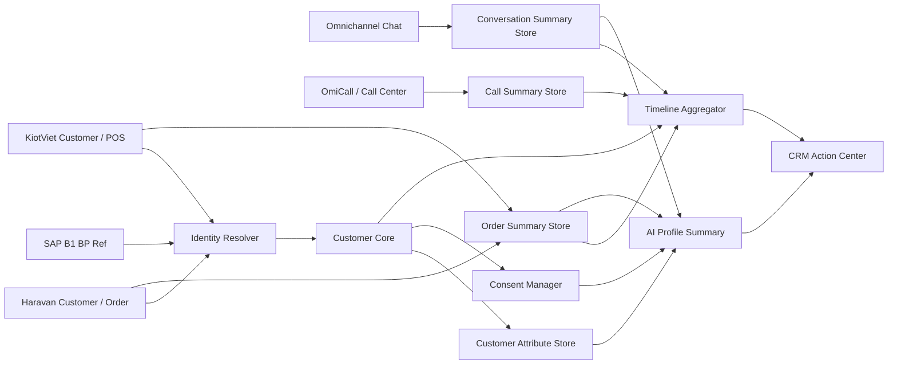
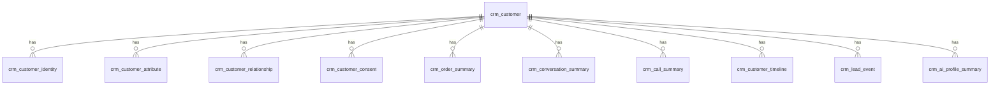

# Feature SRS: F-M06-CRM-001 Customer and CRM

**Status**: Draft
**Owner**: A03 BA Agent
**Last Updated By**: Codex CLI (GPT-5 Codex)
**Last Reviewed By**: A01 PM Agent
**Approval Required**: PM
**Approved By**: -
**Last Status Change**: 2026-04-15
**Source of Truth**: This document
**Blocking Reason**: Cần chốt consent legal source, write-back scope từ MIA sang SAP/channel, duplicate merge governance, và phase ưu tiên cho call history / action center
**Module**: M06
**Phase**: PB-02 / PB-03
**Priority**: High
**Document Role**: SRS chi tiết cho module Customer and CRM, nền tảng hồ sơ khách hàng 360 của MIABOS

---

## 0. Metadata

- Feature ID: `F-M06-CRM-001`
- Related User Story: `US-M06-CRM-001`
- Related Screens:
  - Customer 360 profile
  - Customer timeline
  - Customer identity merge / conflict review
  - CRM enrichment panel
  - Customer relationship panel
  - Customer order history
  - Customer conversation history
  - Customer call history
  - Customer AI summary / next-best-action
  - Lead / remarketing context
- Related APIs:
  - `GET /mia/customers/{customer_id}`
  - `POST /mia/customers/profile`
  - `PATCH /mia/customers/{customer_id}`
  - `POST /mia/customers/resolve`
  - `POST /mia/customers/merge`
  - `GET /mia/customers/{customer_id}/timeline`
  - `GET /mia/customers/{customer_id}/orders`
  - `GET /mia/customers/{customer_id}/conversations`
  - `GET /mia/customers/{customer_id}/calls`
  - `POST /mia/leads`
  - `POST /mia/remarketing/triggers`
- Related Tables:
  - `crm_customer`
  - `crm_customer_identity`
  - `crm_customer_attribute`
  - `crm_customer_relationship`
  - `crm_customer_segment`
  - `crm_customer_consent`
  - `crm_customer_timeline`
  - `crm_order_summary`
  - `crm_conversation_summary`
  - `crm_call_summary`
  - `crm_lead_event`
  - `crm_ai_profile_summary`
  - `har_customer_read_model`
  - `kv_customer_read_model`
  - `sap_business_partner_ref`
- Related Events:
  - `mia.customer.profile.created`
  - `mia.customer.profile.updated`
  - `mia.customer.identity.resolved`
  - `mia.customer.identity.conflict_detected`
  - `mia.customer.timeline.updated`
  - `mia.customer.segment.updated`
  - `mia.remarketing.triggered`
- Related Error IDs:
  - `CRM-001`
  - `CRM-002`
  - `CRM-003`
  - `CRM-004`

## 0B. Integration Source Map

| Data Domain | Source System | Direction | Notes |
|---|---|---|---|
| Customer master, thông tin khách hàng cơ bản | SAP B1 | Read | Nguồn cho business partner / customer code |
| Khách hàng ecommerce, loyalty, đơn online | Haravan | Read | Nguồn cho customer profile phía online và loyalty |
| Khách hàng tại cửa hàng, CRM POS | KiotViet | Read | Nguồn cho customer tại điểm bán |
| Chính sách loyalty, điểm tích lũy, hạng thành viên | MIABOS Knowledge Center (M08) | Read | Policy layer cho CRM rules |
| CRM customer master, lead, enrichment attributes | MIABOS internal DB | Read/Write | MIABOS là master của CRM layer; source là read-only |

## 0C. POC Implementation Framing

### 0C.1 Mục tiêu POC

POC của `Customer 360 CRM` không nhằm xây full CRM enterprise ngay từ đầu. POC phải đủ để:

- định danh khách hàng đa nguồn trong một hồ sơ hợp nhất
- giúp Sales, CSKH, Marketing, và AI nhìn được cùng một ngữ cảnh khách hàng
- hỗ trợ tư vấn bán hàng, chăm sóc sau bán, remarketing cơ bản, và hỏi đáp AI có ngữ cảnh
- tạo nền để MIA BOS có thể phát sinh lead, nhận đơn từ chatbot, và đồng bộ ngược về các hệ thống lõi

### 0C.2 Phạm vi POC bắt buộc

POC phase 1 bắt buộc có:

- `Customer Core Profile`
- `Identity Mapping`
- `Customer Attribute / Preference`
- `Order Summary`
- `Conversation Summary`
- `Customer Timeline`
- `Consent + Opt-out`
- `AI Summary + Next Best Action`

POC phase 1 chưa bắt buộc full sâu:

- call recording storage
- transcript raw dài hạn
- loyalty engine riêng
- campaign automation phức tạp nhiều nhánh
- duplicate merge tự động bằng AI confidence cao

### 0C.3 Quyết định triển khai chính

- `MIA BOS` là master của lớp `CRM customer profile`
- `SAP B1` vẫn là master của `business partner ref`, `product`, `inventory`, và các transaction ERP
- `Haravan / KiotViet` vẫn là master của các customer/order phát sinh trên từng kênh
- `MIA BOS` lưu `summary + CRM context + identity map + enrichment`, không mirror full payload của từng hệ nguồn
- `Order / conversation / call` ưu tiên lưu `summary record` để phục vụ AI, CRM, Sales, CSKH
- `Raw data` chỉ lưu khi thật sự cần cho nghiệp vụ, audit, hoặc policy

## 1. User Story

Là Sales, CSKH, Marketing, Store Manager, hoặc AI bán hàng, tôi muốn MIABOS có hồ sơ khách hàng 360 hợp nhất để xem được thông tin định danh, sở thích, nhu cầu, lịch sử mua hàng, lịch sử chat, lịch sử gọi điện, lịch sử chăm sóc, quan hệ dữ liệu giữa các mã khách hàng trên nhiều hệ thống, và gợi ý hành động tiếp theo, nhằm tư vấn chính xác hơn, chăm sóc tốt hơn, remarketing đúng tệp hơn, và không phải tra nhiều hệ thống rời rạc.

## 1A. User Task Flow

| Step | User Role | Action | Task Type | Notes |
|------|-----------|--------|-----------|-------|
| 1 | Sales / CSKH / AI | Tìm khách bằng số điện thoại, tên, mã khách, mã đơn, social profile, hoặc channel ref | Quick Action | Điểm vào chính |
| 2 | Hệ thống | Resolve identity qua CRM, Haravan, KiotViet, SAP ref, chat channel, call history | Quick Action | Cần deterministic trước, fuzzy sau |
| 3 | User / AI | Xem Customer 360 gồm hồ sơ, segment, consent, timeline, order/chat/call summary | Reporting | View trung tâm |
| 4 | Sales / AI | Cập nhật sở thích, size giày, nhu cầu, ngân sách, khu vực, mục đích mua | Quick Action | CRM enrichment |
| 5 | CSKH | Xem lịch sử đơn, chat, call, ticket, đổi trả để phản hồi khách | Quick Action | Customer care |
| 6 | Marketing | Tạo tệp remarketing hoặc trigger chăm sóc từ segment / hành vi / ngày sinh | Bulk Operation | Campaign use |
| 7 | Manager | Xem conflict / duplicate / consent issue / customer health | Reporting | Governance |

## 2. Business Context

MIABOS được định vị là `CRM + AI Sales / CSKH operating layer` cho Giày BQ. Trong bán lẻ nhiều kênh, dữ liệu khách hàng thường bị phân tán:

- khách để lại thông tin trên chatbot / social
- khách mua online trên Haravan
- khách mua tại cửa hàng qua KiotViet
- khách có thông tin ERP / business partner trên SAP B1
- khách gọi điện qua OmiCall hoặc tổng đài
- khách chat qua Facebook, Zalo, Website, hoặc kênh nội bộ

Nếu không có Customer 360, nhân viên và AI sẽ không biết khách là ai, đã mua gì, từng hỏi gì, đang có nhu cầu gì, có được phép remarketing không, hoặc nên chăm sóc bằng kịch bản nào.

Module Customer and CRM có mục tiêu trở thành lõi CRM của MIABOS:

- lưu và quản lý hồ sơ khách hàng ở lớp CRM
- hợp nhất định danh khách hàng đa hệ thống
- lưu thông tin phục vụ Marketing, Sales, CSKH
- cung cấp customer context cho Internal AI Chat và Sales Advisor AI
- không thay thế ERP master của SAP B1 ở các nghiệp vụ kế toán / kho / hạch toán

## 3. Preconditions

- Có chính sách dữ liệu cá nhân và consent tối thiểu cho việc lưu, chăm sóc, remarketing.
- Có quy tắc customer identity resolution phase 1.
- Có nguồn order summary từ M05 hoặc các read model Haravan / KiotViet / SAP.
- Có nguồn conversation summary từ hệ thống chat / omni-channel.
- Có nguồn call summary từ OmiCall hoặc call center nếu BQ muốn bật call history.
- Có access-control rule cho trường nhạy cảm như điện thoại, địa chỉ, ghi chú nội bộ, lịch sử chăm sóc.

## 4. Postconditions

- Tạo / tìm / xem / cập nhật được hồ sơ khách hàng 360.
- Mỗi hồ sơ có thể liên kết nhiều identity từ nhiều nguồn.
- User có thể xem lịch sử đơn hàng, chat, gọi điện, chăm sóc, và ticket ở mức summary.
- AI có thể dùng customer context để tư vấn, chăm sóc, remarketing, hoặc handoff.
- Dữ liệu khách hàng có audit, consent, và nguồn dữ liệu rõ ràng.

## 5. Main Flow

### 5.1 Tìm và mở Customer 360

1. User nhập số điện thoại, tên, mã khách, mã đơn, hoặc social profile.
2. MIA gọi `customer resolve` để tìm các identity liên quan.
3. Nếu chỉ có một match tin cậy, hệ thống mở Customer 360.
4. Nếu có nhiều match, hệ thống hiển thị danh sách ứng viên và cảnh báo conflict.
5. Customer 360 hiển thị profile, consent, segment, attributes, timeline, order history, chat history, call history, và AI summary.

### 5.2 Tạo hồ sơ khách hàng mới

1. User hoặc AI thu thập thông tin tối thiểu: tên / số điện thoại / kênh liên hệ.
2. Hệ thống kiểm tra duplicate theo phone, normalized phone, email, social id, channel ref.
3. Nếu không trùng, tạo `crm_customer`.
4. Ghi identity nguồn vào `crm_customer_identity`.
5. Ghi event `mia.customer.profile.created`.

### 5.3 Enrich hồ sơ qua hội thoại AI

1. AI hỏi khai thác nhu cầu: size giày, giới tính, sở thích, mục đích mua, ngân sách, khu vực.
2. User trả lời.
3. AI đề xuất cập nhật thuộc tính CRM.
4. Hệ thống lưu thuộc tính vào `crm_customer_attribute` kèm `source`, `confidence`, `collected_at`.
5. AI dùng thuộc tính này cho gợi ý sản phẩm và chăm sóc sau đó.

### 5.4 Xem timeline khách hàng

1. User mở tab Timeline.
2. Hệ thống lấy event từ đơn hàng, chat, call, lead, ticket, remarketing.
3. Timeline gom theo ngày / kênh / loại sự kiện.
4. User có thể lọc theo `order`, `chat`, `call`, `ticket`, `campaign`, `note`.

### 5.5 Trigger remarketing / chăm sóc

1. Marketing hoặc AI chọn khách / segment phù hợp.
2. Hệ thống kiểm tra consent và opt-out.
3. Nếu hợp lệ, tạo trigger chăm sóc.
4. Ghi event `mia.remarketing.triggered`.

## 6. Alternate Flows

### 6.1 Anonymous lead

- Khách chưa để lại số điện thoại nhưng có chat profile.
- Hệ thống tạo lead tạm với `anonymous_customer_id`.
- Khi có phone/email, hệ thống merge vào customer chính.

### 6.2 Customer có nhiều mã ở nhiều hệ thống

- Một khách có `mia_customer_id`, `sap_bp_code`, `haravan_customer_id`, `kiotviet_customer_id`, `facebook_psid`, `zalo_user_id`.
- MIA không ép các mã này thành một mã duy nhất.
- MIA lưu identity mapping để truy xuất và hợp nhất ngữ cảnh.

### 6.3 Trùng khách hàng nghi ngờ

- Hệ thống phát hiện cùng số điện thoại nhưng khác tên, hoặc cùng tên nhưng khác số.
- Tạo trạng thái `Potential Duplicate`.
- Chỉ user có quyền mới được merge.

### 6.4 Consent chưa rõ

- Hệ thống vẫn có thể lưu profile vận hành tối thiểu nếu được phép.
- Không được đưa khách vào remarketing nếu thiếu consent phù hợp.

## 7. Error Flows

| Error | Trigger | Expected Behavior |
|-------|---------|-------------------|
| Không resolve được khách | Không có identity match | Cho phép tạo lead / profile mới |
| Có nhiều customer match | Trùng phone/email/social ref | Hiển thị conflict và yêu cầu chọn / merge |
| Thiếu consent | User muốn remarketing | Chặn trigger và yêu cầu cập nhật consent |
| Lịch sử đơn không load được | Order source timeout | Hiển thị customer profile, cảnh báo order history unavailable |
| Lịch sử chat/call không load được | Interaction source timeout | Hiển thị phần còn lại của profile và log lỗi nguồn |

## 8. State Machine

### 8.1 Customer lifecycle

`Anonymous Lead -> Lead -> Qualified Lead -> Customer -> Loyal Customer -> Inactive -> Blocked`

### 8.2 Identity resolution status

`Unresolved -> Resolved -> Potential Duplicate -> Merge Pending -> Merged -> Split Required`

### 8.3 Consent status

`Unknown -> Opt-in -> Opt-out -> Expired -> Restricted`

## 9. UX / Screen Behavior

Customer 360 nên có các vùng chính:

1. `Header`: tên, phone/email masked theo quyền, segment, lifecycle, consent badge.
2. `AI Summary`: tóm tắt khách, nhu cầu, rủi ro, next-best-action.
3. `Profile`: thông tin định danh, địa chỉ, ngày sinh, giới tính, kênh ưu tiên.
4. `Attributes`: size giày, sở thích, mục đích mua, ngân sách, phong cách.
5. `Relationships`: mã khách ở SAP / Haravan / KiotViet / social / call center.
6. `Order History`: đơn gần nhất, trạng thái, giá trị, kênh, sản phẩm mua.
7. `Conversation History`: các hội thoại gần nhất, intent, sentiment, summary.
8. `Call History`: cuộc gọi gần nhất, kết quả, ghi chú, recording ref nếu được phép.
9. `Timeline`: hợp nhất mọi sự kiện theo thời gian.
10. `Actions`: tạo lead, tạo task, trigger campaign, gọi lại, gửi CTKM, tạo ticket.

## 10. Role / Permission Rules

| Role | Quyền xem | Quyền cập nhật | Ghi chú |
|------|-----------|----------------|---------|
| Sales | Profile, attributes, order summary, conversation summary | Cập nhật nhu cầu, size, note bán hàng | Phone có thể masked theo policy |
| CSKH | Profile, order summary, chat/call summary, ticket, policy context | Cập nhật care note, issue, follow-up | Cần quyền sâu hơn Sales |
| Marketing | Segment, consent, campaign eligibility, aggregate behavior | Cập nhật segment / campaign tag | Không cần xem chi tiết nhạy cảm từng hội thoại |
| Store Manager | Khách thuộc cửa hàng / khu vực | Cập nhật note phục vụ bán hàng | Theo store scope |
| Manager | View rộng hơn theo scope | Duyệt merge / conflict / policy issue | Cần audit |
| AI Bot | Chỉ đọc/write theo policy đã cấu hình | Enrich field được phép | Không được tự ý dùng field restricted |

## 11. Business Rules

1. MIA BOS có thể là customer master ở lớp CRM, nhưng không thay thế ERP customer / BP logic của SAP.
2. Mỗi customer có một `mia_customer_id` nội bộ.
3. Một customer có thể có nhiều external identities.
4. Phone nên là matching key mạnh nhưng không phải khóa chính duy nhất.
5. Không merge tự động nếu confidence thấp hoặc có xung đột định danh nhạy cảm.
6. Lịch sử đơn hàng nên lưu dạng summary phục vụ CRM, không mirror toàn bộ transaction.
7. Lịch sử chat nên lưu summary, intent, sentiment, channel, timestamps; raw message lưu theo policy riêng.
8. Lịch sử call nên lưu summary, outcome, duration, call ref; recording/transcript chỉ lưu nếu được phép.
9. Dữ liệu AI enrichment phải có `source`, `confidence`, và thời điểm thu thập.
10. Remarketing bắt buộc kiểm tra consent / opt-out.
11. AI chỉ được dùng customer context trong phạm vi mục đích đã chốt: tư vấn, chăm sóc, remarketing, CSKH.
12. Các trường nhạy cảm phải có access-control và audit.

## 11A. Module Architecture For Implementation

### 11A.1 Các module nội bộ cần có trong MIA BOS

| Module | Vai trò | POC Priority |
|--------|---------|--------------|
| `Customer Core` | Hồ sơ khách hàng lõi, lifecycle, status, primary contact | P0 |
| `Identity Resolver` | Map `mia_customer_id` với SAP, Haravan, KiotViet, social, call center | P0 |
| `Customer Attribute Store` | Lưu size giày, sở thích, nhu cầu, budget, preferred channel | P0 |
| `Consent Manager` | Lưu opt-in, opt-out, mục đích sử dụng dữ liệu, channel consent | P0 |
| `Order Summary Store` | Lưu order summary để Sales/CSKH/AI dùng nhanh | P0 |
| `Conversation Summary Store` | Lưu lịch sử chat ở mức summary, intent, sentiment, handoff | P0 |
| `Timeline Aggregator` | Hợp nhất order, chat, care note, campaign, call vào một timeline | P0 |
| `AI Profile Summary` | Tạo tóm tắt khách, next-best-action, risk flags | P1 |
| `Call Summary Store` | Lưu lịch sử gọi điện ở mức summary | P1 |
| `Duplicate Review Console` | Review merge/split khách nghi trùng | P1 |
| `CRM Action Center` | Tạo task, follow-up, remarketing trigger, handoff | P1 |

### 11A.2 Mô hình tổng quan implementation

## 11B. Source Ownership And Sync Boundary

### 11B.1 Ownership theo domain

| Domain | System tạo chính | System master vận hành | MIA lưu gì | Không nên lưu gì |
|--------|------------------|------------------------|------------|------------------|
| `mia_customer_id` | MIA BOS | MIA BOS | Full CRM profile và identity map | - |
| `sap_bp_code` | SAP B1 | SAP B1 | Reference, link status, sync status | Full BP transaction payload |
| `haravan_customer_id` | Haravan | Haravan | Link ID, contact summary, order linkage | Toàn bộ raw customer payload |
| `kiotviet_customer_id` | KiotViet | KiotViet | Link ID, store relationship, order linkage | Toàn bộ raw POS payload |
| `customer preference / shoe size / style / budget` | MIA BOS / AI / Sales | MIA BOS | Có | - |
| `order transaction detail` | MIA / Haravan / KiotViet / SAP tùy kênh | Hệ thống phát sinh + SAP ref | Order summary | Full line-level ERP accounting fields |
| `chat history` | Omni systems | Omni systems | Summary, intent, sentiment, key excerpts nếu cần | Mirror toàn bộ raw message dài hạn nếu không có policy |
| `call history` | OmiCall / call center | OmiCall | Summary, outcome, duration, call ref | Recording copy trừ khi có policy |
| `consent / marketing preference` | MIA BOS | MIA BOS | Full consent state | - |

### 11B.2 Chiều đồng bộ chính

- `SAP B1 -> MIA BOS`: business partner ref, customer ref, ERP-linked order ref
- `Haravan -> MIA BOS`: customer ref, order summary, ecommerce behavior
- `KiotViet -> MIA BOS`: customer ref, POS order summary, store relationship
- `Omnichannel -> MIA BOS`: conversation summary
- `OmiCall -> MIA BOS`: call summary
- `MIA BOS -> SAP B1`: chỉ áp dụng khi MIA tạo customer/order cần sync ngược sang ERP
- `MIA BOS -> Haravan / KiotViet`: chỉ áp dụng nếu phase sau bật use case create lead/order/coupon/care action sang channel

### 11B.3 Tần suất đồng bộ đề xuất cho POC

| Hạng mục | Tần suất | Ghi chú |
|----------|----------|---------|
| Customer ref từ SAP | 15-30 phút | Batch/incremental |
| Customer ref từ Haravan / KiotViet | 5-15 phút | Ưu tiên incremental |
| Order summary | 5-15 phút | Đơn đang mở có thể refresh nhanh hơn |
| Conversation summary | 1-5 phút | Gần realtime để AI/CSKH dùng |
| Call summary | 5-15 phút | Sau khi cuộc gọi kết thúc |
| Consent / profile update từ MIA | realtime | Ghi ngay tại MIA |
| AI profile summary refresh | event-based hoặc 15 phút | Chạy lại khi có event quan trọng |

## 11C. Quan Hệ Hồ Sơ Khách Hàng Và Hồ Sơ Mạng Xã Hội

### 11C.1 Nguyên tắc mô hình hóa

- `Customer Profile` là hồ sơ CRM trung tâm của MIA BOS.
- `Social Profile` không phải lúc nào cũng là khách hàng đã định danh hoàn chỉnh.
- Một `Customer Profile` có thể liên kết nhiều `Social Profile`.
- Một `Social Profile` có thể bắt đầu ở trạng thái `anonymous / unresolved`, sau đó mới được gắn vào `Customer Profile`.
- Không được coi `facebook_psid`, `zalo_user_id`, `phone`, `email` là cùng một loại identity; phải lưu riêng theo `identity_type`.

### 11C.2 Các loại social profile cần hỗ trợ

| Social Profile Type | Ví dụ | Vai trò |
|---------------------|-------|---------|
| `Facebook Messenger Profile` | `facebook_psid`, page conversation ref | Hồ sơ chat Facebook |
| `Zalo OA Profile` | `zalo_user_id`, OA conversation ref | Hồ sơ chat Zalo |
| `Website Visitor Profile` | anonymous web chat ref, browser/device ref | Lead ẩn danh trước khi định danh |
| `Call Contact Profile` | phone-based call contact ref | Hồ sơ cuộc gọi nếu chưa map customer |
| `Marketplace / Social Commerce Ref` | social seller / external channel ref | Dùng cho phase sau nếu BQ mở rộng |

### 11C.3 Các module quan hệ cần có

| Module | Quan hệ chính | Mục tiêu |
|--------|---------------|----------|
| `crm_customer` | 1 customer trung tâm | Hồ sơ CRM chính |
| `crm_customer_identity` | 1-n với external identity | Map mã đa hệ |
| `crm_social_profile` | n social profile / 1 customer hoặc unresolved | Lưu hồ sơ social / chat identity |
| `crm_social_relationship` | map social profile với customer, conversation, source | Theo dõi quá trình resolve |
| `crm_conversation_summary` | gắn với customer hoặc social profile unresolved | Giữ ngữ cảnh chat |
| `crm_customer_relationship` | quan hệ giữa customer với store, sales owner, membership, account owner | CRM operation |

### 11C.4 Trạng thái quan hệ customer-social

`Unlinked -> Suggested Match -> Linked -> Multi-Link Conflict -> Merged Identity -> Split Required`

### 11C.5 Rule quan hệ chính

1. Mỗi `social profile` phải có `source_system`, `external_profile_ref`, `display_name`, `last_seen_at`.
2. Nếu social profile chưa có phone/email hoặc key định danh tin cậy, vẫn phải lưu dưới dạng `unresolved social profile`.
3. Khi social profile được resolve sang một customer, không xóa social profile; chỉ tạo link và audit trail.
4. Một customer có thể có nhiều social profile theo nhiều kênh khác nhau.
5. Nếu một social profile bị nghi map nhầm customer, hệ thống phải cho `unlink / re-link` có audit.

## 11D. Duplicate Detection, Merge, Bulk Update

### 11D.1 Nguồn phát sinh trùng thường gặp

- cùng một khách mua tại POS và online nhưng khác tên hiển thị
- khách chat Facebook rồi để lại số điện thoại trùng với hồ sơ đã có
- cùng một số điện thoại nhưng có nhiều `sap_bp_code` / `kiotviet_customer_id`
- cùng email nhưng khác phone
- sales nhập khách thủ công trong MIA khi hồ sơ đã tồn tại ở channel khác

### 11D.2 Tín hiệu phát hiện trùng

| Tín hiệu | Mức độ | Ghi chú |
|----------|--------|---------|
| exact normalized phone match | Rất mạnh | Ưu tiên cao nhất |
| exact email match | Mạnh | Sau phone |
| exact social profile ref match | Rất mạnh | Kênh social |
| exact order receiver phone match | Mạnh | Có thể cần phân biệt người mua / người nhận |
| fuzzy name + same district/store behavior | Trung bình | Chỉ để suggest |
| same device / browser / chat history pattern | Yếu | Chỉ dùng cho gợi ý |

### 11D.3 Rule merge

1. Không auto-merge chỉ dựa trên fuzzy name.
2. Exact phone + same consent owner + không conflict mạnh có thể tạo `Merge Suggested`.
3. Nếu 2 hồ sơ có xung đột ở `birthday`, `gender`, `legal consent source`, hoặc `VIP / membership tier`, phải đưa vào `Duplicate Review`.
4. Merge phải theo mô hình `survivor record + merged record`.
5. Hồ sơ bị merge không bị xóa hard-delete; chuyển sang trạng thái `Merged / inactive`.
6. Toàn bộ identity, order summary, conversation summary, call summary, customer action phải được remap sang `survivor customer_id`.

### 11D.4 Màn hình Duplicate Review phải hỗ trợ

- xem 2 hoặc nhiều hồ sơ nghi trùng cạnh nhau
- xem field-by-field conflict
- chọn `survivor record`
- chọn rule ưu tiên dữ liệu theo field
- xem preview sau merge
- merge / split / postpone / assign for review

### 11D.5 Bulk update cần hỗ trợ

| Loại bulk action | Mục tiêu |
|------------------|----------|
| bulk assign segment | gắn segment cho tập khách |
| bulk update preferred store / region | chuẩn hóa CRM |
| bulk opt-out / opt-in update | cập nhật consent khi có nguồn legal |
| bulk owner assignment | gán sales / CSKH owner |
| bulk tag add / remove | phục vụ campaign / care |
| bulk import customer attributes | import size, style, budget từ file chuẩn |

### 11D.6 Rule an toàn cho bulk update

1. Bulk update phải có preview trước khi apply.
2. Bulk update phải ghi `job_id`, `performed_by`, `field_changes`, `affected_count`.
3. Bulk update trên field nhạy cảm như consent, phone, owner assignment phải có audit và có thể require approval.
4. Bulk merge không được cho phép ở phase 1 POC; chỉ cho bulk tag / bulk assign / bulk attribute import.

## 12. API Contract Excerpt + Canonical Links

### 12.1 Customer resolve

`POST /mia/customers/resolve`

Input tối thiểu:

- `phone`
- `email`
- `name`
- `channel`
- `channel_user_id`
- `order_ref`

Output tối thiểu:

- `match_status`
- `customer_id`
- `candidate_customers`
- `confidence`
- `conflict_reason`

### 12.2 Customer profile

`GET /mia/customers/{customer_id}`

Output groups:

- `profile`
- `identities`
- `attributes`
- `segments`
- `consents`
- `summary_metrics`
- `ai_summary`

### 12.3 Customer timeline

`GET /mia/customers/{customer_id}/timeline`

Filters:

- `event_type`
- `channel`
- `date_from`
- `date_to`
- `source_system`

### 12.4 Customer enrichment

`PATCH /mia/customers/{customer_id}`

Allowed update groups:

- `basic_profile`
- `attributes`
- `segments`
- `consents`
- `notes`

### 12.5 API payload tối thiểu cho POC

#### `POST /mia/customers/profile`

Mục đích:

- tạo hồ sơ khách mới từ chatbot, nhân viên, import, hoặc lead capture

Input tối thiểu:

- `full_name`
- `phone`
- `email`
- `source_channel`
- `created_by_type`
- `consent_flags`

Output tối thiểu:

- `customer_id`
- `profile_status`
- `duplicate_check_result`
- `identity_links_created`

#### `POST /mia/customers/{customer_id}/attributes`

Mục đích:

- ghi nhận sở thích, size giày, nhu cầu, budget, occasion, preferred style

Input tối thiểu:

- `attribute_key`
- `attribute_value`
- `source_type`
- `source_ref`
- `confidence`

#### `GET /mia/customers/{customer_id}/dashboard`

Mục đích:

- trả về payload gọn để render `Customer 360`

Output groups tối thiểu:

- `profile_header`
- `identity_map`
- `consent_status`
- `key_attributes`
- `order_metrics`
- `recent_orders`
- `recent_conversations`
- `recent_calls`
- `timeline_preview`
- `ai_summary`
- `recommended_actions`

#### `POST /mia/customers/{customer_id}/actions`

Mục đích:

- tạo hành động CRM từ Customer 360

Action types POC:

- `create_follow_up_task`
- `schedule_callback`
- `send_promo`
- `handoff_to_human`
- `create_care_note`
- `mark_customer_preference`

## 13. Event / Webhook Contract Excerpt + Canonical Links

| Event | Trigger | Consumer |
|-------|---------|----------|
| `mia.customer.profile.created` | Tạo profile mới | Audit, AI, CRM |
| `mia.customer.profile.updated` | Update profile / attributes | AI, CRM, remarketing |
| `mia.customer.identity.resolved` | Resolve identity thành công | Timeline, audit |
| `mia.customer.identity.conflict_detected` | Trùng / conflict | Manager review |
| `mia.customer.timeline.updated` | Có order/chat/call/campaign event mới | Customer 360 |
| `mia.customer.segment.updated` | Segment thay đổi | Marketing |
| `mia.remarketing.triggered` | Tạo trigger chăm sóc | M10 / Campaign |

### 13.1 Background jobs / consumers tối thiểu cho POC

| Job / Consumer | Input | Output | Tần suất |
|----------------|-------|--------|----------|
| `customer_ref_sync_from_sap` | SAP BP/customer ref | update identity map / ref table | 15-30 phút |
| `customer_ref_sync_from_haravan` | Haravan customer | update identity map / profile enrich | 5-15 phút |
| `customer_ref_sync_from_kiotviet` | KiotViet customer | update identity map / profile enrich | 5-15 phút |
| `order_summary_sync` | order events / pulls | upsert `crm_order_summary` | 5-15 phút |
| `conversation_summary_ingestor` | chat sessions | upsert `crm_conversation_summary` | 1-5 phút |
| `call_summary_ingestor` | call events | upsert `crm_call_summary` | 5-15 phút |
| `timeline_rebuilder` | customer events | append/update timeline | event-based |
| `ai_profile_summary_generator` | customer snapshot | refresh AI summary | event-based / scheduled |

### 13.2 Event-driven trigger nên có

- khi có đơn mới hoặc đơn đổi trạng thái
- khi chat xuất hiện intent mua hàng / khiếu nại / đổi trả
- khi khách để lại size giày hoặc nhu cầu mới
- khi customer chuyển stage `Lead -> Customer`
- khi consent thay đổi
- khi phát hiện duplicate confidence cao

## 14. Data / DB Impact Excerpt + Canonical Links

### 14.1 Customer 360 data model overview

### 14.1A Bảng lưu trữ tối thiểu để build POC

| Table | Purpose | Bắt buộc POC | Note |
|-------|---------|--------------|------|
| `crm_customer` | Hồ sơ khách lõi | Có | Core table |
| `crm_customer_identity` | Map mã khách đa hệ | Có | Resolve engine dựa vào đây |
| `crm_customer_attribute` | Thuộc tính khách phục vụ Sales/AI | Có | Size, style, budget, purpose |
| `crm_customer_consent` | Consent, opt-in/out | Có | Không có bảng này thì không remarketing được |
| `crm_order_summary` | Lịch sử đơn dạng summary | Có | Phục vụ Sales/CSKH/AI |
| `crm_conversation_summary` | Lịch sử chat dạng summary | Có | Phục vụ CSKH và AI |
| `crm_customer_timeline` | Timeline hợp nhất | Có | Card view và action view |
| `crm_ai_profile_summary` | Tóm tắt AI | Nên có | P1 nhưng nên thiết kế schema từ đầu |
| `crm_call_summary` | Lịch sử gọi | Nên có | Có thể bật ở P1 nếu có OmiCall |
| `crm_customer_merge_case` | Case duplicate/conflict | Nên có | Giảm rủi ro merge nhầm |
| `crm_customer_action` | Task/follow-up/care action | Nên có | Tạo nền cho CRM execution |
| `crm_social_profile` | Hồ sơ social / chat identity | Nên có | Quan trọng cho social commerce |
| `crm_social_relationship` | Link social profile với customer | Nên có | Phục vụ resolve/unlink/re-link |

### 14.1B Dữ liệu không nên lưu full trong MIA

- full raw ERP customer payload
- full raw order accounting payload
- full raw chat transcript dài hạn nếu không có policy rõ
- file ghi âm call copy riêng trong MIA nếu hệ call đã lưu chuẩn
- các trường kế toán, công nợ, credit control không phục vụ CRM/AI/CSKH

### 14.2 Customer core fields

| Field | Required | Purpose |
|-------|----------|---------|
| `customer_id` | Có | Mã khách CRM nội bộ của MIA |
| `display_name` | Nên có | Tên hiển thị |
| `full_name` | Nên có | Tên đầy đủ |
| `primary_phone` | Nên có | Liên hệ và identity matching |
| `normalized_phone` | Nên có | Matching ổn định |
| `email` | Không bắt buộc | Liên hệ / identity |
| `gender` | Không bắt buộc | Cá nhân hóa tư vấn |
| `birthday` | Không bắt buộc | Chúc mừng sinh nhật / campaign |
| `region` | Không bắt buộc | Gợi ý cửa hàng / segment |
| `preferred_channel` | Không bắt buộc | Kênh chăm sóc ưu tiên |
| `preferred_store` | Không bắt buộc | Cửa hàng hay mua |
| `lifecycle_stage` | Có | Lead / Customer / Loyal / Inactive |
| `customer_status` | Có | Active / Inactive / Blocked |
| `created_source` | Có | Nguồn tạo |
| `created_at` | Có | Ngày tạo |
| `updated_at` | Có | Ngày cập nhật |

### 14.3 Identity mapping fields

| Field | Required | Purpose |
|-------|----------|---------|
| `identity_id` | Có | Mã identity |
| `customer_id` | Có | Liên kết customer |
| `source_system` | Có | MIA / SAP / Haravan / KiotViet / Facebook / Zalo / OmiCall |
| `external_customer_id` | Nên có | Mã khách bên ngoài |
| `external_profile_ref` | Nên có | Social / channel profile |
| `identity_type` | Có | phone / email / social / erp_bp / channel_customer |
| `identity_value_hash` | Nên có | Matching không lộ raw value |
| `is_primary` | Có | Identity chính hay phụ |
| `verified_status` | Có | Verified / Unverified / Conflict |
| `last_seen_at` | Nên có | Lần cuối xuất hiện |

### 14.3A Social profile fields

| Field | Required | Purpose |
|-------|----------|---------|
| `social_profile_id` | Có | Mã social profile nội bộ |
| `source_system` | Có | Facebook / Zalo / Website / Call |
| `external_profile_ref` | Có | Mã profile nguồn |
| `display_name` | Không bắt buộc | Tên hiển thị trên kênh |
| `avatar_url` | Không bắt buộc | Ảnh đại diện |
| `profile_url` | Không bắt buộc | Link profile nếu có |
| `linked_customer_id` | Không bắt buộc | Customer đã resolve |
| `link_status` | Có | Unlinked / Suggested / Linked / Conflict |
| `first_seen_at` | Có | Thời điểm xuất hiện đầu tiên |
| `last_seen_at` | Có | Lần gần nhất tương tác |
| `last_conversation_id` | Không bắt buộc | Hội thoại gần nhất |
| `notes` | Không bắt buộc | Ghi chú điều tra / resolve |

### 14.4 Customer attributes

| Field | Required | Purpose |
|-------|----------|---------|
| `attribute_id` | Có | Mã thuộc tính |
| `customer_id` | Có | Liên kết khách |
| `attribute_key` | Có | shoe_size / style_preference / budget_range |
| `attribute_value` | Có | Giá trị |
| `source_type` | Có | AI / Sales / Import / Order / Chat |
| `confidence` | Nên có | Độ tin cậy |
| `collected_at` | Có | Thời điểm thu thập |
| `expires_at` | Không bắt buộc | Hết hạn nếu thuộc tính dễ đổi |

### 14.5 Order history summary

| Field | Required | Purpose |
|-------|----------|---------|
| `order_summary_id` | Có | Mã summary |
| `customer_id` | Có | Liên kết khách |
| `mia_order_ref` | Nên có | Mã đơn từ MIA |
| `sap_order_no` | Nên có | Mã đơn SAP |
| `haravan_order_no` | Nên có | Mã đơn Haravan |
| `kiotviet_invoice_no` | Nên có | Mã hóa đơn KiotViet |
| `order_channel` | Có | Online / POS / Chatbot / Marketplace |
| `order_status` | Có | Trạng thái đơn |
| `fulfillment_status` | Nên có | Trạng thái giao / nhận |
| `return_status` | Không bắt buộc | Đổi trả |
| `order_value` | Nên có | Giá trị đơn |
| `item_summary` | Nên có | Tóm tắt sản phẩm |
| `order_date` | Có | Ngày đơn |
| `last_updated_at` | Có | Cập nhật cuối |

### 14.6 Conversation history summary

| Field | Required | Purpose |
|-------|----------|---------|
| `conversation_summary_id` | Có | Mã summary |
| `customer_id` | Có | Liên kết khách |
| `channel` | Có | Facebook / Zalo / Website / OA / Internal |
| `conversation_id` | Có | Mã hội thoại nguồn |
| `started_at` | Có | Bắt đầu |
| `last_message_at` | Có | Tin nhắn cuối |
| `primary_intent` | Nên có | Ý định chính |
| `sentiment` | Không bắt buộc | Cảm xúc |
| `ai_summary` | Nên có | Tóm tắt hội thoại |
| `handoff_status` | Không bắt buộc | Có chuyển người thật không |
| `source_system` | Có | Nguồn |

### 14.7 Call history summary

| Field | Required | Purpose |
|-------|----------|---------|
| `call_summary_id` | Có | Mã summary |
| `customer_id` | Có | Liên kết khách |
| `call_id` | Có | Mã cuộc gọi nguồn |
| `phone_number_masked` | Nên có | Số gọi masked |
| `agent_id` | Không bắt buộc | Nhân viên |
| `direction` | Có | inbound / outbound |
| `started_at` | Có | Thời điểm gọi |
| `duration_seconds` | Nên có | Thời lượng |
| `call_outcome` | Nên có | Kết quả |
| `call_summary` | Nên có | Tóm tắt |
| `recording_ref` | Không bắt buộc | Chỉ lưu nếu được phép |

### 14.8 AI profile summary

| Field | Required | Purpose |
|-------|----------|---------|
| `customer_id` | Có | Liên kết khách |
| `summary_text` | Có | Tóm tắt khách hàng |
| `next_best_action` | Nên có | Gợi ý hành động |
| `risk_flags` | Không bắt buộc | Rủi ro / cảnh báo |
| `recommended_products` | Không bắt buộc | Gợi ý sản phẩm |
| `recommended_campaigns` | Không bắt buộc | Gợi ý chiến dịch |
| `generated_at` | Có | Thời điểm sinh summary |
| `source_snapshot_refs` | Nên có | Nguồn đã dùng |

### 14.9 Customer 360 screen modules

| Module | Data Source | Purpose |
|--------|-------------|---------|
| Profile Header | `crm_customer`, `crm_customer_consent` | Nhận diện nhanh |
| Identity Map | `crm_customer_identity` | Biết khách này là ai ở từng hệ |
| AI Summary | `crm_ai_profile_summary` | Gợi ý hành động |
| Attribute Panel | `crm_customer_attribute` | Cá nhân hóa |
| Order History | `crm_order_summary` | Lịch sử mua |
| Chat History | `crm_conversation_summary` | Lịch sử tư vấn |
| Call History | `crm_call_summary` | Lịch sử gọi |
| Timeline | `crm_customer_timeline` | Bức tranh toàn diện |
| Actions | `crm_lead_event`, workflow | Chăm sóc / remarketing |

### 14.10 API-to-DB mapping tối thiểu cho BE

| API | Main Tables | Hành vi |
|-----|-------------|---------|
| `POST /mia/customers/resolve` | `crm_customer_identity`, `crm_customer` | Tìm customer candidate |
| `POST /mia/customers/profile` | `crm_customer`, `crm_customer_identity`, `crm_customer_consent` | Tạo customer mới |
| `PATCH /mia/customers/{customer_id}` | `crm_customer`, `crm_customer_attribute`, `crm_customer_consent` | Cập nhật profile |
| `GET /mia/customers/{customer_id}/dashboard` | nhiều bảng summary | Render Customer 360 |
| `GET /mia/customers/{customer_id}/timeline` | `crm_customer_timeline` | Trả timeline có filter |
| `POST /mia/customers/{customer_id}/actions` | `crm_customer_action`, `crm_lead_event` | Tạo tác vụ |

## 15. Validation Rules

1. Không tạo customer mới nếu có exact phone match đã verified, trừ khi user có quyền tách hồ sơ.
2. Merge customer phải có audit trail.
3. Không dùng customer cho remarketing nếu consent là `Opt-out`, `Unknown` hoặc `Restricted`.
4. Phone/email hiển thị theo masking rule.
5. AI enrichment không được ghi đè field verified bởi người dùng nếu chưa có approval.
6. Order/chat/call history phải hiển thị source và last updated.
7. Recording ref / transcript chỉ được hiện với role được phép.
8. Social profile không được hard-link vào customer nếu chưa qua deterministic match hoặc human confirmation.
9. Merge phải có preview kết quả trước khi apply.
10. Bulk update phải có preview và audit job.

## 16. Error Codes

| Error ID | Description | Behavior |
|----------|-------------|----------|
| `CRM-001` | Customer profile conflict | Tạo conflict review |
| `CRM-002` | Consent missing / restricted | Chặn remarketing |
| `CRM-003` | Identity resolution failed | Cho tạo lead mới |
| `CRM-004` | Interaction history source unavailable | Hiển thị partial profile |

## 17. Non-Functional Requirements

- Customer profile load mục tiêu dưới `3 giây` cho phần header và summary.
- Timeline có thể lazy-load theo tab để tránh chậm.
- Mọi update customer-sensitive field phải có audit.
- Identity resolution phải deterministic trước, fuzzy matching sau.
- Customer 360 phải hỗ trợ partial data, không fail toàn màn hình khi một nguồn lỗi.
- Dữ liệu nhạy cảm phải có masking, access control, và retention policy.

## 18. Acceptance Criteria

1. User tìm được khách bằng phone, tên, mã đơn, hoặc social ref.
2. Hệ thống hiển thị Customer 360 gồm profile, identity map, attributes, consent, segment.
3. Hệ thống hiển thị được lịch sử đơn hàng dạng summary.
4. Hệ thống hiển thị được lịch sử chat dạng summary.
5. Hệ thống hiển thị được lịch sử gọi điện dạng summary nếu nguồn call được bật.
6. AI có thể đọc customer context để tư vấn hoặc CSKH theo policy.
7. Sales / CSKH có thể cập nhật thuộc tính khách hàng được phép.
8. Marketing chỉ remarketing cho khách có consent phù hợp.
9. Hệ thống phát hiện duplicate / conflict cơ bản.
10. Mỗi phần dữ liệu có source và last updated.
11. BE có thể dựng Customer 360 dashboard từ một API tổng hợp thay vì gọi rời từng bảng.
12. Có cơ chế sync tối thiểu từ SAP / Haravan / KiotViet vào identity + order summary.
13. AI có thể đọc `key_attributes`, `recent_orders`, `recent_conversations`, `consent_status` từ payload dashboard.
14. Marketing không thể gửi trigger nếu consent không phù hợp.
15. Customer tạo từ MIA có thể sync ngược sang ERP/channel theo mapping rule khi bật integration write-back.

## 19. Test Scenarios

- Tìm khách bằng số điện thoại có cả Haravan và KiotViet identity.
- Tìm khách bằng mã đơn Haravan và mở đúng Customer 360.
- AI thu thập size giày và lưu vào customer attribute.
- CSKH xem đơn gần nhất và lịch sử chat trước khi gọi lại.
- Marketing tạo tệp khách có sinh nhật tháng này và consent opt-in.
- Hệ thống phát hiện hai hồ sơ cùng số điện thoại nhưng khác tên.
- Call history source timeout nhưng profile và order history vẫn hiển thị.
- User không đủ quyền chỉ thấy phone masked và không thấy recording ref.
- Customer mới được tạo từ chatbot MIA, sau đó đồng bộ sang SAP ref thành công.
- Khách mua ở POS và online nhưng hệ thống vẫn render một Customer 360 hợp nhất.
- AI đọc dashboard payload và đề xuất `next best action` đúng với lịch sử đơn + preference.
- Consent đổi từ `Unknown` sang `Opt-in`, hệ thống mở được action `send_promo`.
- Duplicate confidence cao tạo merge case nhưng không tự merge nếu chưa có manager approval.
- Social profile Facebook chưa định danh được lưu ở trạng thái unresolved, sau đó link đúng vào customer khi có phone match.
- Một customer có cả Facebook profile và Zalo profile nhưng vẫn chỉ render một Customer 360.
- Merge hai hồ sơ nghi trùng remap toàn bộ order summary và conversation summary sang survivor record.
- Bulk assign segment cho 500 khách tạo đúng audit job và preview count trước khi apply.

## 20. Observability

- Số profile tạo mới theo nguồn.
- Tỷ lệ resolve identity thành công.
- Số duplicate / conflict đang mở.
- Tỷ lệ customer có consent hợp lệ.
- Tỷ lệ customer có order history / chat history / call history.
- Số lần AI đọc customer context.
- Số lần enrichment được tạo bởi AI.
- Số remarketing trigger thành công / bị chặn vì consent.

## 21. Rollout / Feature Flag

- Phase 1: Customer profile, identity map, attributes, order summary.
- Phase 2: Conversation summary và customer timeline.
- Phase 3: Call history summary và care workflow.
- Phase 4: AI summary, next-best-action, remarketing automation.

### 21.1 POC implementation plan đề xuất

#### Sprint / Phase A - CRM foundation

- tạo schema `crm_customer`, `crm_customer_identity`, `crm_customer_attribute`, `crm_customer_consent`
- build `customer resolve`, `create profile`, `update attribute`
- render `Customer Core` tab

#### Sprint / Phase B - Transaction context

- build `crm_order_summary`
- sync order summary từ Haravan / KiotViet / MIA order
- render `Order History`

#### Sprint / Phase C - Interaction context

- build `crm_conversation_summary`, `crm_customer_timeline`
- ingest summary từ omni-chat
- render `Conversation History` + `Timeline`

#### Sprint / Phase D - AI + action layer

- build `crm_ai_profile_summary`, `crm_customer_action`
- sinh `next-best-action`
- bật follow-up task / send promo / handoff

### 21.2 POC exit criteria

- Sales mở được Customer 360 trong dưới 3 giây cho hồ sơ phổ biến
- CSKH xem được tối thiểu 10 đơn gần nhất dạng summary
- AI sales bot đọc được size, style, budget, recent orders, consent
- Marketing lọc được tệp khách có consent hợp lệ và thuộc segment cơ bản
- Manager review được duplicate/conflict quan trọng

## 22. Open Questions

1. MIA BOS có phải là nguồn tạo `mia_customer_id` chính thức cho lớp CRM không?
2. Quy tắc map giữa `mia_customer_id`, `sap_bp_code`, `haravan_customer_id`, `kiotviet_customer_id` là gì?
3. BQ cho phép lưu những trường cá nhân nào: phone, birthday, gender, address, size, preference?
4. Raw chat message có lưu trên MIA không, hay chỉ lưu summary?
5. Call recording / transcript có được lưu hoặc link trên MIA không?
6. Consent opt-in lấy từ đâu và update như thế nào?
7. Ai có quyền merge / split customer duplicate?
8. Order history nên lưu summary bao lâu?
9. Customer timeline có cần hiển thị campaign exposure không?
10. AI được phép dùng trường nào để cá nhân hóa tư vấn và remarketing?
11. Khi customer được tạo trên MIA, SAP có bắt buộc sinh ngay `sap_bp_code` hay có thể deferred?
12. Channel nào được phép nhận write-back từ MIA trong phase đầu: SAP, Haravan, KiotViet, hay chưa có?
13. BQ có muốn call history là P0 hay chỉ cần để architecture-ready?
14. Hệ thống nào giữ legal source cho consent nếu khách opt-in qua nhiều kênh?
15. Có cần rule phân biệt `người mua`, `người nhận`, và `người liên hệ` trong cùng order không?

## 23. Definition of Done

- Customer 360 SRS đủ chi tiết cho UXUI, FE Preview, và BE integration design.
- Có danh sách data model tối thiểu.
- Có rule identity, consent, interaction history, và permission.
- Có acceptance criteria và test scenarios đủ cho phase 1.
- Có POC scope rõ, module boundary rõ, sync ownership rõ.
- Có API, job, event, DB mapping tối thiểu để BE estimation và implementation planning.
- Có rollout plan để chia sprint triển khai.

## 24. Ready-for-UXUI Checklist

- [x] Customer 360 screen areas đã rõ.
- [x] Task flow cho Sales / CSKH / Marketing / AI đã rõ.
- [x] State và error cases quan trọng đã có.
- [x] Data groups cho profile / order / chat / call đã rõ.
- [ ] UXUI cần chốt layout cụ thể cho timeline, conflict review, social relationship, và bulk action preview.

## 25. Ready-for-FE-Preview Checklist

- [ ] FE Preview có mock lead-only, customer đầy đủ, duplicate conflict, thiếu consent.
- [ ] FE Preview có mock order/chat/call summary.
- [ ] FE Preview có masking theo role.

## 26. Ready-for-BE / Integration Promotion Checklist

- [ ] BE contract customer resolve đã chốt.
- [ ] BE contract identity mapping đã chốt.
- [ ] BE contract order/chat/call summary đã chốt.
- [ ] Consent model đã được duyệt.
- [ ] Retention và audit rule đã được duyệt.

