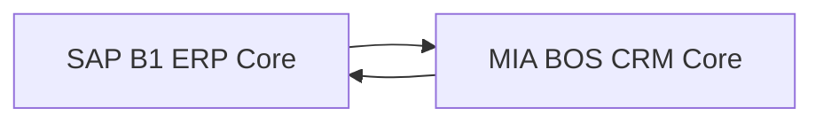
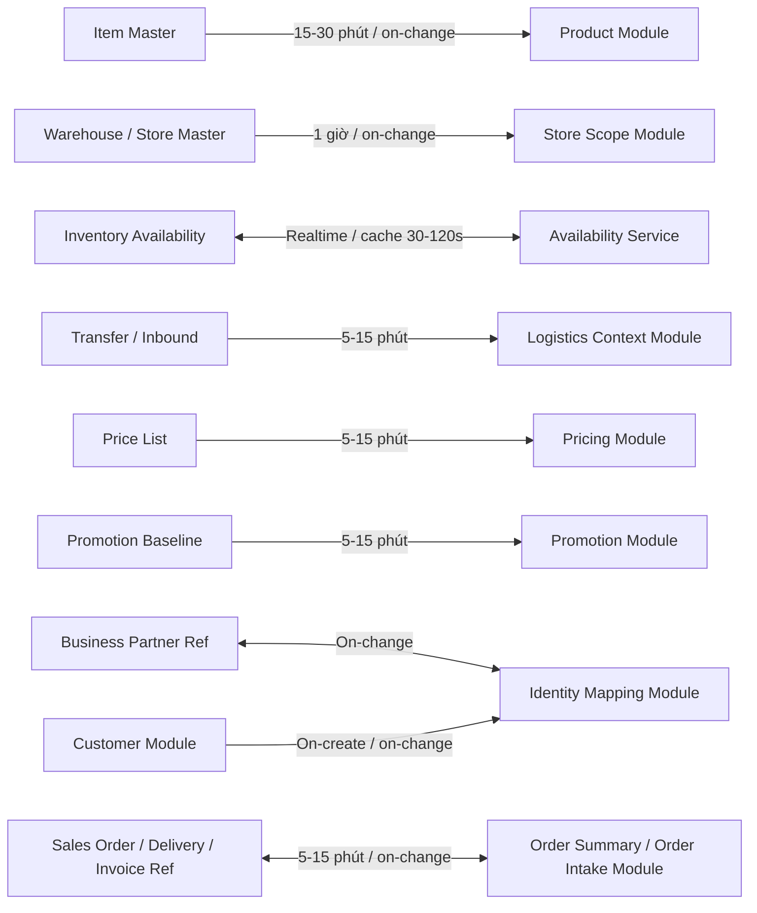
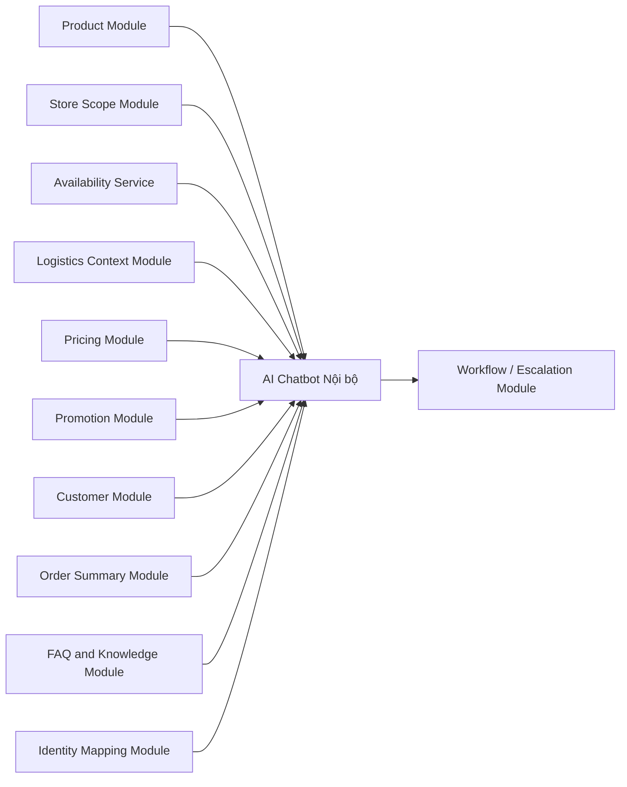
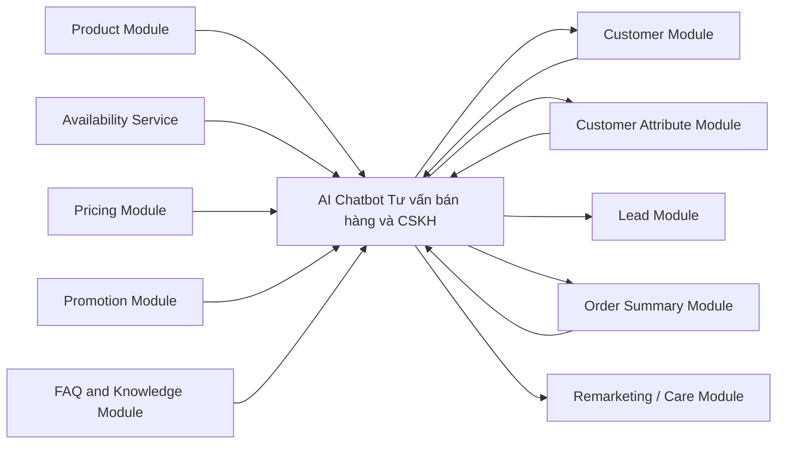

# Feature SRS: F-SAP-INT-001 Tích hợp SAP B1 cho Chatbot Nội bộ và Chatbot Tư vấn Bán hàng

**Status**: Draft
**Owner**: A03 BA Agent
**Last Updated By**: Codex CLI (GPT-5 Codex)
**Last Reviewed By**: A01 PM Agent
**Approval Required**: PM
**Approved By**: -
**Last Status Change**: 2026-04-14
**Source of Truth**: This document
**Blocking Reason**: Chưa chốt nguồn cuối cùng cho pricing và CTKM theo từng kênh; chưa chốt phạm vi dữ liệu khách hàng / đơn hàng cho phase 1
**Module**: MIA-INT
**Phase**: PB-02 / PB-03
**Priority**: High
**Document Role**: Tài liệu SRS chuẩn để phân tích nghiệp vụ, thiết kế UXUI, FE Preview, và handoff kỹ thuật tích hợp

---

## 0. Metadata

- Feature ID: `F-SAP-INT-001`
- Related User Story: `US-SAP-INT-001`
- Related PRD: Chưa có PRD chính thức; tạm thời kế thừa từ brief POC nội bộ
- Related Screens:
  - Màn hình chatbot nội bộ
  - Màn hình chatbot tư vấn bán hàng
  - Màn hình hồ sơ khách hàng / customer profile
  - Màn hình kết quả tra cứu dữ liệu
  - Màn hình chi tiết nguồn dữ liệu và thời điểm cập nhật
  - Màn hình tạo escalation / ticket
  - Màn hình hội thoại remarketing / chăm sóc
- Related APIs:
  - API đồng bộ Product từ SAP B1
  - API đồng bộ Warehouse / Store mapping từ SAP B1
  - API tồn kho thời gian thực từ SAP B1
  - API đồng bộ Transfer / Inbound từ SAP B1
  - API đồng bộ Price List từ SAP B1 hoặc nguồn được chỉ định
  - API đồng bộ Promotion baseline từ SAP B1 hoặc nguồn được chỉ định
  - API hỏi đáp nội bộ của MIA
  - API tư vấn bán hàng của MIA
  - API tạo escalation / ticket của MIA
  - API customer profile / lead capture / remarketing của MIA
- Related Tables:
  - `crm_customer`
  - `crm_customer_attribute`
  - `crm_lead_event`
  - `crm_order_summary`
  - `product_read_model`
  - `store_scope_read_model`
  - `pricing_read_model`
  - `promotion_read_model`
  - `logistics_read_model`
  - `faq_knowledge_base`
  - `knowledge_document_index`
  - `mia_user_scope_profile`
  - `chat_audit_log`
  - `escalation_ticket_ref`
- Related Events:
  - `sap.product.synced`
  - `sap.pricing.synced`
  - `sap.promotion.synced`
  - `sap.logistics.synced`
  - `mia.inventory.realtime_checked`
  - `mia.customer.profile_updated`
  - `mia.remarketing.triggered`
  - `mia.chatbot.answer_generated`
  - `mia.chatbot.escalation_created`
- Related Error IDs:
  - `SAP-INT-001`
  - `SAP-INT-002`
  - `MIA-CHAT-001`
  - `MIA-CHAT-002`
  - `MIA-CRM-001`

## 1. User Story

Là người dùng nội bộ của BQ thuộc các nhóm `Sales`, `Logistics`, `Marketing / Trade`, hoặc `Finance / Pricing`, tôi muốn hỏi đáp bằng ngôn ngữ tự nhiên với AI trên MIA để tra cứu nhanh thông tin từ SAP B1 và các lớp dữ liệu liên quan, nhằm giảm thời gian tìm kiếm thông tin và tăng tốc độ ra quyết định trong vận hành hàng ngày.

Đối với chatbot tư vấn bán hàng, tôi muốn AI có thể đóng vai trò như một nhân viên tư vấn bán hàng số: tư vấn mẫu mã, giải đáp thắc mắc, khai thác thông tin khách hàng như sở thích, nhu cầu, giới tính, size giày, mục đích mua hàng, khu vực mua hàng; đồng thời có thể chăm sóc, remarketing, gửi CTKM, chúc mừng sinh nhật, và hướng khách tới điểm bán hoặc kênh mua phù hợp.

## 1A. User Task Flow

| Step | User Role | Action | Task Type | Notes |
|------|-----------|--------|-----------|-------|
| 1 | Sales / ASM | Mở chatbot nội bộ và nhập câu hỏi về sản phẩm, tồn kho, giá, CTKM | Quick Action | Điểm vào chính |
| 2 | Sales / ASM | Xem câu trả lời kèm nguồn dữ liệu và thời điểm cập nhật | Quick Action | Bắt buộc có trace để tạo niềm tin |
| 3 | Sales / ASM | Tạo escalation / ticket nếu dữ liệu chưa rõ hoặc cần xử lý tiếp | Exception Handling | Luồng follow-up |
| 4 | Logistics | Hỏi về tồn kho theo kho, hàng đang chuyển, ETA hàng về | Quick Action | Luồng nghiệp vụ kho |
| 5 | Marketing / Trade | Hỏi CTKM theo kênh, loại cửa hàng, nhóm sản phẩm, thời gian hiệu lực | Quick Action | Luồng kiểm tra CTKM |
| 6 | Finance / Pricing | Hỏi giá cơ sở, giá đang áp dụng, tính hợp lệ của giá / CTKM | Reporting | Luồng đối soát |
| 7 | Khách hàng / Lead | Chat với AI để được tư vấn mẫu mã, size, nhu cầu, nơi còn hàng trong khu vực | Quick Action | Luồng bán hàng trực tiếp |
| 8 | AI Sales Chatbot | Thu thập thuộc tính khách hàng, gợi ý sản phẩm, đẩy CTA mua hàng / để lại thông tin | Quick Action | Vai trò thay thế nhân viên tư vấn |
| 9 | AI Sales / CRM | Gửi nhắc lại, CTKM, chăm sóc sinh nhật, remarketing | Bulk Operation | Luồng CRM / chăm sóc |

## 2. Business Context

BQ đang vận hành trong bối cảnh bán lẻ nhiều cửa hàng, nhiều kênh và nhiều hệ thống. Hiện tại:

- `SAP B1` là nguồn dữ liệu đúng cho tồn kho và một phần dữ liệu ERP lõi.
- Giá và CTKM có khả năng đang phân tán giữa `SAP B1`, `KiotViet`, `Haravan`, hoặc file điều hành thủ công.
- Doanh nghiệp không chỉ cần một chatbot tra cứu mà cần một AI có thể tham gia trực tiếp vào chuỗi bán hàng và chăm sóc khách hàng.
- Các thông tin FAQ, chính sách đổi trả, chính sách doanh nghiệp, quy tắc ứng xử AI, kiến thức chung về BQ là các dữ liệu riêng mà MIA BOS cần tự sở hữu vì không tồn tại chuẩn trên các hệ thống vận hành khác.

Định vị của `MIA BOS` trong bài toán này không chỉ là lớp hỏi đáp. MIA BOS có thể được định vị như một `CRM + AI Sales / CSKH Operating Layer`, trong đó:

- `SAP B1` là ERP nguồn nghiệp vụ lõi.
- `MIA BOS` là nơi quản lý tương tác khách hàng, hồ sơ khách hàng, dữ liệu chăm sóc, dữ liệu hội thoại, remarketing, và các read model phục vụ bán hàng / CSKH.
- MIA BOS có thể là nơi nhận lead, nuôi dưỡng lead, chốt đơn qua chatbot, hoặc chuyển đổi khách sang nhân viên phụ trách khi cần.

Theo góc nhìn tư vấn giải pháp bán lẻ, cần tách rõ ba vai trò hệ thống:

- `ERP record system`: SAP B1 giữ vai trò hạch toán và điều phối nghiệp vụ lõi như tồn kho, kho, giá cơ sở, một phần đơn hàng, và đối soát.
- `Channel execution systems`: KiotViet, Haravan, sàn, social commerce là nơi phát sinh giao dịch hoặc tương tác theo từng kênh bán.
- `Customer operating system`: MIA BOS giữ vai trò CRM, AI sales, CSKH, và lớp điều phối tương tác khách hàng đa kênh.

Với định vị này, MIA BOS không chỉ là nơi “xem lại dữ liệu SAP”, mà là nơi doanh nghiệp vận hành các nghiệp vụ:

- quản lý hồ sơ khách hàng hợp nhất
- lưu thuộc tính và hành vi khách hàng phục vụ cá nhân hóa
- tạo lead, tạo đơn từ chatbot hoặc từ sale nội bộ
- remarketing và chăm sóc sau bán
- hỏi đáp AI nội bộ và tư vấn bán hàng

Điểm quan trọng là `MIA BOS phải độc lập ở lớp CRM`, nhưng `không thay thế ERP của SAP B1`. Nghĩa là MIA BOS có thể tạo và sở hữu bản ghi CRM, còn SAP B1 vẫn là nguồn kế toán - kho - ERP chuẩn hóa ở backend.

## 3. Preconditions

- SAP B1 có thể expose dữ liệu qua `Service Layer` hoặc middleware tương đương.
- BQ đồng ý phạm vi POC ưu tiên cho `Sales`, `Logistics`, `Marketing / Trade`, `Finance / Pricing`, và `AI tư vấn bán hàng`.
- MIA có cơ chế quản lý user, role, feature-scope, data-scope, customer profile, và workflow riêng.
- Có danh sách hệ thống hoặc đầu mối xác nhận nguồn đúng của giá và CTKM theo từng kênh.
- Có quy định rõ loại dữ liệu khách hàng nào được phép lưu trên MIA BOS để phục vụ CRM và remarketing.
- Có workflow hoặc nơi tiếp nhận escalation / ticket sau chatbot.

## 4. Postconditions

- Người dùng nội bộ có thể hỏi đáp bằng ngôn ngữ tự nhiên trên các domain đã chốt.
- Câu trả lời nội bộ hiển thị được nội dung chính, nguồn dữ liệu, và độ mới dữ liệu.
- Nếu dữ liệu chưa chắc chắn hoặc cần xử lý tiếp, người dùng có thể tạo escalation.
- Chatbot tư vấn bán hàng có thể tư vấn sản phẩm, ghi nhận nhu cầu, thu thập thông tin khách hàng, và điều hướng sang hành động bán hàng hoặc chăm sóc tiếp theo.
- MIA BOS có đủ module CRM tối thiểu để lưu trữ dữ liệu phục vụ Marketing, Bán hàng, và CSKH, nhưng không mirror 1:1 dữ liệu ERP của SAP B1.

## 5. Main Flow

### 5.1 Luồng hỏi đáp nội bộ

1. Người dùng đăng nhập vào MIA.
2. MIA xác định `user`, `role`, `department`, `data scope` theo cấu hình của MIA.
3. Người dùng nhập câu hỏi tự nhiên.
4. MIA phân loại câu hỏi theo domain: `sản phẩm`, `tồn kho`, `logistics`, `giá`, `CTKM`, `SOP / policy`.
5. MIA truy vấn read model tương ứng; với tồn kho hệ thống có thể gọi realtime SAP B1 hoặc dùng cơ chế cache mềm tùy rule đã cấu hình.
6. MIA áp dụng business rule, source priority rule, và data scope của user.
7. MIA trả lời kèm `nguồn`, `thời điểm cập nhật`, `phạm vi áp dụng`, và `cảnh báo` nếu có.
8. Nếu user yêu cầu hoặc hệ thống phát hiện rủi ro, MIA cho phép tạo escalation / ticket.

### 5.2 Luồng chatbot tư vấn bán hàng

1. Khách hàng bắt đầu hội thoại với AI trên web, social, OA, hoặc kênh chat được kết nối.
2. AI nhận diện nhu cầu sơ bộ và hỏi khai thác thêm các thông tin như `giới tính`, `size giày`, `mục đích mua`, `sở thích`, `ngân sách`, `khu vực cần mua`, `thời gian cần nhận hàng`.
3. MIA BOS lưu các thuộc tính khách hàng phù hợp vào hồ sơ CRM.
4. AI truy vấn thông tin sản phẩm, giá, CTKM, và tình trạng còn hàng phù hợp.
5. Với câu hỏi tồn kho, hệ thống ưu tiên gọi realtime SAP B1 hoặc availability service để xác định còn hàng / hết hàng và địa chỉ khu vực phù hợp.
6. AI gợi ý mẫu mã, combo, CTKM, cửa hàng gần nhất còn hàng, hoặc kênh mua phù hợp.
7. Nếu khách sẵn sàng mua, AI tạo lead, tạo yêu cầu chốt đơn, hoặc đẩy sang nhân viên phụ trách.
8. Sau hội thoại, MIA BOS có thể tiếp tục remarketing, gửi CTKM, chăm sóc sinh nhật, hoặc chăm sóc lại theo lịch / trigger.

## 6. Alternate Flows

### 6.1 Tồn kho được gọi realtime
- MIA không bắt buộc phải lưu bảng tồn kho chi tiết thường trực.
- Hệ thống gọi trực tiếp SAP B1 hoặc inventory service tại thời điểm hỏi.
- Có thể cache rất ngắn theo `item + khu vực + cửa hàng` để giảm tải, ví dụ 30-120 giây.

### 6.2 Tồn kho dùng cơ chế cache mềm
- MIA lưu `availability cache` hoặc snapshot rút gọn thay vì full inventory table.
- Chỉ lưu các trường tối thiểu phục vụ AI bán hàng hoặc fallback khi SAP chậm.
- Khi cache quá hạn, hệ thống phải gọi lại realtime.

### 6.3 Câu hỏi cần SOP, policy, FAQ hoặc tri thức doanh nghiệp
- MIA truy vấn `faq_knowledge_base` và `knowledge_document_index`.
- Các nội dung như chính sách đổi trả, chính sách công ty, quy tắc ứng xử AI, giới thiệu thương hiệu BQ, FAQ bán hàng phải được quản trị trực tiếp trên MIA BOS.

### 6.4 User hỏi vượt ngoài data scope
- MIA không trả dữ liệu chi tiết.
- MIA thông báo người dùng không có phạm vi truy cập phù hợp.

### 6.5 Nguồn giá và CTKM xung đột
- MIA không tự suy diễn kết luận cuối cùng nếu chưa có source-priority rule.
- Hệ thống trả cảnh báo và đề nghị tạo escalation hoặc xác minh nghiệp vụ.

## 7. Error Flows

### 7.1 SAP B1 không phản hồi hoặc timeout khi kiểm tra tồn kho realtime
- MIA fallback về cache mềm gần nhất nếu còn trong ngưỡng cho phép.
- Nếu không có cache hợp lệ, AI trả lời thận trọng và điều hướng người dùng sang bước xác nhận tiếp theo.

### 7.2 Không map được mã hàng, size, hoặc địa điểm
- MIA gợi ý danh sách gần đúng theo mã, tên, size, hoặc khu vực.
- Nếu vẫn không xác định được, trả lỗi có hướng dẫn nhập lại.

### 7.3 Không xác định được nguồn cuối cùng cho pricing / CTKM
- MIA trả lời theo trạng thái `chưa đủ chắc chắn`.
- Cho phép tạo escalation tới owner phụ trách.

## 8. State Machine

### 8.1 Trạng thái dữ liệu tích hợp
`Pending Sync` -> `Synced` -> `Stale` -> `Needs Review`

### 8.2 Trạng thái kiểm tra tồn kho realtime
`Ready` -> `Realtime Checking` -> `Available` / `Unavailable` / `Fallback Cached` / `Check Failed`

### 8.3 Trạng thái escalation / ticket
`Draft` -> `Submitted` -> `Assigned` -> `Resolved` -> `Closed`

## 9. UX / Screen Behavior

- Câu trả lời nội bộ phải hiển thị rõ `kết luận chính` trước, `chi tiết hỗ trợ` sau.
- Luôn hiển thị `nguồn dữ liệu` và `thời điểm cập nhật` đối với dữ liệu tích hợp.
- Nếu dữ liệu có xung đột hoặc chưa chắc chắn, phải có badge cảnh báo rõ ràng.
- Luồng tạo escalation phải lấy được ngay ngữ cảnh gồm `câu hỏi`, `câu trả lời`, `nguồn`, `user`, `thời điểm`.
- Chatbot tư vấn bán hàng phải có hành vi như một tư vấn viên thực thụ: biết hỏi ngược, biết khai thác nhu cầu, biết gợi ý lựa chọn, biết thúc đẩy chuyển đổi.
- Nếu khách hỏi `cửa hàng nào gần khu vực em còn mẫu này`, chatbot phải có khả năng trả lời danh sách điểm bán phù hợp trong khu vực ở mức an toàn nghiệp vụ.
- Giao diện chatbot tư vấn bán hàng cần có CTA rõ như `Xem mẫu phù hợp`, `Để lại số điện thoại`, `Kết nối tư vấn viên`, `Nhận CTKM`.

## 10. Role / Permission Rules

- Không tích hợp đồng bộ phân quyền từ SAP B1 sang MIA như một yêu cầu bắt buộc.
- MIA tự quản lý `user`, `role`, `feature permission`, và `data scope` cho chatbot nội bộ.
- Với chatbot bán hàng cho khách, quyền được kiểm soát theo `public-safe response policy` thay vì role nội bộ.
- SAP B1 chỉ đóng vai trò là nguồn dữ liệu nghiệp vụ; không đóng vai trò là nguồn phân quyền cho chatbot.
- Cần cấu hình trên MIA tối thiểu các lớp sau:
  - `Phòng ban / role`
  - `Phạm vi kho / cửa hàng / vùng / kênh`
  - `Mức độ nhạy cảm dữ liệu`
  - `Quyền tạo escalation`
  - `Public-safe response policy` cho chatbot bán hàng

## 11. Business Rules

1. `SAP B1` là nguồn đúng cho tồn kho ERP và dữ liệu ERP lõi cần tra cứu.
2. `MIA BOS` được định vị là lớp CRM + AI Sales / CSKH operating layer, không phải bản sao đầy đủ của SAP B1.
3. MIA chỉ lưu các read model và CRM model tối thiểu cần cho AI hỏi đáp, chăm sóc khách hàng, remarketing, audit, và workflow follow-up.
4. Dữ liệu tồn kho có thể được kiểm tra realtime từ SAP B1; không bắt buộc phải lưu full inventory trên MIA.
5. Nếu có lưu dữ liệu tồn kho trên MIA thì chỉ nên là cache mềm hoặc availability snapshot rút gọn phục vụ fallback và tối ưu tốc độ.
6. Các thông tin FAQ, chính sách công ty, quy tắc ứng xử AI, kiến thức chung về BQ, chính sách đổi trả phải được lưu và quản trị trên MIA BOS vì đây là tri thức riêng của doanh nghiệp.
7. Với chatbot bán hàng, MIA BOS được phép lưu dữ liệu khách hàng, sản phẩm, đơn hàng ở mức phục vụ CRM, Marketing, Bán hàng, và CSKH.
8. Nếu giá hoặc CTKM chưa có source-priority rule theo kênh, câu trả lời phải kèm cảnh báo.
9. Nếu dữ liệu vượt quá ngưỡng freshness cho phép, chatbot phải nói rõ dữ liệu có thể đã cũ.
10. Nếu người dùng hỏi vượt ngoài scope, hệ thống không được trả về dữ liệu chi tiết.
11. Câu trả lời nội bộ nên ưu tiên dạng `kết luận + bằng chứng + hành động tiếp theo`.
12. Câu trả lời chatbot bán hàng nên ưu tiên dạng `khai thác nhu cầu + gợi ý phù hợp + CTA chuyển đổi`.

## 12. API Contract Excerpt + Canonical Links

### 12.1 Nguyên tắc ownership API
- `SAP / đối tác SAP` nên sở hữu API hoặc view đọc dữ liệu từ SAP B1.
- `MIA BOS` sở hữu connector, scheduler, cache mềm, read model, CRM model, AI query API, advisory API, và escalation API.
- Không cho LLM gọi trực tiếp SAP B1.

### 12.2 Nhóm API tích hợp tối thiểu
- `GET /sap/items`
- `GET /sap/warehouses`
- `GET /sap/inventory/availability`
- `GET /sap/transfers`
- `GET /sap/price-lists`
- `GET /sap/promotions`
- `POST /mia/chat/query`
- `POST /mia/sales-advisor/query`
- `POST /mia/customers/profile`
- `POST /mia/leads`
- `POST /mia/escalations`
- `POST /mia/remarketing/triggers`

## 13. Event / Webhook Contract Excerpt + Canonical Links

- `sap.product.synced`: Phát sau khi đồng bộ xong danh mục hàng.
- `sap.pricing.synced`: Phát sau khi đồng bộ giá.
- `sap.promotion.synced`: Phát sau khi đồng bộ CTKM.
- `sap.logistics.synced`: Phát sau khi đồng bộ logistics context.
- `mia.inventory.realtime_checked`: Ghi nhận lượt kiểm tra tồn kho realtime.
- `mia.customer.profile_updated`: Ghi nhận cập nhật hồ sơ khách hàng.
- `mia.remarketing.triggered`: Ghi nhận trigger chăm sóc / remarketing.
- `mia.chatbot.answer_generated`: Lưu audit cho truy vết.
- `mia.chatbot.escalation_created`: Ghi nhận phát sinh xử lý tiếp theo.

## 14. Data / DB Impact Excerpt + Canonical Links

### 14.1 Mô hình tích hợp tổng quan giữa SAP B1 và MIA BOS

Diễn giải mô hình tổng quan:

- `SAP B1 ERP Core`: là lõi ERP, giữ các dữ liệu nghiệp vụ backend chuẩn hóa.
- `MIA BOS CRM Core`: là lõi CRM và AI operating layer, nhận dữ liệu cần thiết từ ERP và đồng bộ ngược các thực thể CRM / bán hàng cần đưa về SAP.

### 14.1A Mô hình đồng bộ module giữa SAP B1 và MIA BOS

Diễn giải ngắn:

- Mô hình này chỉ hiển thị `module đồng bộ giữa SAP B1 và MIA BOS`.
- Module nào đồng bộ hai chiều thì dùng mũi tên `2 chiều`.
- Tần suất được ghi ngay trên mũi tên để phục vụ workshop nhanh.

### 14.1B Mô hình các module của MIA BOS cung cấp cho AI Chatbot nội bộ

Diễn giải ngắn:

- Chatbot nội bộ dùng rộng hơn vì phải trả lời cho nhiều phòng ban.
- Ngoài dữ liệu ERP-read-model, chatbot nội bộ còn cần `Customer Module`, `Order Summary`, `Identity Mapping`, và `Workflow / Escalation`.

### 14.1C Mô hình các module của MIA BOS cung cấp cho AI Chatbot tư vấn bán hàng và CSKH

Diễn giải ngắn:

- Chatbot bán hàng và CSKH cần mạnh ở `Customer`, `Customer Attribute`, `Lead`, `Order Summary`, và `Remarketing / Care`.
- Đây là lớp giúp AI không chỉ tư vấn sản phẩm mà còn chăm sóc, nhắc lại, gửi CTKM, và hỗ trợ sau bán.

### 14.1D Bảng module tích hợp chi tiết SAP B1 và MIA BOS

| Module SAP B1 | Module MIA BOS | Chiều tích hợp | Tần suất | MIA lưu dữ liệu không | Vai trò chính |
|---------------|----------------|----------------|----------|-----------------------|---------------|
| Item Master | Product Module | SAP -> MIA | 15-30 phút / on-change | Có | Làm chuẩn danh mục cho AI và CRM |
| Warehouse / Store Master | Store Scope Module | SAP -> MIA | 1 giờ / on-change | Có | Map kho, cửa hàng, khu vực |
| Inventory Availability | Availability Service | SAP <-> MIA | Realtime, cache mềm ngắn | Cache mềm nếu cần | Kiểm tra còn hàng, hết hàng, khu vực còn hàng |
| Transfer / Inbound | Logistics Context Module | SAP -> MIA | 5-15 phút | Có | Hàng chuyển, ETA, điều phối |
| Price List | Pricing Module | SAP -> MIA | 5-15 phút | Có | Giá bán, giá theo kênh |
| Promotion Baseline | Promotion Module | SAP -> MIA | 5-15 phút | Có | CTKM và logic push sales |
| Business Partner Ref | Identity Mapping Module | SAP <-> MIA | On-change | Có | Map khách ERP với khách CRM |
| Sales Order / Delivery / Invoice Ref | Order Summary Module | SAP <-> MIA | 5-15 phút / on-change | Có, summary | Chăm sóc sau bán, hỏi đáp trạng thái và đồng bộ order ref |
| MIA CRM Customer | Identity Mapping Module / Sync Out | MIA -> SAP / kênh khác | On-create / on-change | Có | Chủ động tạo khách CRM và đồng bộ ra ngoài khi cần |
| MIA Lead / Draft Order | SAP Order Intake | MIA -> SAP | Realtime / near-realtime | Có | Tạo đơn / yêu cầu chốt đơn từ MIA |

### 14.2 Bảng giải thích chi tiết thông tin tích hợp

| Hạng mục tích hợp | Module nguồn | Module đích trên MIA | Chiều tích hợp | Tần suất | MIA có lưu dữ liệu không | Mục đích | Ghi chú logic |
|-------------------|--------------|----------------------|----------------|----------|--------------------------|----------|---------------|
| Danh mục sản phẩm | SAP B1 Item Master | `product_read_model` | SAP B1 -> MIA | 15-30 phút hoặc on-change | Có, dạng read model rút gọn | Tra cứu sản phẩm, tư vấn bán hàng | Không cần sao chép toàn bộ object SAP |
| Kho / cửa hàng | SAP B1 Warehouse Master | `store_scope_read_model` | SAP B1 -> MIA | 1 giờ hoặc on-change | Có | Map kho, cửa hàng, khu vực | Dùng cho scope và gợi ý nơi còn hàng |
| Tồn kho realtime | SAP B1 Inventory Availability API | `availability service / soft cache` | SAP B1 -> MIA theo yêu cầu | Realtime, cache 30-120 giây nếu cần | Không lưu full inventory; chỉ cache mềm khi cần | Trả lời còn hàng, hết hàng, khu vực còn hàng | Đây là cơ chế ưu tiên được đề xuất |
| Hàng chuyển / inbound | SAP B1 Transfer / Inbound | `logistics_read_model` | SAP B1 -> MIA | 5-15 phút | Có | Phục vụ Logistics và Sales hỏi ETA | Không cần lưu toàn bộ lịch sử chi tiết nếu chưa dùng |
| Bảng giá | SAP B1 Price List hoặc nguồn được chỉ định | `pricing_read_model` | Nguồn đúng -> MIA | 5-15 phút | Có | Phục vụ hỏi đáp giá và tư vấn bán hàng | Chỉ chốt sau khi rõ source-of-truth theo kênh |
| CTKM baseline | SAP B1 Promotion hoặc nguồn được chỉ định | `promotion_read_model` | Nguồn đúng -> MIA | 5-15 phút | Có | Phục vụ hỏi đáp CTKM và push sales | Cần quy tắc ưu tiên nguồn theo kênh |
| FAQ / policy / tri thức doanh nghiệp | MIA quản trị nội bộ | `faq_knowledge_base` và `knowledge_document_index` | MIA nội bộ | On-change / manual publish | Có | Giải đáp FAQ, chính sách đổi trả, tri thức thương hiệu, quy tắc AI | Đây là tri thức riêng phải nằm trên MIA |
| Hồ sơ khách hàng CRM | Chatbot, form, chiến dịch, import | `crm_customer` | Kênh bán hàng -> MIA | Realtime / on-change | Có | Phục vụ tư vấn, cá nhân hóa, CSKH, remarketing | Chỉ lưu các trường phục vụ CRM |
| Thuộc tính khách hàng | Hội thoại AI / nhân viên nhập | `crm_customer_attribute` | Hội thoại -> MIA | Realtime | Có | Lưu size giày, sở thích, giới tính, nhu cầu, mục đích mua | Dùng cho gợi ý và chăm sóc |
| Tóm tắt đơn hàng | Nguồn đơn hàng được chỉ định | `crm_order_summary` | OMS / ERP / MIA -> MIA | 5-15 phút hoặc on-change | Có, dạng summary | Phục vụ CSKH, chăm sóc sau bán, remarketing | Chỉ lưu summary phục vụ CRM, không mirror chi tiết ERP |
| User / role / scope | Cấu hình trên MIA | `mia_user_scope_profile` | MIA nội bộ | On-change | Có | Kiểm soát phạm vi chatbot nội bộ | Không kéo phân quyền từ SAP |
| Audit câu trả lời | MIA Chat Layer | `chat_audit_log` | MIA nội bộ | Realtime | Có | Truy vết, kiểm tra chất lượng trả lời | Cần lưu tối thiểu câu hỏi, nguồn, kết luận |
| Escalation / ticket | MIA Workflow hoặc hệ thống nhận việc | `escalation_ticket_ref` | MIA -> Workflow | Realtime | Có, mức tham chiếu | Theo dõi xử lý sau chatbot | Không cần sao chép toàn bộ ticket payload nếu hệ ngoài là nguồn chính |

### 14.2A Ma trận ownership dữ liệu và phát sinh mã

| Domain | Hệ thống tạo mới mặc định | Hệ thống phát sinh mã chính | Hệ thống nhận / đồng bộ tới | Vai trò của MIA BOS | Ghi chú kiến trúc |
|--------|----------------------------|-----------------------------|-----------------------------|---------------------|------------------|
| Khách hàng CRM | MIA BOS | `MIA customer_id` | SAP B1, channel systems, CDP khác nếu có | Master ở lớp CRM | Phù hợp khi MIA là nơi phát sinh lead, tư vấn, chăm sóc và hợp nhất khách hàng |
| Khách hàng ERP / BP | SAP B1 hoặc quy trình tích hợp xác định | `SAP business_partner_code` | MIA BOS | Reference ERP | Nên map `customer_id <-> business_partner_code`, không dùng một mã cho mọi mục đích nếu nghiệp vụ chưa sạch |
| Sản phẩm | SAP B1 | `item_code` | MIA BOS, KiotViet, Haravan, các kênh khác | Nhận và sử dụng | Trong bán lẻ, item master nên để ERP làm chủ để tránh lệch SKU |
| Kho / cửa hàng | SAP B1 hoặc master vận hành đã chốt | `warehouse_code` / `store_code` | MIA BOS, channel systems | Nhận và map | MIA dùng để tư vấn nơi còn hàng và áp scope nội bộ |
| Đơn hàng tạo từ chatbot / MIA | MIA BOS tạo draft order / sales lead / reservation | `mia_order_ref` | SAP B1 là nơi nhận để tạo `sap_order_no` chính thức | Tạo và theo dõi đầu kênh | Nên có cơ chế 2-step: MIA tạo order intent, SAP xác nhận order ERP |
| Đơn hàng tạo từ KiotViet / Haravan | KiotViet / Haravan | `channel_order_no` | SAP B1, sau đó đồng bộ ngược về MIA BOS | Nhận, hợp nhất, lưu summary | MIA không cần làm master order cho các đơn phát sinh ngoài MIA |
| Đơn hàng ERP hậu kiểm / đối soát | SAP B1 | `sap_order_no` | MIA BOS | Nhận và lưu summary / trạng thái | SAP là nguồn chuẩn cho trạng thái backend cần đối soát |
| CTKM / bảng giá | Cần chốt theo kênh | Theo hệ thống owner từng kênh | MIA BOS và các kênh liên quan | Nhận, giải thích, áp rule | Đây là domain cần ma trận source-of-truth riêng |

Nguyên tắc kiến trúc khuyến nghị:

- `Customer master ở lớp CRM`: nếu MIA BOS là nơi phát sinh lead và chăm sóc, MIA nên là hệ thống tạo `customer_id` nội bộ.
- `ERP reference ở lớp SAP`: SAP vẫn có thể cần `business_partner_code` hoặc mã đối tác riêng phục vụ ERP.
- `Order dual-ID model`: đơn phát sinh từ MIA nên có `mia_order_ref` trước, sau khi đẩy thành công sang SAP mới có `sap_order_no`.
- `Channel order federation`: đơn phát sinh từ KiotViet / Haravan vẫn giữ `channel_order_no`, MIA chỉ hợp nhất và map đa mã để phục vụ CRM và AI.

### 14.3 MIA nên lưu gì và không nên lưu gì

#### MIA nên lưu
- Read model rút gọn cho `product`, `warehouse / store`, `pricing`, `promotion`, `logistics`.
- Availability cache mềm hoặc snapshot rút gọn nếu cần tối ưu cho hỏi đáp tồn kho.
- Customer master của lớp CRM gồm hồ sơ khách hàng, mã khách nội bộ, phân khúc, trạng thái chăm sóc.
- Hồ sơ khách hàng CRM và các thuộc tính phục vụ cá nhân hóa như `size giày`, `sở thích`, `nhu cầu`, `mục đích mua`, `khu vực`.
- Dữ liệu lead, lịch sử tương tác, trigger remarketing, và tóm tắt đơn hàng phục vụ CRM.
- Bảng map đa mã giữa `customer_id`, `business_partner_code`, `channel_customer_ref`, `mia_order_ref`, `sap_order_no`, `channel_order_no`.
- Metadata về `source system`, `last_synced_at`, `freshness status`.
- User scope của MIA.
- Audit câu hỏi, câu trả lời, nguồn đã dùng.
- Tham chiếu escalation / ticket.
- FAQ, chính sách doanh nghiệp, quy tắc AI, chính sách đổi trả, kiến thức thương hiệu BQ.

#### MIA không nên lưu
- Full inventory ledger hoặc toàn bộ bảng tồn kho chi tiết nếu realtime query đã đáp ứng tốt.
- Toàn bộ transaction history chi tiết của SAP nếu chưa phục vụ trực tiếp cho CRM hoặc chatbot.
- Toàn bộ object gốc của SAP B1 theo kiểu mirror 1:1.
- Phân quyền SAP nội bộ nếu không dùng trực tiếp cho MIA.
- Dữ liệu kế toán hoặc tài chính sâu không phục vụ Marketing, Bán hàng, và CSKH.

### 14.4 Thông tin chi tiết các trường tích hợp

#### a. Product master
| Trường | Bắt buộc | Mục đích |
|--------|----------|----------|
| `item_code` | Có | Khóa chính để tra cứu |
| `sku` | Có | Hỏi đáp theo SKU |
| `barcode` | Nên có | Tra cứu nhanh tại cửa hàng |
| `item_name` | Có | Hiển thị tên sản phẩm |
| `category` | Có | Phân nhóm câu hỏi |
| `subcategory` | Nên có | Chi tiết hóa phân loại |
| `brand` | Nên có | Tư vấn bán hàng |
| `collection` / `season` | Nên có | Gợi ý bán hàng |
| `gender_tag` | Nên có | Gợi ý theo giới tính |
| `style_tag` | Nên có | Gợi ý theo phong cách |
| `color` | Nên có | Tư vấn sản phẩm |
| `size` | Nên có | Tư vấn sản phẩm |
| `material` | Không bắt buộc | Mô tả thêm |
| `status` | Có | Biết còn kinh doanh hay không |
| `uom` | Có | Đơn vị tính |
| `image_url` | Nên có | Hỗ trợ tư vấn bán hàng |
| `short_description` | Nên có | Trả lời nhanh cho khách |

#### b. Inventory / availability
| Trường | Bắt buộc | Mục đích |
|--------|----------|----------|
| `item_code` | Có | Liên kết sản phẩm |
| `warehouse_code` | Có | Xác định kho |
| `store_code` | Nên có | Map cửa hàng nếu có |
| `available_flag` | Có | Còn hàng / hết hàng |
| `available_qty` | Nội bộ nên có | Tồn khả dụng cho chatbot nội bộ |
| `area_code` / `region_code` | Nên có | Gợi ý khu vực còn hàng |
| `last_checked_at` | Có | Độ mới kiểm tra realtime |
| `check_mode` | Có | Realtime hay fallback cache |

#### c. Pricing
| Trường | Bắt buộc | Mục đích |
|--------|----------|----------|
| `item_code` | Có | Liên kết sản phẩm |
| `price_list_code` | Có | Xác định bảng giá |
| `channel` | Có | Phân biệt theo kênh |
| `store_type` | Nên có | Phân biệt theo loại cửa hàng |
| `regular_price` | Có | Giá cơ sở |
| `promo_price` | Nên có | Giá đang bán |
| `effective_from` | Có | Hiệu lực |
| `effective_to` | Có | Hết hiệu lực |
| `status` | Có | Có còn dùng hay không |
| `source_system` | Có | Truy nguồn |

#### d. Promotion
| Trường | Bắt buộc | Mục đích |
|--------|----------|----------|
| `promo_code` | Có | Mã CTKM |
| `promo_name` | Có | Hiển thị CTKM |
| `promo_type` | Có | Loại CTKM |
| `discount_type` | Có | Phần trăm / số tiền / quà tặng |
| `discount_value` | Có | Giá trị khuyến mãi |
| `apply_scope` | Có | Phạm vi áp dụng |
| `channel_scope` | Có | Kênh áp dụng |
| `store_scope` | Nên có | Cửa hàng áp dụng |
| `item_scope` | Nên có | Mặt hàng áp dụng |
| `category_scope` | Nên có | Nhóm hàng áp dụng |
| `start_at` | Có | Ngày bắt đầu |
| `end_at` | Có | Ngày kết thúc |
| `approval_status` | Nên có | Trạng thái phê duyệt |
| `source_system` | Có | Truy nguồn |

#### e. Transfer / inbound
| Trường | Bắt buộc | Mục đích |
|--------|----------|----------|
| `transfer_id` | Có | Mã giao dịch chuyển |
| `item_code` | Có | Liên kết sản phẩm |
| `from_warehouse` | Có | Kho đi |
| `to_warehouse` | Có | Kho đến |
| `qty` | Có | Số lượng |
| `status` | Có | Trạng thái |
| `created_at` | Có | Thời điểm tạo |
| `expected_arrival_at` | Nên có | ETA hàng về |

#### f. CRM customer profile
| Trường | Bắt buộc | Mục đích |
|--------|----------|----------|
| `customer_id` | Có | Định danh khách hàng |
| `full_name` | Nên có | Xưng hô và CSKH |
| `phone` | Nên có | Liên hệ / remarketing |
| `email` | Không bắt buộc | Email chăm sóc |
| `gender` | Nên có | Cá nhân hóa tư vấn |
| `birthday` | Nên có | Chúc mừng sinh nhật / chăm sóc |
| `region` | Nên có | Gợi ý cửa hàng gần |
| `preferred_store` | Không bắt buộc | Gợi ý điểm bán |
| `preferred_channel` | Không bắt buộc | Cá nhân hóa kênh bán |
| `last_interaction_at` | Có | Xử lý chăm sóc tiếp theo |

#### g. CRM customer attributes
| Trường | Bắt buộc | Mục đích |
|--------|----------|----------|
| `customer_id` | Có | Liên kết hồ sơ khách |
| `shoe_size` | Nên có | Tư vấn size |
| `style_preference` | Nên có | Gợi ý phong cách |
| `purchase_purpose` | Nên có | Mục đích mua như đi làm, đi chơi, quà tặng |
| `budget_range` | Nên có | Gợi ý theo ngân sách |
| `favorite_category` | Nên có | Ưa thích sản phẩm |
| `notes` | Không bắt buộc | Ghi chú thêm |

#### h. CRM order summary
| Trường | Bắt buộc | Mục đích |
|--------|----------|----------|
| `mia_order_ref` | Nên có | Mã đơn / ý định mua phát sinh từ MIA |
| `sap_order_no` | Nên có | Mã đơn ERP sau khi SAP xác nhận |
| `channel_order_no` | Nên có | Mã đơn của KiotViet / Haravan / kênh khác |
| `order_id` | Có | Định danh đơn |
| `customer_id` | Có | Liên kết khách |
| `order_status` | Có | CSKH sau bán |
| `order_date` | Có | Lịch sử mua |
| `channel` | Có | Kênh đặt hàng |
| `store_code` | Không bắt buộc | Điểm bán |
| `order_value` | Nên có | Phân khúc chăm sóc |
| `last_item_summary` | Nên có | Tóm tắt món gần nhất |

#### i. User scope trên MIA
| Trường | Bắt buộc | Mục đích |
|--------|----------|----------|
| `employee_id` | Có | Định danh người dùng |
| `role_code` | Có | Vai trò |
| `department` | Có | Phòng ban |
| `region_scope` | Nên có | Phạm vi vùng |
| `warehouse_scope` | Nên có | Phạm vi kho |
| `store_scope` | Nên có | Phạm vi cửa hàng |
| `channel_scope` | Nên có | Phạm vi kênh |
| `sensitivity_level` | Có | Mức nhạy cảm dữ liệu |

#### j. Identity mapping và đồng bộ đa hệ thống
| Trường | Bắt buộc | Mục đích |
|--------|----------|----------|
| `entity_type` | Có | Phân biệt customer / order / product / store |
| `mia_entity_id` | Có | Mã nội bộ của MIA |
| `sap_ref_id` | Nên có | Mã tham chiếu trên SAP |
| `channel_ref_id` | Nên có | Mã tham chiếu trên KiotViet / Haravan / kênh khác |
| `source_system` | Có | Hệ thống phát sinh bản ghi |
| `sync_direction` | Có | Chiều đồng bộ chính |
| `sync_status` | Có | Trạng thái map và đồng bộ |
| `last_synced_at` | Nên có | Mốc đồng bộ gần nhất |

### 14.5 Nghiệp vụ hỏi đáp của các phòng ban và nhóm sử dụng

| Đối tượng sử dụng | Module hỏi đáp chính | Những câu hỏi thường gặp | Dữ liệu cần lấy |
|------------------|----------------------|---------------------------|-----------------|
| Sales cửa hàng | Product, Availability, Pricing, Promotion | `Mẫu này còn hàng không?`, `Cửa hàng nào gần đây còn hàng?`, `Giá đang áp dụng là gì?`, `Có CTKM nào không?` | Product, Availability realtime, Pricing, Promotion, Store mapping |
| ASM / RSM | Availability, Pricing, Promotion, Logistics | `Khu vực này còn hàng không?`, `Hàng nào đang thiếu?`, `CTKM nào áp cho chuỗi?`, `Có hàng đang chuyển về không?` | Availability, Transfer, Pricing, Promotion |
| Logistics / Kho | Availability, Transfer / Inbound | `Mã này còn bao nhiêu ở kho tổng?`, `Hàng đang chuyển đến đâu?`, `ETA khi nào?` | Availability realtime, Transfer / Inbound, Warehouse |
| Marketing / Trade | Promotion, Product, Pricing, CRM segment | `CTKM nào đang chạy theo kênh?`, `Nhóm hàng nào đang tham gia?`, `Nhóm khách nào nên push campaign này?` | Promotion, Product, Pricing, CRM segment |
| Finance / Pricing | Pricing, Promotion, Product | `Giá nào đang có hiệu lực?`, `CTKM này có hợp lệ không?`, `Nguồn giá hiện hành là từ đâu?` | Pricing, Promotion, Product, source metadata |
| CSKH / CRM | Customer, Order summary, FAQ, Policy | `Khách này đã mua gì?`, `Có thể chăm sóc lại khi nào?`, `Chính sách đổi trả thế nào?` | CRM customer, Order summary, FAQ / Policy |
| Quản lý vận hành | Audit, Escalation, source metadata | `Có xung đột dữ liệu nào đang mở?`, `Những câu hỏi nào đang phải escalation nhiều?` | Audit, Escalation, source metadata |
| Chatbot tư vấn bán hàng | Product, Availability, Promotion, CRM Customer | `Tôi hợp mẫu nào?`, `Size nào phù hợp?`, `Cửa hàng nào gần tôi còn hàng?`, `Có ưu đãi nào không?` | Product, Availability realtime, Promotion, Customer attributes, FAQ / Policy |

### 14.5A Phân tích sâu nghiệp vụ hỏi đáp nội bộ theo từng phòng ban

#### a. Sales cửa hàng / Tư vấn viên / Cửa hàng trưởng

Mục tiêu vận hành:

- chốt đơn nhanh tại điểm bán
- tư vấn đúng mẫu, đúng size, đúng CTKM
- điều hướng khách sang cửa hàng hoặc kênh còn hàng

Các nhóm câu hỏi chính:

- `Tra cứu sản phẩm`: mẫu này là dòng gì, dành cho ai, có màu nào, có size nào
- `Tra cứu bán hàng`: giá hiện tại, CTKM đang áp, quà tặng kèm, điều kiện áp dụng
- `Tra cứu còn hàng`: còn ở cửa hàng này không, còn ở khu vực gần đây không, có thể chuyển hàng không
- `Tra cứu khách hàng`: khách này đã mua gì, size thường mua là gì, đang trong tệp nào

Thông tin cần nhìn thấy:

- product master rút gọn
- availability theo khu vực / cửa hàng
- pricing / promotion theo kênh và loại cửa hàng
- customer profile và order summary ở mức CRM

#### b. ASM / RSM / Quản lý vùng bán hàng

Mục tiêu vận hành:

- điều phối hàng và CTKM theo vùng
- phát hiện khu vực thiếu hàng hoặc tồn lệch
- hỗ trợ cửa hàng xử lý tình huống nhanh

Các nhóm câu hỏi chính:

- vùng nào đang thiếu size bán chạy
- mã nào đang dồn tồn ở khu vực này
- CTKM nào đang áp cho chuỗi / nhóm cửa hàng
- cửa hàng nào cần điều chuyển hàng

Thông tin cần nhìn thấy:

- availability theo vùng
- transfer / inbound
- pricing / promotion theo vùng, kênh, store type
- escalation đang mở theo cửa hàng

#### c. Logistics / Kho / Điều phối hàng

Mục tiêu vận hành:

- xác định hàng đang nằm ở đâu
- theo dõi hàng đang chuyển và ETA
- hỗ trợ trả lời nhanh cho sale và vận hành

Các nhóm câu hỏi chính:

- hàng đang ở kho nào
- hàng nào đang chuyển từ kho nào sang kho nào
- ETA dự kiến khi nào
- có tồn khả dụng để điều phối không

Thông tin cần nhìn thấy:

- inventory / availability nội bộ
- transfer / inbound
- warehouse master
- trạng thái đồng bộ / thời điểm kiểm tra gần nhất

#### d. Marketing / Trade Marketing / Campaign

Mục tiêu vận hành:

- hiểu CTKM nào đang chạy, áp cho ai, áp ở đâu
- chọn đúng nhóm khách và nhóm hàng để đẩy campaign
- kiểm tra điều kiện CTKM với dữ liệu hàng hóa và tồn kho

Các nhóm câu hỏi chính:

- CTKM nào đang active theo kênh
- CTKM nào áp cho nhóm khách nào
- nhóm hàng nào nên push vì còn tồn hoặc cần sell-through
- tệp khách nào phù hợp với CTKM này

Thông tin cần nhìn thấy:

- promotion master
- pricing baseline
- product grouping
- customer segment / CRM segment
- availability mức đủ dùng cho campaign planning

#### e. Finance / Pricing Control

Mục tiêu vận hành:

- kiểm tra tính hợp lệ của giá và CTKM
- đối soát nguồn dữ liệu nào đang được dùng
- giảm rủi ro sale trả lời sai giá

Các nhóm câu hỏi chính:

- giá chuẩn hiện tại là gì
- giá đang áp theo kênh nào
- CTKM này có còn hiệu lực không
- dữ liệu này lấy từ hệ thống nào và cập nhật lúc nào

Thông tin cần nhìn thấy:

- pricing source metadata
- promotion source metadata
- effective time
- approval / validation status nếu có

#### f. CSKH / CRM / Chăm sóc sau bán

Mục tiêu vận hành:

- chăm sóc khách sau mua
- hỗ trợ đổi trả / phản hồi / tư vấn mua lại
- cá nhân hóa chăm sóc dựa trên lịch sử mua và thuộc tính khách

Các nhóm câu hỏi chính:

- khách này mua lần gần nhất khi nào
- đang dùng size nào / hay mua dòng nào
- có thể upsell hoặc cross-sell gì
- chính sách đổi trả đang áp dụng là gì

Thông tin cần nhìn thấy:

- customer profile
- customer attributes
- order summary
- FAQ / policy / đổi trả

#### g. Ban điều hành / Quản lý vận hành / Chủ doanh nghiệp

Mục tiêu vận hành:

- nắm các điểm nghẽn đang phát sinh
- theo dõi chất lượng trả lời của AI
- theo dõi vấn đề dữ liệu nào gây ảnh hưởng đến vận hành

Các nhóm câu hỏi chính:

- phòng ban nào đang hỏi nhiều nhất
- chủ đề nào gây escalation nhiều nhất
- nguồn dữ liệu nào hay xung đột
- chatbot đang hỗ trợ chốt sale tới mức nào

Thông tin cần nhìn thấy:

- audit log
- escalation summary
- integration health / sync freshness
- CRM funnel summary ở mức quản trị

## 15. Validation Rules

1. Mã hàng phải map được về `item_code` hợp lệ trước khi truy vấn dữ liệu nghiệp vụ.
2. Nếu kiểm tra tồn kho theo realtime thất bại, phải ghi rõ hệ thống đang dùng fallback cache hay chưa thể xác nhận.
3. Nếu giá hoặc CTKM không có source-priority rule, không được đưa ra kết luận khẳng định tuyệt đối.
4. Chatbot bán hàng không được hiển thị số lượng tồn kho chi tiết cho khách nếu policy không cho phép.
5. Nếu không map được mã hàng, size, khu vực, hoặc nhu cầu, bắt buộc gợi ý lại hoặc yêu cầu người dùng nhập rõ hơn.
6. Nếu user nội bộ không có scope phù hợp, hệ thống chỉ trả về thông báo giới hạn truy cập.
7. Thông tin khách hàng lưu vào CRM phải tuân thủ policy dữ liệu cá nhân mà BQ chấp thuận.

## 16. Error Codes

| Error ID | Mô tả | Hành vi mong muốn |
|----------|------|-------------------|
| `SAP-INT-001` | Không đọc được dữ liệu từ SAP B1 | Fallback cache hoặc cảnh báo lỗi nguồn |
| `SAP-INT-002` | Dữ liệu SAP B1 trả về thiếu trường bắt buộc | Bỏ qua bản ghi lỗi, log cảnh báo |
| `MIA-CHAT-001` | Không xác định được intent hoặc domain câu hỏi | Yêu cầu người dùng nhập lại rõ hơn |
| `MIA-CHAT-002` | User vượt ngoài data scope | Không trả dữ liệu chi tiết |
| `MIA-CRM-001` | Không đủ dữ liệu khách hàng để cá nhân hóa tư vấn | Chatbot hỏi khai thác thêm thông tin |

## 17. Non-Functional Requirements

- Truy vấn chatbot nội bộ từ read model nên có thời gian phản hồi mục tiêu dưới `5 giây`.
- Kiểm tra tồn kho realtime nên có mục tiêu phản hồi dưới `8 giây`; quá ngưỡng phải fallback hoặc cảnh báo.
- Dữ liệu trả lời phải kèm trace tối thiểu gồm `source`, `last_synced_at` hoặc `last_checked_at`, `scope áp dụng`.
- Tất cả câu hỏi và câu trả lời tích hợp phải có audit log.
- Kiến trúc phải cho phép mở rộng thêm domain mà không phải mirror lại toàn bộ SAP.
- Cần có cơ chế retry, circuit-breaker, và dead-letter cho job đồng bộ hoặc call realtime thất bại.

## 18. Acceptance Criteria

1. Sales có thể hỏi về sản phẩm, tồn kho, giá, CTKM, và nơi còn hàng trong khu vực được cấp.
2. Logistics có thể hỏi về tồn kho theo kho, hàng đang chuyển, và ETA.
3. Marketing / Trade có thể hỏi CTKM theo kênh, nhóm hàng, thời gian hiệu lực, và nhóm khách phù hợp để đẩy chiến dịch.
4. Finance / Pricing có thể hỏi giá hiện hành, nguồn giá, và tính hợp lệ của giá / CTKM.
5. CSKH hoặc CRM có thể tra cứu thông tin khách hàng, lịch sử tương tác, tóm tắt đơn hàng, và chính sách phục vụ khách.
6. Mỗi câu trả lời nội bộ đều hiển thị nguồn dữ liệu và thời điểm cập nhật / thời điểm kiểm tra.
7. Người dùng có thể tạo escalation / ticket trực tiếp từ một câu trả lời.
8. Chatbot tư vấn bán hàng có thể hỏi khai thác nhu cầu khách, ghi nhận thuộc tính khách hàng, gợi ý mẫu mã, gợi ý size, gợi ý CTKM, và điều hướng sang hành động mua hàng.
9. Chatbot có thể hỗ trợ các use case remarketing như chăm sóc lại, gửi CTKM, hoặc chúc mừng sinh nhật khi có dữ liệu và policy phù hợp.
10. MIA BOS có module CRM tối thiểu cho `khách hàng`, `sản phẩm`, và `đơn hàng summary` phục vụ Marketing, Bán hàng, và CSKH.
11. MIA không lưu mirror 1:1 toàn bộ object của SAP B1.
12. Đơn hàng phát sinh từ MIA BOS có thể được tạo với mã tham chiếu của MIA và đồng bộ sang SAP B1 để nhận mã ERP chính thức.
13. Đơn hàng phát sinh từ KiotViet / Haravan có thể đi về SAP B1 trước, sau đó đồng bộ ngược về MIA BOS dưới dạng order summary và mapping đa mã.

## 19. Test Scenarios

- Sales hỏi `Mã BQ123 còn hàng không ở khu vực Quận 1?`
- Sales hỏi `Cửa hàng nào gần đây còn mẫu BQ123 size 38?`
- Logistics hỏi `Mã BQ123 còn bao nhiêu ở kho tổng và có hàng đang chuyển không?`
- Marketing hỏi `CTKM ABC đang áp cho kênh nào và nhóm khách nào nên push?`
- Finance hỏi `Giá hiện hành của mã BQ123 theo kênh online là bao nhiêu và lấy từ nguồn nào?`
- CSKH hỏi `Khách này đã mua mẫu gì gần đây và chính sách đổi trả áp dụng thế nào?`
- Chatbot bán hàng hỏi `Chị đang tìm giày đi làm hay đi chơi?`, sau đó gợi ý mẫu theo size và ngân sách.
- Chatbot bán hàng trả lời `Mẫu này hiện còn hàng ở khu vực Hà Nội` hoặc gợi ý cửa hàng phù hợp.
- Chatbot ghi nhận ngày sinh khách và kích hoạt luồng chúc mừng sinh nhật khi đến thời điểm.

## 20. Observability

- Theo dõi số lượng job sync thành công / thất bại theo từng domain.
- Theo dõi độ trễ đồng bộ theo từng nguồn.
- Theo dõi tỷ lệ kiểm tra tồn kho realtime thành công / fallback / thất bại.
- Theo dõi tỷ lệ câu hỏi có thể trả lời ngay so với tỷ lệ phải escalation.
- Theo dõi top câu hỏi theo phòng ban và top intent của chatbot bán hàng.
- Theo dõi số lượng khách hàng được enrich thêm thuộc tính qua hội thoại AI.
- Theo dõi số lượng trigger remarketing, conversion sang lead, và conversion sang đơn hàng.

## 21. Rollout / Feature Flag

- Giai đoạn 1: Bật cho nhóm nội bộ pilot gồm Sales, Logistics, Marketing / Trade, Finance / Pricing.
- Giai đoạn 2: Bật chatbot tư vấn bán hàng với khả năng khai thác nhu cầu và gợi ý sản phẩm.
- Giai đoạn 3: Bật CRM enrichment, remarketing, và chăm sóc tự động.
- Giai đoạn 4: Mở rộng thêm domain sau khi chốt source-of-truth cho giá và CTKM theo kênh.

## 22. Open Questions

### 22.1 Bộ câu hỏi cần trao đổi với khách hàng

1. Hệ thống nào là nguồn cuối cùng của `giá` theo từng kênh: cửa hàng, online, đại lý, sàn?
2. Hệ thống nào là nguồn cuối cùng của `CTKM` theo từng kênh và loại cửa hàng?
3. Trong SAP B1, các module hoặc bảng nào đang được dùng để xuất `Price List`, `Promotion`, `Transfer`, `Inbound`, và `availability`?
4. Với tồn kho, BQ muốn ưu tiên `realtime query`, `cache mềm`, hay `hybrid`?
5. AI bán hàng có được phép trả `địa chỉ cửa hàng còn hàng trong khu vực` ở mức chi tiết nào?
6. Những trường dữ liệu khách hàng nào BQ đồng ý để MIA BOS lưu cho CRM và remarketing?
7. Có được lưu `size giày`, `sở thích`, `mục đích mua`, `ngày sinh`, `khu vực`, và `lịch sử tương tác` không?
8. Nguồn đơn hàng summary sẽ lấy từ đâu: SAP B1, Haravan, KiotViet, hay MIA BOS tự tạo từ luồng chatbot?
9. Escalation sau chatbot sẽ đẩy sang đâu: Lark, email, ticket system, hay workflow nội bộ của MIA?
10. Với chatbot bán hàng, ngoài `còn hàng / hết hàng`, có được phép trả lời giá, CTKM, cửa hàng gần nhất, và CTA mua hàng ở mức nào?
11. Có danh mục tài liệu FAQ / policy / chính sách đổi trả nào đã duyệt để import vào MIA chưa?
12. Ai là owner nghiệp vụ chịu trách nhiệm xác nhận khi chatbot trả lời sai hoặc dữ liệu xung đột?
13. Nếu MIA BOS là nơi tạo khách hàng CRM đầu tiên, quy trình cấp và map mã khách sang SAP B1 sẽ như thế nào?
14. Nếu MIA BOS tạo đơn từ chatbot, SAP B1 sẽ nhận ở dạng draft order, sales order, hay lead-to-order workflow?
15. Với đơn phát sinh từ KiotViet / Haravan, BQ muốn MIA BOS nhận trực tiếp từ channel hay chỉ nhận sau khi SAP B1 xác nhận backend?

### 22.2 Open Questions kỹ thuật

- Có hỗ trợ webhook / event từ SAP B1 hay chỉ poll theo lịch?
- Có middleware trung gian hiện hữu hay MIA sẽ kết nối trực tiếp Service Layer của SAP B1?
- Mức độ sạch dữ liệu mã hàng, mã kho, mã cửa hàng hiện nay ra sao?
- Có API realtime sẵn cho availability theo `item + size + khu vực` chưa?
- Cần lưu snapshot ngày cho một số domain để audit hay chỉ cần last-state read model và cache mềm?

## 23. Definition of Done

- Có SRS được PM review.
- Có danh sách domain tích hợp tối thiểu và trường dữ liệu tối thiểu.
- Có quyết định rõ về những gì MIA lưu và không lưu.
- Có mô hình realtime / cache cho tồn kho.
- Có bộ câu hỏi discovery để chốt phần còn mở với khách hàng.
- Có thể dùng tài liệu này để mở downstream UXUI và technical design.

## 24. Ready-for-UXUI Checklist

- [x] `User Story` có problem, trigger, happy path, dependencies, và AC context
- [x] User Task Flow đủ rõ cho screen/state design
- [x] Business rules và permission rules có thể test được
- [x] Main, alternate, và error flows đã được mô tả
- [x] State machine đã nêu rõ hoặc giản lược phù hợp
- [x] Data và event dependencies đã được linked ở mức SRS
- [x] Open questions ảnh hưởng đến UXUI đã được liệt kê rõ

## 25. Ready-for-FE-Preview Checklist

- [ ] User Story được approve và linked trong Sprint Backlog
- [ ] UXUI spec tồn tại và trích dẫn SRS này
- [ ] Không còn mâu thuẫn giữa SRS và UXUI
- [ ] Mock / stub data assumptions cho FE Preview được chốt
- [ ] PM mở rõ trạng thái `FE Preview`

## 26. Ready-for-BE / Integration Promotion Checklist

- [ ] FE Preview đã được review
- [ ] Feedback thay đổi hành vi đã được cập nhật ngược về SRS / UXUI
- [ ] Integration Spec hoặc technical pack đã align với SRS này
- [ ] UXUI spec tồn tại và trích dẫn SRS này
- [ ] Không còn mâu thuẫn giữa SRS, UXUI, và technical handoff
- [ ] PM xác nhận trạng thái `Build Ready`

