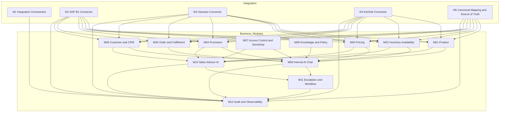

# Feature Dependency Map

## Dependency Graph

## Structural Rule

- `Integration` là layer cấp dữ liệu, không phải business module.
- `Modules` là layer nghiệp vụ và AI vận hành của MIABOS.
- `Source Specs` là input để materialize `Integration SRS` và `Business Module SRS`.
