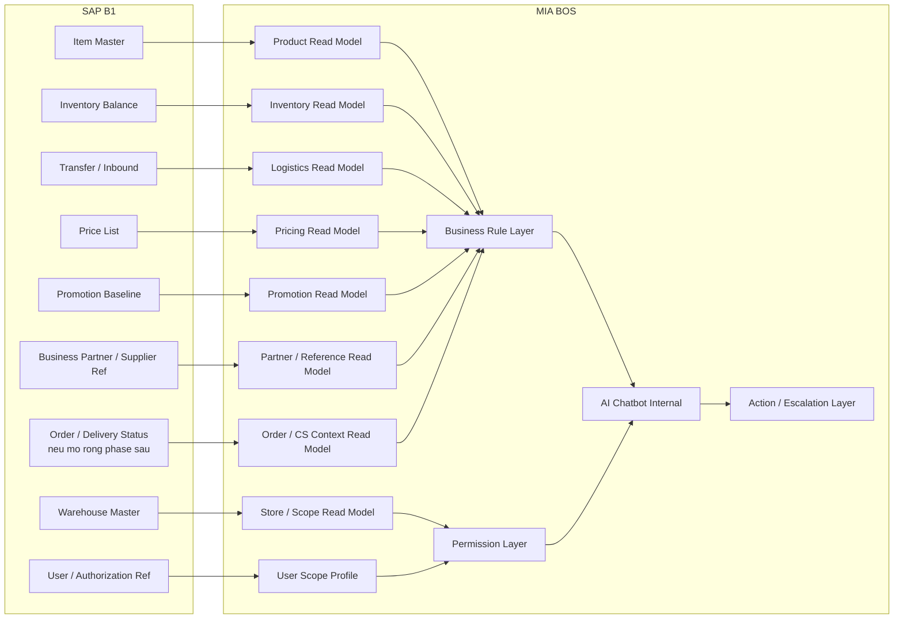
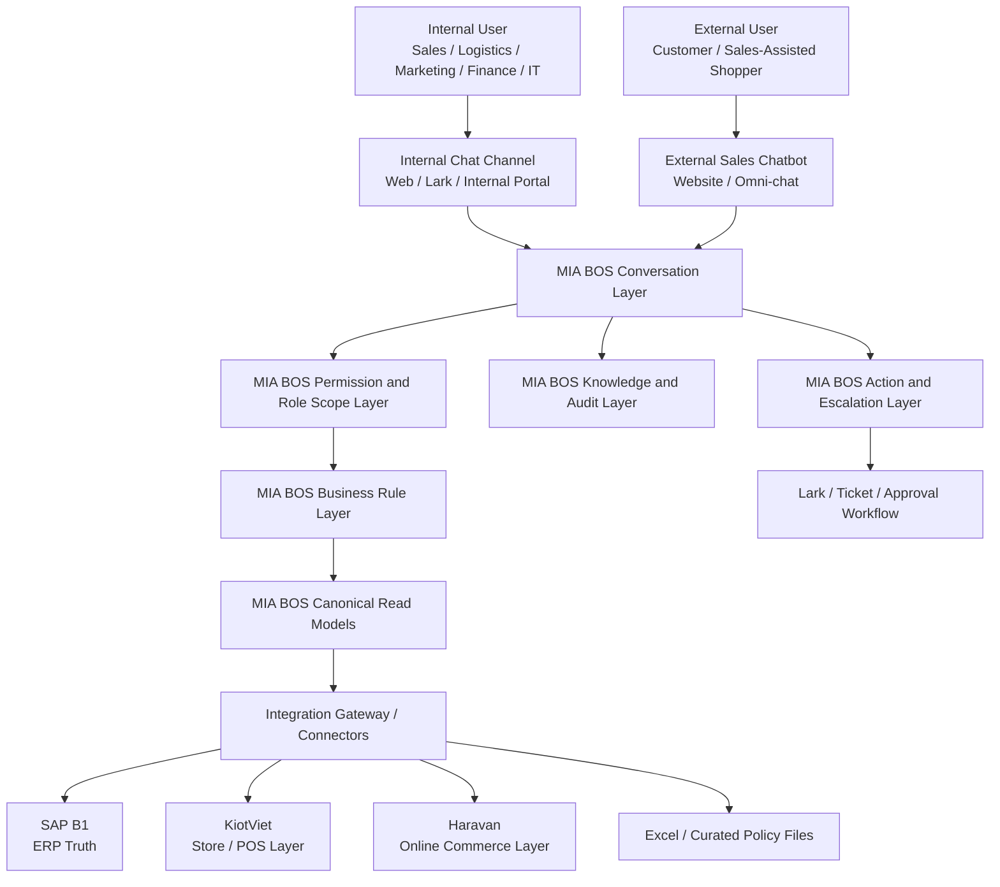

# Kien Truc Tich Hop va Ranh Gioi Du Lieu BQ

**Status**: Deprecated
**Owner**: A01 PM Agent
**Last Updated By**: Codex CLI (GPT-5 Codex)
**Last Reviewed By**: A01 PM Agent
**Approval Required**: Business Owner
**Approved By**: -
**Last Status Change**: 2026-04-14
**Source of Truth**: Replaced by `01_Projects/MIABOS/Analysis/Features/Briefs/SAP_B1_Internal_Chatbot_Integration_POC.md`
**Blocking Reason**: This raw-intake artifact is no longer the canonical working document for the SAP integration feature.
**Created by**: A05 Tech Lead Agent
**Date**: 2026-04-14

---

## Trang Thai Tai Lieu

Tai lieu nay duoc giu lai o `04_Raw_Information` nhu mot artifact discovery goc.

Tai lieu feature chinh da duoc chuan hoa va chuyen sang workspace du an tai:

- [SAP_B1_Internal_Chatbot_Integration_POC.md](../../../01_Projects/MIABOS/Analysis/Features/Briefs/SAP_B1_Internal_Chatbot_Integration_POC.md)

Neu can:

- review scope POC
- chot du lieu can lay
- chot phong ban nao hoi gi
- trao doi voi doi trien khai

hay dung tai lieu cap project o duong dan ben tren lam ban chinh.

---

## 1. Muc Dich

Tai lieu nay mo ta mo hinh tich hop tong the giua `SAP Business One`, `KiotViet`, `Haravan`, va `MIA BOS` cho bai toan `Giay BQ`.

Muc tieu cua tai lieu:

- thong nhat truoc mo hinh tich hop tong the giua MIA va BQ
- xac dinh ro MIA nen luu gi va khong nen luu gi
- giai thich logic nguon du lieu, chieu ket noi, tan suat dong bo, va ranh gioi he thong
- tao nen de di tiep sang cac luong chi tiet, API, va workshop discovery

Day la tai lieu framing cho proposal va discovery, chua phai tai lieu build-ready.

## 2. Gia Dinh Lam Viec Da Chot

Tai thoi diem hien tai, cac gia dinh sau duoc xem la baseline:

- `SAP B1` la nguon dung cho ton kho.
- gia va CTKM co the dang nam phan tan tren `SAP B1`, `KiotViet`, va `Haravan`.
- `SAP B1` da co `Service Layer` hoac middleware de expose API.
- chatbot noi bo can ho tro ca `hoi dap read-only` va `ticket / escalation / follow-up action`.
- chatbot ban hang external chi duoc tra ton kho o muc don gian `con hang` / `het hang`.

## 3. Dinh Vi Giai Phap

Voi bai toan `Giay BQ`, `MIA BOS` khong nen duoc thiet ke nhu mot ban sao cua `SAP B1`.

Thay vao do, `MIA BOS` nen dong vai tro:

- `lop truy cap AI`
- `lop dien giai nghiep vu xuyen he thong`
- `lop business rule va phan quyen`
- `lop tuong tac, ticket, escalation, va audit`

`SAP B1`, `KiotViet`, va `Haravan` van la cac he thong van hanh goc cho tung domain nghiep vu.

## 4. Mo Hinh Tich Hop Don Gian De Mo Hinh Hoa Som

Bang duoi day la mo hinh cuc ky don gian de doi hai ben co the hinh dung truoc: module nao se tich hop, du lieu chay tu dau den dau, tan suat ra sao, va MIA dung de lam gi.

| Module SAP B1                                   | Module MIA BOS              | Chieu ket noi                     | Tan suat dong bo             | Muc dich chinh                                  | Ghi chu logic                                                                     |
| ----------------------------------------------- | --------------------------- | --------------------------------- | ---------------------------- | ----------------------------------------------- | --------------------------------------------------------------------------------- |
| Item Master                                     | Product Read Model          | `SAP B1 -> MIA`                   | 15-30 phut                   | Tra cuu san pham cho chatbot noi bo va external | MIA chi luu bo truong can thiet de tim kiem, dien giai, va mapping                |
| Warehouse Master                                | Store / Scope Read Model    | `SAP B1 -> MIA`                   | 1 gio hoac on-change         | Biet san pham dang gan voi kho/cua hang nao     | Dung cho phan quyen theo kho, vung, cua hang                                      |
| Inventory Balance                               | Inventory Read Model        | `SAP B1 -> MIA`                   | 1-5 phut hoac near-real-time | Tra loi ton kho cho noi bo                      | Day la module quan trong nhat vi SAP la nguon ton kho dung                        |
| Transfer / Inbound                              | Logistics Read Model        | `SAP B1 -> MIA`                   | 5-15 phut                    | Giai thich hang dang chuyen, hang sap ve        | Rat quan trong cho logistics va sales support                                     |
| Price List                                      | Pricing Read Model          | `SAP B1 -> MIA`                   | 5-15 phut                    | Tra cuu gia co so va gia theo pham vi           | Can ket hop logic uu tien nguon theo kenh                                         |
| Promotion / Promotion Baseline neu co trong SAP | Promotion Read Model        | `SAP B1 -> MIA`                   | 5-15 phut                    | Tra cuu CTKM va pham vi ap dung                 | Neu CTKM nam nhieu he thong, MIA phai co lop resolution rule                      |
| User / Authorization Reference neu can dung     | User Scope Profile          | `SAP B1 -> MIA` hoac `IdP -> MIA` | Hang ngay + on-change        | Dinh nghia user nao duoc xem gi                 | Khong nen phu thuoc hoan toan vao role SAP, MIA nen co lop role abstraction rieng |
| Chatbot Escalation / Ticket                     | Action and Escalation Layer | `MIA -> Workflow Tool`            | Theo su kien                 | Tao ticket, escalation, handoff sau hoi dap     | Day khong phai dong bo du lieu tu SAP, ma la luong hanh dong tu MIA               |

### 4.1 Cach hieu nhanh mo hinh tren

- `SAP -> MIA` la chieu chinh cho Phase 1.
- `MIA -> Workflow` la chieu hanh dong sau khi chatbot tra loi xong.
- Chua nen co `MIA -> SAP write-back` trong pilot, tru khi co use case duoc kiem soat rat chat.

## 5. Review Do Day Du Cua Du Lieu Dong Bo Cho Chat Noi Bo

Xet theo nhu cau `chat noi bo cho cac phong ban`, bo dong bo hien tai moi dap ung tot cho nhom cau hoi ve:

- san pham
- ton kho
- kho / cua hang
- hang dang chuyen / inbound
- gia co so
- CTKM o muc tong quan

Day la mot nen tang tot cho `Sales`, `Logistics`, va mot phan `Marketing / Trade`.

Tuy nhien, neu muc tieu la de cac phong ban hoi dap AI trong pham vi nghiep vu cua ho, thi bo dong bo hien tai `chua du` va can bo sung them mot so module / read model nua.

### 5.1 Danh gia theo phong ban

| Phong ban / nhom nguoi dung | Muc do dap ung hien tai | Da co gi | Con thieu gi de chat noi bo dung du |
|-----------------------------|-------------------------|----------|------------------------------------|
| `Sales / cua hang / ASM` | `Kha` | Product, inventory, warehouse, pricing, promotion baseline | availability theo scope, mapping cua hang-vung, don hang / order status neu can ho tro ban hang sau tra loi |
| `Logistics / kho` | `Kha tot` | Inventory, transfer, inbound | outbound / transfer exception, lead time, partner delivery context |
| `Marketing / Trade` | `Trung binh` | Pricing baseline, promotion baseline | campaign scope, kenh ap dung, loai cua hang, rule uu tien CTKM, owner xac nhan CTKM |
| `Finance / pricing control` | `Trung binh` | Price list co so | gia theo kenh, gia theo store type, approval status, chinh sach override, muc do nhay cam du lieu |
| `CSKH / call center` | `Chua du` | Product, inventory tong quan co the tai su dung mot phan | order status, warranty policy, exchange / return policy, customer-facing SOP |
| `IT / ERP key user` | `Trung binh` | metadata nguon, knowledge layer co the bo sung | system usage guide, error glossary, integration health, source-of-truth dispute rules |
| `Ban dieu hanh / van hanh trung tam` | `Trung binh` | ton kho, gia, CTKM tong quan | dashboard-style summary, exception list, source freshness, conflict view giua cac he thong |

### 5.2 Ket luan review

Neu chi de pilot nhanh cho `Sales + Logistics + mot phan Marketing/Trade`, pham vi dong bo hien tai la `tam du`.

Neu muc tieu la `chat noi bo da phong ban` dung nghia, can bo sung them it nhat 5 nhom du lieu / module sau:

1. `Organization and Scope Mapping`
- phong ban
- vai tro
- vung
- cua hang / kho duoc phep xem
- do nhay cam du lieu

2. `Promotion Resolution and Approval`
- CTKM nao la hieu luc cuoi cung
- ap cho kenh nao
- ap cho loai cua hang nao
- ai la owner / nguoi phe duyet

3. `Order / Fulfillment / Customer Service Context`
- trang thai don hang
- giao hang
- doi tra
- bao hanh
- escalation context cho CSKH

4. `Knowledge / SOP / Policy Layer`
- quy dinh nghiep vu
- huong dan su dung SAP
- quy tac tra loi khi du lieu xung dot

5. `System Governance and Freshness`
- du lieu cap nhat lan cuoi luc nao
- nguon nao dang la source of truth
- khi nao chatbot phai canh bao `du lieu co the chua moi`

## 6. So Do Tong Quan Module SAP B1 se Tich Hop voi MIA BOS

So do duoi day tap trung rieng vao `SAP B1 -> MIA BOS`, bo qua cac he thong khac de de mo hinh hoa.

### 6.1 Cach doc so do

- Cac module `SAP1 -> SAP7` la nhom nen tang nen uu tien trong Phase 1.
- `SAP8` va `SAP9` la nhom de xem xet neu muon mo rong chat noi bo sang CSKH, purchasing, hoac order-related support.
- MIA khong cho chatbot doc truc tiep vao SAP module.
- Moi module SAP di qua `read model` hoac `scope model` truoc khi vao `business rule layer` va `permission layer`.

## 7. Kien Truc Tong The

### Mo ta thanh phan

| Thanh phan                                | Vai tro                                                                                                |
| ----------------------------------------- | ------------------------------------------------------------------------------------------------------ |
| `SAP B1`                                  | ERP anchor, nguon dung cho ton kho, cau truc san pham, kho, va mot phan du lieu kiem soat doanh nghiep |
| `KiotViet`                                | Lop van hanh cua hang / POS                                                                            |
| `Haravan`                                 | Lop van hanh ecommerce / online channel                                                                |
| `Excel / Curated Policy Files`            | Nguon bo tro tam thoi cho cac policy va rule chua duoc chuan hoa he thong                              |
| `Integration Gateway / Connectors`        | Lop ket noi giua MIA va cac he thong nguon, tranh de chatbot goi truc tiep vao ERP                     |
| `MIA BOS Canonical Read Models`           | Cac bang nhin du lieu gon nhe, toi uu cho chatbot va AI                                                |
| `MIA BOS Business Rule Layer`             | Lop uu tien nguon, resolution rule, semantic normalization, va logic nghiep vu                         |
| `MIA BOS Permission and Role Scope Layer` | Lop phan quyen tinh nang va phan quyen du lieu                                                         |
| `MIA BOS Knowledge and Audit Layer`       | Lop tai lieu, grounding, traceability, va audit                                                        |
| `MIA BOS Action and Escalation Layer`     | Lop tao task, ticket, escalation sau hoi dap                                                           |

## 8. Nguyen Tac Thiet Ke Tich Hop

### 5.1 Read-first before write-back

Phase 1 should maximize trusted read use cases before any transactional write-back to ERP.

### 5.2 MIA stores meaning, not everything

MIA should persist only the data needed for:

- fast AI retrieval
- permission-safe responses
- answer traceability
- cross-system interpretation
- escalation workflows

MIA should not copy full ERP transaction history unless a later phase proves that retention is required.

### 5.3 Source-aware answers

Every answer should be generated with awareness of:

- source system
- timestamp or freshness window
- business scope
- user permission scope
- confidence or ambiguity level

### 5.4 Channel-safe response design

Internal and external chatbots must not share the same raw data exposure model.

- Internal bot can access more detailed inventory, policy, and system-guidance context based on role.
- External bot must only use a restricted sales-safe read model.

### 5.5 Business-rule layer is mandatory

Because pricing and promotion logic may live across several systems, MIA must not answer from raw API output alone. It needs an explicit rule layer that resolves:

- which source wins by domain
- which source wins by channel
- which source wins by store type
- which answer is valid at a given effective time

## 9. Mo Hinh Nguon Dung va Trach Nhiem

| Domain | Nguon dung chinh | Nguon bo tro | Ham y cho MIA |
|--------|--------------------------|--------------------------------|-----------------|
| Inventory | `SAP B1` | `KiotViet` cho operational context | MIA phai uu tien SAP cho cau tra loi ton kho chinh thuc, tru khi co exception rule |
| Item master | `SAP B1` | `KiotViet`, `Haravan` cho channel formatting | MIA can chuan hoa danh tinh san pham mot lan va tai su dung tren moi kenh |
| Warehouse / store structure | `SAP B1` | `KiotViet` branch mapping | MIA chi can luu mapping va scope can thiet cho chatbot va phan quyen |
| Pricing | `TBD theo kenh` | `SAP B1`, `KiotViet`, `Haravan` | MIA can co pricing resolution policy, khong nen hardcode 1 nguon |
| Promotions | `TBD theo kenh` | `SAP B1`, `KiotViet`, `Haravan`, Excel da duyet | MIA can co promotion resolution logic va effective-date rule |
| SOP / policy documents | tai lieu da duyet | Excel, PDF, manuals | MIA nen luu metadata, version, owner, chunk, va grounding info |
| Ticket / escalation workflow | `Lark` hoac workflow tool duoc chot | MIA internal action model | MIA dieu phoi luong handoff, khong thay the workflow governance |

## 10. MIA Nen Luu Gi

MIA should persist only a `minimal canonical read model` plus the metadata needed to govern AI behavior.

### 7.1 Persisted business read models

Recommended persisted objects:

- `product_read_model`
- `inventory_read_model`
- `pricing_read_model`
- `promotion_read_model`
- `store_scope_read_model`
- `knowledge_document_index`
- `user_scope_profile`
- `action_ticket_reference`

### 7.2 Persisted operational metadata

Recommended metadata to persist:

- source system identifier
- source object ID
- source last updated timestamp
- MIA sync timestamp
- effective-from / effective-to
- channel scope
- store scope
- permission sensitivity level
- document version
- answer audit trail

### 7.3 Persisted AI and audit metadata

MIA should persist:

- user question
- final answer shown to user
- source references used
- confidence / ambiguity markers
- escalation outcome
- feedback or correction markers

This is needed for:

- audit
- trust improvement
- answer quality review
- future prompt and rule tuning

## 11. MIA Khong Nen Luu Gi Mac Dinh

To avoid turning MIA into a replica of `SAP B1`, the following should not be fully duplicated by default:

- full historical transaction ledgers
- every sales document line from ERP
- full A/R and A/P accounting detail
- full journal entry detail
- full payment movement history
- low-value raw logs from source systems
- every internal SAP technical field or user-defined field
- raw operational tables that are not needed for AI answers or routing

### Why this matters

If MIA stores too much raw ERP detail:

- sync complexity increases sharply
- data governance risk increases
- reconciliation cost increases
- performance degrades without clear user value
- MIA becomes harder to evolve as an AI layer

## 12. Ranh Gioi Du Lieu Canonical De Xuat

### 9.1 Product read model

Store only the fields needed for AI search, explanation, and channel-safe retrieval:

- item_code
- sku
- barcode
- item_name
- short_name
- brand
- category
- subcategory
- collection
- season
- color
- size
- material
- image_url
- active_status
- source_last_updated_at

### 9.2 Inventory read model

Persist:

- item_code
- warehouse_code
- warehouse_name
- store_code
- store_name
- on_hand_qty
- committed_qty
- on_order_qty
- available_qty
- in_transit_qty
- status_summary
- freshness_timestamp

Do not persist by default:

- every movement-level ledger line
- every historical recount event
- every technical warehouse transaction reference

### 9.3 Pricing read model

Persist:

- item_code
- channel
- store_type
- regular_price
- promo_price
- currency
- effective_from
- effective_to
- source_system
- resolution_rule_id

Do not persist by default:

- every historical price revision record unless a reporting use case requires it

### 9.4 Promotion read model

Persist:

- promo_code
- promo_name
- promo_type
- discount_type
- discount_value
- apply_scope
- channel_scope
- store_scope
- item_scope
- category_scope
- start_at
- end_at
- approval_status
- source_system

Do not persist by default:

- every campaign execution metric
- full marketing event history

### 9.5 Knowledge read model

Persist:

- document_id
- title
- domain
- department
- source_location
- owner
- approved_version
- effective_date
- chunk references
- keywords

## 13. De Xuat Ownership API

| Khu vuc API / Service | Owner de xuat | Logic |
|--------------------|-------------------|-------|
| `SAP-facing APIs` | `BQ / doi SAP implementation` | Phia BQ / doi SAP kiem soat semantics ERP, quyen truy cap, va Service Layer |
| `KiotViet-facing connector` | `MIA`, co BQ support | MIA can chu dong lop ingestion va mapping theo nhu cau AI |
| `Haravan-facing connector` | `MIA`, co BQ support | MIA can chu dong lop ingestion online-channel va sales-safe model |
| `Canonical read APIs for chatbot` | `MIA` | Chatbot nen doc tu business view do MIA quan tri, khong doc truc tiep ERP |
| `Permission and answer-scope APIs` | `MIA` | MIA so huu AI access boundary |
| `Action / escalation APIs` | `MIA` | MIA so huu luong hanh dong sau cau tra loi |

## 14. Tan Suat Dong Bo De Xuat

| Domain | Kieu dong bo | Tan suat de xuat | Ghi chu |
|--------|--------------|-----------------------|------|
| Product master | Scheduled | 15-30 phut | Du cho phan lon thay doi master data retail |
| Inventory | Frequent schedule hoac near-real-time | 1-5 phut | Rat quan trong va phai du tin cay |
| Pricing | Scheduled co publish override | 5-15 phut | Can du tuoi trong khung ban hang |
| Promotions | Scheduled co publish override | 5-15 phut | Effective-date logic rat quan trong |
| Warehouse/store master | Scheduled hoac on-change | 1 gio hoac event-based | Bien dong thap hon |
| Transfer / inbound | Frequent schedule | 5-15 phut | Huu ich cho logistics va sales support |
| User scope / permission | Daily + on-change | hang ngay + event override | Can cho bao mat va phan quyen |
| Knowledge documents | Curated publish | manual hoac theo approval workflow | Governance quan trong hon tan suat |

## 15. Cac Lop Logic MIA Bat Buoc Phai So Huu

### 12.1 Inventory interpretation logic

MIA should not only expose raw stock numbers. It should define:

- what counts as `available`
- whether in-transit stock is shown separately
- how to communicate stale inventory safely
- how to answer when source freshness is below threshold

### 12.2 Pricing and promotion resolution logic

Because pricing and promotions may be distributed, MIA needs a deterministic decision model such as:

1. identify user channel or request channel
2. identify store type or commercial scope
3. filter by effective time window
4. apply source priority by domain
5. apply explicit exception rules
6. return answer plus scope note

### 12.3 Permission and sensitivity logic

MIA should separate:

- `feature permission`: what kind of questions the role may ask
- `data scope permission`: which stores, warehouses, regions, or channels the role may see
- `sensitivity permission`: whether the role may see internal prices, promotion mechanics, financial or margin-adjacent details

### 12.4 Escalation logic

When the answer is not sufficient, MIA should support:

- create a verification ticket
- assign to the owning department
- attach the original question and answer context
- attach related item/store/promotion identifiers
- route to the correct workflow queue

## 16. Mo Hinh Luong Theo Tung Kenh

### 13.1 Internal chatbot flow

1. user signs in through approved identity and role mapping
2. MIA classifies the question domain
3. MIA checks permission scope
4. MIA retrieves from canonical read models or calls high-freshness sources if needed
5. MIA applies business-rule interpretation
6. MIA answers with source and freshness notes
7. if unresolved, MIA offers escalation or creates a follow-up task

### 13.2 External sales chatbot flow

1. user asks about product availability
2. MIA resolves the product identity
3. MIA reads only the restricted sales-safe availability model
4. MIA answers only `in stock` or `out of stock`
5. MIA may recommend next action such as store visit, product alternative, or lead capture

### 13.3 Escalation flow after internal Q&A

1. user requests follow-up
2. MIA packages question, answer, context, source references, and business objects
3. MIA creates a task or ticket in the approved workflow system
4. owner team receives the escalation
5. resolution can later feed back into knowledge improvement

## 17. Cac Cau Hoi Discovery Con Can Chot

The following questions are not blockers for this architecture framing, but they must be answered before build-ready integration design:

### 14.1 Pricing and promotion ownership

- Which system is the final effective source for `base price` by channel?
- Which system is the final effective source for `promotion` by channel?
- Are promotions maintained centrally, locally, or both?
- Are there store-type overrides for owned stores versus dealer stores?
- Which Excel files currently contain critical promotion logic?

### 14.2 Identity and permission

- Which identity source should internal chatbot users authenticate against?
- How are departments, regions, stores, and approval roles mapped today?
- Can SAP roles be reused, or should MIA maintain its own role abstraction?

### 14.3 Escalation and action

- Which workflow platform should receive tasks or tickets: `Lark`, `MIA`, email queue, or another tool?
- Which departments own unresolved questions by domain?
- What SLA or routing priority should apply?

### 14.4 Technical integration

- Will BQ expose SAP through direct `Service Layer`, middleware, or custom APIs?
- What rate limits, auth model, and network constraints apply?
- Which systems can publish events, and which support only polling?

### 14.5 Data governance

- How long should answer audit logs be retained?
- Which fields are considered sensitive or restricted?
- What approval model governs updates to knowledge documents and policy tables?

## 18. De Xuat Bo Tai Lieu Di Tiep

After this document, the recommended sequence is:

1. `Source-of-Truth Matrix` by domain and channel
2. `Role-Permission Matrix` for internal chatbot users
3. `Escalation Routing Matrix` by question type and department
4. `API Inventory and Endpoint Ownership List`
5. `Detailed integration flows` for inventory, product, pricing, promotion, and escalation

## 19. Ket Luan Ngan

Tu goc nhin mo hinh hoa som, co the chot rat gon nhu sau:

- `SAP B1 -> MIA` la chieu du lieu chinh cho Phase 1.
- `MIA -> Workflow` la chieu hanh dong sau khi chatbot hoi dap xong.
- `MIA khong nen la ban sao cua SAP B1`.
- `MIA chi nen luu read model, metadata, permission, knowledge, va audit can thiet`.
- chi khi co business case ro rang moi xem xet mo rong sang write-back hoac replicate sau hon.

Day la boundary giup MIA van gon, de quan tri, de mo rong, va phu hop dung vai tro AI operating layer.
