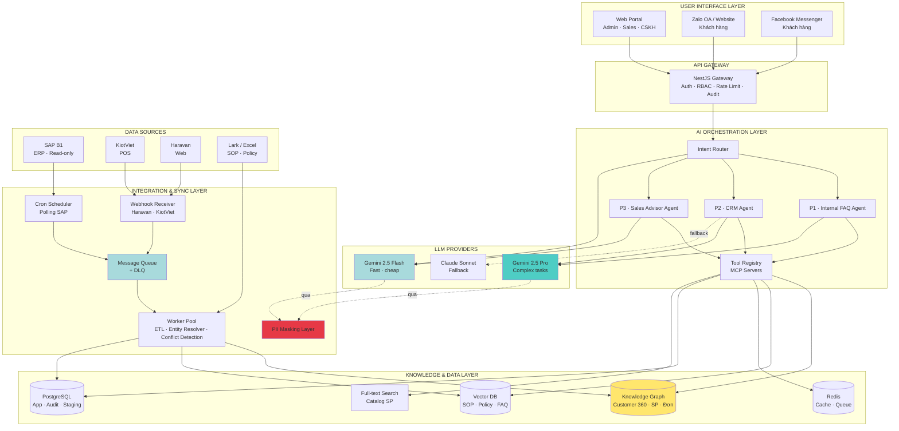
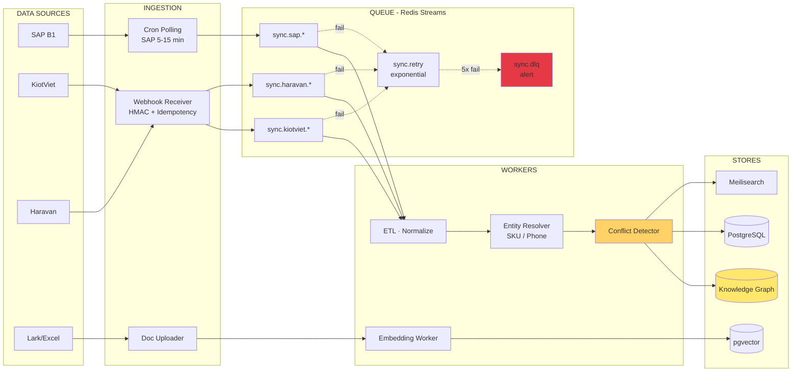

## 1. Architecture Tổng Thể

### 1.1 Kiến trúc High-Level

---

## 2. Tech Stack

### 2.1 Tận dụng từ `mia-chatbot` hiện tại

| Tier            | Công nghệ                                    |
| --------------- | -------------------------------------------- |
| Backend         | NestJS (modular monolith, 11 domain modules) |
| Frontend        | React + TanStack Router + MUI                |
| ORM + DB        | Drizzle ORM + PostgreSQL                     |
| Auth            | Better-Auth (multi-tenant + RBAC)            |
| API             | oRPC (type-safe RPC)                         |
| Background jobs | Trigger.dev                                  |
| Monorepo        | Turborepo                                    |

### 2.2 Components bổ sung

| Component         | Lựa chọn                                      | Mục đích                         | Phí     |
| ----------------- | --------------------------------------------- | -------------------------------- | ------- |
| Graph DB          | **Neo4j Community** (đánh giá Apache AGE sau) | Customer 360 + relationships     | Free    |
| Vector DB         | **pgvector**                                  | SOP/Policy/FAQ embeddings        | Free    |
| Message Queue     | **Redis Streams**                             | Sync pipeline + DLQ              | Free    |
| Cache             | **Redis 7.x** (hoặc Valkey)                   | Session + hot cache + rate limit | Free    |
| Full-text Search  | **Meilisearch**                               | Tìm SP (Vietnamese tốt)          | Free    |
| MCP Servers       | **TypeScript** (`@modelcontextprotocol/sdk`)  | 1 server / data source           | Free    |
| Tool Registry     | **TypeScript** (Vercel AI SDK / Mastra)       | Align stack, reuse Drizzle + Zod | Free    |
| Embeddings        | **bge-m3** self-host                          | Multilingual VN                  | Free    |
| PII Masking       | **Microsoft Presidio** + VN rules             | Trước khi gọi cloud LLM          | Free    |
| LLM Observability | **Langfuse** self-host                        | Trace · Cost · Latency           | Free    |
| **LLM Primary**   | **Gemini 2.5 Pro / Flash** (Paid)             | Generation chính                 | $/tháng |

---

## 3. Chiến Lược Đồng Bộ Data

### 3.1 Sơ đồ Sync Layer

---

## 4. Bảo Mật Data & Lựa Chọn LLM

**Trích Gemini API Terms:**
> **Unpaid:** *"Google uses the content you submit to the Services and any generated responses to provide, improve, and develop Google products and services."*
>
> **Paid:** *"Google doesn't use your prompts (including system instructions, cached content, and files such as images, videos, or documents) or responses to improve our products."*

**Nguồn:**
- [Gemini API Terms — Data Use (Paid)](https://ai.google.dev/gemini-api/terms#data-use-paid)
- [Google Processor Terms (DPA)](https://business.safety.google/processorterms/)
- [Anthropic Privacy Policy](https://www.anthropic.com/legal/privacy)
---

*Document owner: MIA Tech Team · Last updated: 2026-04-19*
